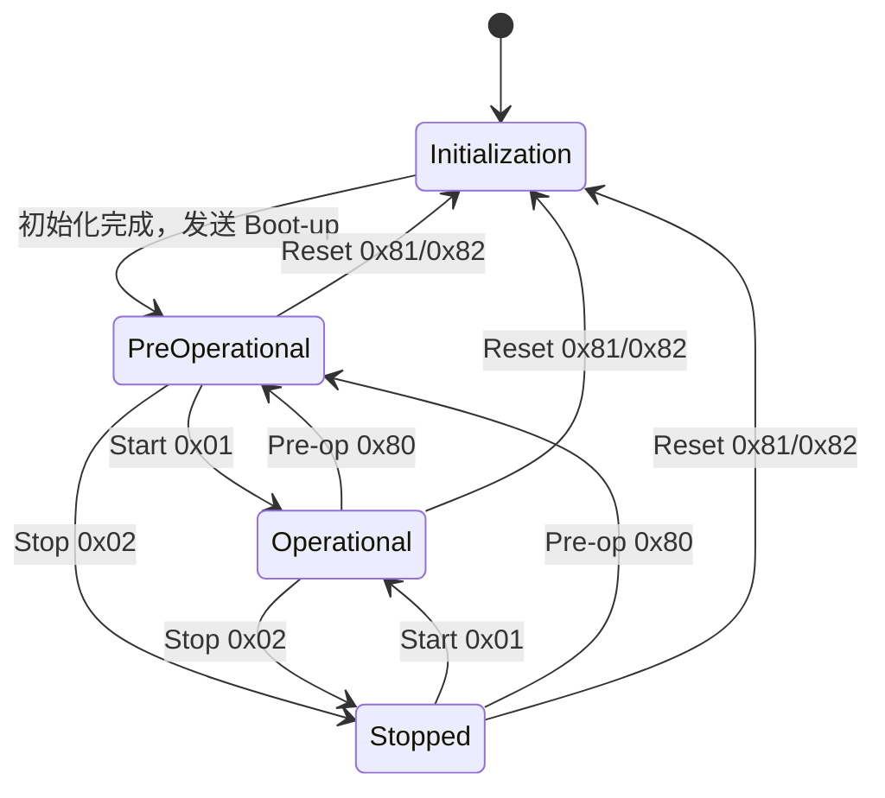

> 2026-09-23：本文已按 [阶段2冻结基线-v1.1](阶段2冻结基线-v1.1.md) 和 [代码修正对照](阶段2代码修正前后对照-学习版.md) 同步修订正文。阶段2对象表及 EDS 已冻结；下文 NMT、Heartbeat、SDO、PDO、EMCY 行为属于后续实现要求，不能视为已完成。

# NMT 与 Heartbeat 状态草案


### 1：状态转换



NMT COB-ID=0，DLC=2：byte0 命令、byte1 目标 Node-ID。接受自身 ID 或广播 0；未知命令、错误长度和其他节点命令不改变状态。重复 Start/Stop/Pre-op 保持对应状态，不重复 Boot-up。


### 2：服务边界

| 状态 | SDO | PDO | NMT | 周期 Heartbeat | EMCY |
|---|---|---|---|---|---|
| Initialization | 不处理 | 不处理 | 初始化完成后处理 | 无；结束时发 Boot-up | 不发送 |
| Pre-operational | 可用 | 不处理 | 可用 | 0x7F | 可用 |
| Operational | 可用，检查写入限制 | 可用 | 可用 | 0x05 | 可用 |
| Stopped | 不处理 | 不处理 | 可用 | 0x04 | 不发送 |

Boot-up 为 0x700+ID，DLC=1，byte0=0x00；每次初始化/通信重置完成发送一次，不是周期心跳状态。0x1017=0 只关闭周期心跳，不关闭 Boot-up。


### 3：时间与复位

- 默认周期1000 ms，阶段4设计非阻塞时间推进入口（函数名待实现时确定）；PC用虚拟时间验证。
- 每次成功写入周期后重新计时，同值重写也重新计时；周期为 0 时停止；阶段 4 只验 PC，STM32 节拍在阶段 7/8 实测。
- Reset Node（0x81）：恢复应用参数，再执行通信复位；Reset Communication（0x82）：恢复0x1000..0x1FFF通信区参数及通信服务状态，保留0x2000..0x9FFF应用区参数。当前尚无持久化保存功能，需恢复的可配置参数使用项目默认值。不能将两种命令都实现为全表初始化。
- 例：先设1017=500、1801:05=100、6423=1；通信复位后1017=1000、1801:05=0，而6423保持1；节点复位则6423恢复0。两种复位完成后都发Boot-up并进入Pre-op。阶段3需测试这些差异。
- 应用参数保留与物理输出安全是不同要求：通信复位不能全表清空，离开Operational仍需应用层执行安全输出策略，避免盲目驱动保留的DO命令。
- 应用在上电、离开 Operational、复位和通信故障时进入约定安全输出状态；本项目DO安全逻辑值为0（PB0..PB3低电平、LED熄灭），硬件执行待集成验证。
- 不在 ISR 中执行复位和协议解析。

阶段6须落实类型255的TPDO进入Operational首次发布；阶段8/9须落实6423为FALSE时进入Operational发送0x0080警告且不因此退出Operational，及严重故障进入Pre-op和默认故障安全输出。当前阶段3只准备状态、复位与应用通知边界。

第一版不实现 Heartbeat Consumer。只发送自身心跳无法判断主站是否失联；阶段 9 的失联输出保护必须另定义 RPDO 命令超时或其他明确的监控来源，不能假设已具有消费者功能。


# 解析

这两张图其实是在给你的 **CANopen 项目定义 NMT（Network Management，网络管理）+ Heartbeat（心跳）这一整套“节点生命周期和存活监控规则”**。

可以把它理解成：

> **NMT 决定“STM32 现在处于什么工作状态”；Heartbeat 告诉别人“我还活着，而且我现在处于什么状态”。**

而你这份草案已经把它具体落实成了一个 **Node-ID = 1 的 STM32F429 CANopen 从节点**。


# 一：先看最核心的 NMT 状态机


### 1：NMT 状态机是什么

NMT 状态机是什么

NMT 全称是：Network Management 网络管理 ，它负责管理 CANopen 节点处于什么工作状态。

在我们项目的 NMT 管理关系中，STM32 是从节点：

```C
上位机主站：发送 NMT 命令
      ↓
STM32 从节点：接收命令，切换自身状态
```

昨天说“以 STM32 为主体”，指的是 **TPDO/RPDO 的收发命名视角**，不是说 STM32 是主站：

| 说法                | 含义               |
| ------------------- | ------------------ |
| STM32 是 NMT 从节点 | 接受主站的状态管理 |
| STM32 的 TPDO       | STM32 发送的 PDO   |
| STM32 的 RPDO       | STM32 接收的 PDO   |

我们的 STM32 上电后大致经历：

```
上电
  ↓
Initialization
  ↓  初始化完成，STM32（从站）发送 Boot-up
Pre-operational	预操作状态
  ↓  can分析仪上位机发送（主站）发送 Start 命令
Operational		可操作状态
```

如果主站发送 Stop：

```c
Operational		可操作状态
  ↓  NMT Stop
Stopped			停止状态
```

如果主站再次发送 Start：

```c
Stopped			停止状态
  ↓  NMT Start
Operational		可操作状态
```


### 2：四个状态分别做什么


#### Initialization：初始化

```
状态含义：STM32 正在启动 CANopen
```

未来整机启动时会完成（阶段3仅实现纯C状态与通知，不调用硬件）：

```
GPIO 初始化
CAN 初始化
协议栈初始化
对象字典初始化
PDO/SDO/Heartbeat 初始化
```

初始化完成后发送 Boot-up：

**STM32 节点主动发送给上位机主站**，通过 CAN 总线和 CAN 分析仪传过去。

流程是：

```c
STM32 上电
    ↓
完成 CANopen 初始化
    ↓
STM32 发送 Boot-up
    ↓
CAN-ID = 0x701
DATA = 00
    ↓
CAN 分析仪接收并显示
    ↓
上位机主站得知 Node-ID=1 已启动
```

这里：

```c
0x701 = 0x700 + Node-ID(1)
00    = Boot-up 状态
```

所以这条报文的意思是：

> Node-ID 为 1 的 STM32 已完成启动，当前进入 Pre-operational，等待主站配置或发送 NMT Start 命令。

然后上位机可以发送：

```
CAN-ID = 0x000
DATA = 01 01
```

表示要求 Node-ID=1 进入 Operational。

之后启用心跳且计时到期时，STM32 会发送（不是NMT命令的直接应答）：

```
CAN-ID = 0x701
DATA = 05
```

表示：

> 节点 1 现在处于 Operational 状态，并且还在正常运行。


#### Pre-operational：预操作

```
状态值：0x7F
```

表示节点已经上线，可以进行配置。

在我们项目中：

```
NMT      ✅
SDO      ✅
Heartbeat ✅
PDO      ❌
```

例如主站可以通过 SDO 修改：

```
0x1017:00 = 500
```

但此时不执行正常的 TPDO/RPDO 过程数据通信。


#### Operational：操作状态

```
状态值：0x05
```

表示节点正式工作。

在此状态下：

```
NMT      ✅
SDO      ✅
Heartbeat ✅
TPDO     ✅
RPDO     ✅
EMCY     ✅
```

我们的 DI、DO、AI 数据都在此状态下通过 PDO 运行。


#### Stopped：停止

```
状态值：0x04
```

表示节点仍然在线，但停止正常的应用过程数据。

在当前项目设计中：

```
PDO：停止
SDO：不处理、不响应
Heartbeat：继续发送
NMT：继续接收
```

它和掉线不同：

```
Stopped：节点还活着，只是不执行正常业务
掉线：节点没有继续发送任何报文
```


### 3：状态码和命令码的区别


#### 1：状态码

状态码表示：

> 节点当前处于什么状态？

常见状态值：

```c
无 ：Initialization   //Initialization 是内部启动过程，而 Boot-up 是对外发送的通知状态。
    			     //这段时间节点还没有准备好和主站正常通信，因此不会周期性发送一个“Initialization 心跳”。
0x00：Boot-up		//节点已经启动完成，它是在通知上位机，Node-ID=1 已经启动，现在可以进入 Pre-operational，等待主站操作。
0x04：Stopped
0x05：Operational
0x7F：Pre-operational
```


#### 2：NMT 命令码

命令码表示：

> 主站要求节点切换到什么状态？

例如 NMT 报文：

```
CAN-ID = 0x000
Data = 01 01
```

解释为：

```
byte0 = 0x01：Start
byte1 = 0x01：目标 Node-ID=1
```

意思是：

```
要求 Node-ID=1 进入 Operational
```

CANopen 把这些状态和转换规则标准化了：

```c
主站发送 NMT 命令
        ↓
STM32 改变 NMT 状态
        ↓
状态决定 SDO/PDO 是否允许
        ↓
Heartbeat 报告当前状态
```


#### 3：区别

例如 Heartbeat 报文：

```c
CAN-ID = 0x701
Data = 05
```

表示：Node-ID 1 当前处于 Operational

例如 NMT 报文：

```c
CAN-ID = 0x000
Data = 01 01
```

解释为：

```c
byte0 = 0x01：Start
byte1 = 0x01：目标 Node-ID=1
```

意思是：要求 Node-ID=1 进入 Operational

所以：

```c
0x01 是命令，不是 Operational 状态值
0x05 是状态，不是 Start 命令
```


你图里的四个状态：

```c
                 上电
                  ↓
           Initialization
                  │
          初始化完成 + Boot-up
                  ↓
           Pre-operational
              ↙         ↘
       Start 0x01       Stop 0x02
           ↓               ↓
      Operational       Stopped
           ↑               │
           └── Start ──────┘
```

CANopen 标准定义的四个 NMT 状态就是：

| 状态            | 状态码 | 核心含义                               |
| --------------- | ------ | -------------------------------------- |
| Initialization  | 内部枚举可用0x00；无周期心跳 | STM32 正在初始化                       |
| Pre-operational | 0x7F   | 已经上线，可以配置，但还不允许 PDO     |
| Operational     | 0x05   | 正常工作，PDO 正式运行                 |
| Stopped         | 0x04   | 停止正常业务通信，只保留有限的管理功能 |


这几个**状态码**和 NMT 主站发的**命令码**不是一回事。比如：

```
NMT 命令：
0x01 = Start → 进入 Operational
0x02 = Stop  → 进入 Stopped
0x80 = Pre-op → 进入 Pre-operational
0x81 = Reset Node
0x82 = Reset Communication
```

这是 CANopen 很容易搞混的地方。CANopen 的 NMT 状态机确实就是这四个状态


### 4：总结

```
上电
  ↓
Initialization
  ↓ Boot-up
Pre-operational
  ↓ Start 0x01
Operational
  ↓ Stop 0x02
Stopped
  ↓ Start 0x01
Operational
```

复位命令：

```
0x81：Reset Node
0x82：Reset Communication
```

会让节点重新初始化，并重新发送 Boot-up。

可以最终记成：

```
NMT 命令码：主站发出的要求
NMT 状态码：节点当前的状态
Heartbeat：把当前状态周期性告诉主站
```


# 二：Initialization：STM32 刚上电的时候

例如你的 STM32F429 上电：

```
上电
 ↓
初始化 CAN
初始化对象字典
初始化 SDO
初始化 PDO
初始化 NMT
初始化 Heartbeat
……
```

此时处于：

```
Initialization
```

这个阶段你草案规定：

```
SDO：不处理
PDO：不处理
NMT：初始化完成后处理
Heartbeat：没有周期心跳
EMCY：不发送
```

也就是说：

> **这个时候设备还没准备好正式对外提供 CANopen 服务。**


# 三：COB-ID分类

CANopen 预定义连接集中有多个**基础 COB-ID**，不同基础值代表不同通信对象。

| 通信对象          | 基础 COB-ID | 计算公式          | Node-ID=1 |
| ----------------- | ----------- | ----------------- | --------- |
| NMT               | `0x000`     | 固定，不加 ID     | `0x000`   |
| EMCY              | `0x080`     | `0x080 + Node-ID` | `0x081`   |
| TPDO1             | `0x180`     | `0x180 + Node-ID` | `0x181`   |
| RPDO1             | `0x200`     | `0x200 + Node-ID` | `0x201`   |
| TPDO2             | `0x280`     | `0x280 + Node-ID` | `0x281`   |
| SDO 响应          | `0x580`     | `0x580 + Node-ID` | `0x581`   |
| SDO 请求          | `0x600`     | `0x600 + Node-ID` | `0x601`   |
| Heartbeat/Boot-up | `0x700`     | `0x700 + Node-ID` | `0x701`   |

可以把它们理解为不同的“频道起点”：

```c
0x080：紧急故障频道
0x180：TPDO1 频道
0x200：RPDO1 频道
0x280：TPDO2 频道
0x580：SDO 响应频道
0x600：SDO 请求频道
0x700：Heartbeat/Boot-up 频道
```

对于 Node-ID=1：

```c
最终 CAN-ID = 基础 COB-ID + 1
```

例如：

```
TPDO1：0x180 + 1 = 0x181
RPDO1：0x200 + 1 = 0x201
Heartbeat：0x700 + 1 = 0x701
```

只有 NMT 特殊：

```
NMT 永远使用 CAN-ID 0x000
```

目标节点写在数据中：

```
Data[0] = NMT 命令
Data[1] = 目标 Node-ID
```

所以记忆顺序是：

```
基础 COB-ID → 加 Node-ID → 最终 COB-ID → 总线 CAN-ID
```

在我们项目里最常用的就是：

```c
0x000、0x081、0x181、0x201、0x281、0x581、0x601、0x701
```


# 四：初始化后

这是 NMT + Boot-up 的第一个关键点。

假设：

```c
Node-ID = 1
//0x700 是 Heartbeat/Boot-up 通信对象的基础 COB-ID。
```

那么设备完成初始化以后发送Boot-up 完整报文：

```c
Boot-up 完整报文表示为：
CAN-ID = 0x701			//0x701：报文编号
DLC    = 1			   //数据区长度为 1 字节
Data[0] = 0x00		   //这 1 个字节的具体内容
```

也就是：

```c
701   [00]

所以 DLC=1 不是“发送一个字节的命令”，而是：
说明后面的 Data 区包含 1 个字节。

这个字节0x00表示Boot-up通知；Boot-up不是第五种NMT运行状态。
对比：
Heartbeat报文：
CAN-ID = 0x701
DLC = 1
Data[0] = 0x7F
表示节点处于 Pre-operational状态。

TPDO2报文：
CAN-ID = 0x281
DLC = 4
Data[0..3] = AI1 和 AI2
表示这条报文携带 4 个数据字节。
可以记成：
DLC：有几个数据字节
Data：这些字节具体是什么
```

这个叫：

> **Boot-up message（节点上线报文）**

它是在 Initialization → Pre-operational 的过程中发送的。CiA 对 Boot-up 的定义就是：初始化完成、进入 Pre-operational 前，用 `0x700 + Node-ID` 发送一个字节 `0x00`。

所以你的 STM32 相当于在 CAN 总线上喊了一句：

> **“Node 1 初始化完成，我上线了！”**


# 五：Pre-operational：最重要的“配置阶段”

Boot-up 之后：

```
Initialization
      ↓
Pre-operational
```

这时候：

```
Node 1 = Pre-operational
```

状态码：

```
0x7F
```

你的表里面写：

| 服务      | Pre-operational |
| --------- | --------------- |
| SDO       | 可用            |
| PDO       | 不处理          |
| NMT       | 可用            |
| Heartbeat | 0x7F            |
| EMCY      | 可用            |

这个状态非常好理解：

> **设备已经上线了，但是还没有开始正式跑过程数据。**

例如主站现在可以通过 SDO 配置：

```
0x1017 Heartbeat Producer Time
0x1800:05 / 0x1801:05 事件周期
0x6423:00 模拟量变化触发开关
（固定COB-ID、映射、传输类型和抑制时间不能写）
```

也就是说：

```
Pre-operational
       ↓
     SDO配置
       ↓
   配置完成
       ↓
   NMT给stm32发送Start命令
       ↓
  进入Operational可操作状态
```

CANopen 的设计就是让设备在 Pre-operational 状态下通过 SDO 完成参数配置，而 PDO 要等到 Operational 才正式启用。


## 为什么`Pre-operational` 不启用 PDO

核心是为了让节点先完成“准备和配置”，再进入“正式运行”


### 1. 先配置，避免参数还没准备好

节点刚上线时，主站可能需要通过 SDO 配置：

```
Heartbeat 周期
PDO 参数
输出初始值
设备工作参数
```

如果 PDO 此时就运行，可能会在配置完成前发送或接收数据，造成状态混乱。

流程是：

```
上电
  ↓
Pre-operational
  ↓
主站通过 SDO 配置
  ↓
配置完成
  ↓
NMT Start
  ↓
Operational
  ↓
PDO 正式工作
```


### 2. 防止输出误动作

我们的 RPDO1 是控制 LED/数字输出的：

```
RPDO1 → 0x6200:01 → DO1~DO4
```

如果节点刚上电、输出状态还没有确认时就接受 RPDO，可能出现：

```
LED 误点亮
输出状态跳变
外部执行器误动作
```

先在 Pre-operational 中完成初始化和配置，再允许 RPDO，可以降低误动作风险。


### 3. 保证 PDO 映射确定

PDO 不带 Index 和 Sub-index，它依赖双方提前约定好的布局：

```
TPDO1 byte0 = 4 路 DI
TPDO2 byte0~1 = AI1
TPDO2 byte2~3 = AI2
RPDO1 byte0 = 4 路 DO
```

如果映射、COB-ID 或传输周期还没确定，就开始收发 PDO，双方可能对同一字节有不同理解。

所以先通过 SDO 读取或配置，确定通信规则，再进入 Operational。


### 4. 减少启动阶段的总线干扰

Pre-operational 阶段主要进行：

```
NMT
SDO
Heartbeat
```

如果所有节点一上电就同时发送 PDO，可能增加总线负载，也不利于主站按顺序启动和配置多个节点。


### 5. 这是“配置阶段”和“运行阶段”的分工

可以类比项目 1：

```
项目 1：
系统初始化、配置采样周期和报警阈值
        ↓
配置完成
        ↓
开始正常采集和通信
```

CANopen 把这个过程标准化了：

```
Pre-operational = 配置阶段
Operational      = 正常过程数据运行阶段
```


### 6. 对我们项目的具体规定

#### Pre-operational

```
NMT：可以
SDO：可以
Heartbeat：可以
TPDO/RPDO：不启用
```

主站可以读取：

```
0x1017:00
0x6000:01
0x6401:01
```

也可以配置允许写入的对象。


#### Operational

```
NMT：可以
SDO：可以
Heartbeat：可以
TPDO：启用
RPDO：启用
EMCY：可以
```

此时：

```
DI 变化 → TPDO1
AI变化（6423=1）或已配置事件周期到期 → TPDO2
主站输出命令 → RPDO1
```

需要补充一点：实际 CANopen 实现中，有些设备会提前配置 PDO 参数，但“正常 PDO 过程数据通信”仍以 Operational 为准。我们项目第一版采用更清晰的规则：

```
Pre-operational：只配置，不跑过程数据
Operational：正式启用 PDO
```

这样状态机更容易理解，测试也更容易设计。


# 六：然后主站发送 Start

假设CAN分析仪PC上位机（主站）要让 Node 1 （STM32单片机）开始正常工作。

发送：

```
CAN ID = 0x000
DLC = 2

01 01
```

这里：

```c
byte0 = 0x01			//命令码Start Remote Node
```

而：

```c
byte1 = 0x01			//从机节点ID，Node-ID = 1
```

所以：

```
000   [01 01]
```

意思就是：

> **“Node 1，进入 Operational。”**

NMT 的 CAN-ID 固定为 `0x000`，第二个数据字节指定目标 Node-ID；如果 Node-ID = 0，则表示广播给所有节点


# 七：Operational：真正干活的状态

进入：

```
Operational
```

状态码：

```
0x05
```

这时候你的项目才真正开始：

```
PDO
```

例如你之前设计的：

```
TPDO1
↓
4路 DI
```

或者：

```
TPDO2
↓
2路 AI
```

都可以开始正常发送。

同时：

```
RPDO
```

也可以接收主站控制数据。

所以可以简单记：

```
Pre-operational
    ↓
    SDO 配置设备

Operational
    ↓
    PDO 跑实时数据
```

这就是为什么你前面一直觉得：

> SDO 是“配置”，PDO 是“实时数据”。

现在把 NMT 放进来以后，三者关系就完整了：

```
             CANopen
                │
       ┌────────┼────────┐
       ↓        ↓        ↓
      NMT       SDO      PDO
       │        │        │
   管状态     配配置    跑数据
```


# 八：Heartbeat 到底在干什么？

这就是第二张图的核心。

假设：

```
Node-ID = 1
Heartbeat = 1000 ms
```

那么 Node 1 会周期发送：

```
CAN ID = 0x701
DLC = 1
```

数据内容根据当前 NMT 状态变化。

例如当前：

```
Operational
```

那么：

```
701  [05]
```

如果当前：

```
Pre-operational
```

则：

```
701  [7F]
```

如果当前：

```
Stopped
```

则：

```
701  [04]
```

所以 Heartbeat 实际上是：

> **“我还活着，而且我现在处于 XX 状态。”**

CiA 对 Heartbeat 的定义正是周期性报告节点是否可用，同时携带当前 NMT 状态。其 CAN-ID 是 `0x700 + Node-ID`，周期由对象字典 `0x1017` 配置


# 九：Boot-up ≠ Heartbeat

它们使用**同一个 CAN-ID**：

```
0x700 + Node-ID
```

例如 Node 1：

```
0x701
```

但是意义不同。

### Boot-up

只发送一次：

```
701  [00]
```

意思：

> 我初始化完成，上线了。

### Heartbeat

周期发送：

```
701  [7F]   ← Pre-op
701  [05]   ← Operational
701  [05]
701  [05]
...
```

意思：

> 我还活着，目前处于这个状态。

所以你图下面这句话非常重要：

> **Boot-up 是每次初始化完成发送一次，不是周期心跳。**

这个区分是正确的。Boot-up 的数据字节固定为 `0x00`；之后如果启用了 Heartbeat，才按照 `0x1017` 周期发送当前状态


# 十：SDO和PDO

SDO 有读写命令字；PDO 没有这种读写命令字。 它们和你下午学的 NMT 命令也不同。


### 1：SDO报文规格

我们第一版 SDO 报文固定使用 8 字节数据区

```c
byte0    ：命令字
byte1～2 ：Index，低字节在前
byte3    ：Sub-index
byte4～7 ：对象数据或错误码
完整结构是：
┌────────┬─────────────┬──────────────┬────────────────┐
│ Data[0]│ Data[1..2]  │ Data[3]      │ Data[4..7]     │
│ 命令字 │ Index       │ Sub-index    │ 数据区/填充区  │
└────────┴─────────────┴──────────────┴────────────────┘
```

#### 主站 → STM32：请求命令

| 命令字 | 含义                           | 数据长度       |
| ------ | ------------------------------ | -------------- |
| `0x40` | 请求读取对象（Upload Request） | 不携带对象数据 |
| `0x2F` | 写入对象                       | 1 字节         |
| `0x2B` | 写入对象                       | 2 字节         |
| `0x27` | 写入对象                       | 3 字节         |
| `0x23` | 写入对象                       | 4 字节         |


#### STM32 → 主站：响应命令

| 命令字 | 含义                        | 数据长度     |
| ------ | --------------------------- | ------------ |
| `0x4F` | 读取成功，返回 1 字节       | 1 字节       |
| `0x4B` | 读取成功，返回 2 字节       | 2 字节       |
| `0x47` | 读取成功，返回 3 字节       | 3 字节       |
| `0x43` | 读取成功，返回 4 字节       | 4 字节       |
| `0x60` | 写入成功                    | 无对象数据   |
| `0x80` | 访问失败，返回 Abort 错误码 | 4 字节错误码 |


#### 例1：can上位机主站读取 stm32`0x1017:00` 心跳周期：

这个例子展示了一次完整的 SDO 读取流程。

```c
CAN-ID：0x601
DLC：8
Data：40 17 10 00 00 00 00 00
      │  └──┘  │
      读 索引  子索引
    
逐字节看：
Data[0] = 0x40
表示：读取请求 							 //命令字

Data[1] = 0x17
Data[2] = 0x10							  //字典对应分组索引：Index 
合起来是：
Index = 0x1017
因为 CANopen 多字节字段按小端排列：
0x1017 → 低字节 17 在前，高字节 10 在后
    
Data[3] = 0x00
表示：
Sub-index = 0x00					   //字典对应分组子索引：Sub-index   
Data[4]~Data[7] = 00 00 00 00
读取请求没有要写入的数据，所以这些位置暂时填 0。
整句话就是：
主站请求 Node-ID=1 的 STM32，读取对象 0x1017:00。
    
STM32 的 SDO Server 收到 0x601 后，会：
判断是不是发给自己的 SDO 请求
        ↓
读取 Index = 0x1017
读取 Sub-index = 0x00
        ↓
在对象字典中查找
0x1017:00
Producer Heartbeat Time
类型：UNSIGNED16
权限：rw
当前值：1000
因为当前操作是读取，所以只需要确认：
对象存在
对象允许读取
```

假设当前周期是 1000 ms：

```
1000 = 0x03E8
```

STM32 返回给Can上位机：

```c
CAN-ID：0x581
DLC：8
Data：4B 17 10 00 E8 03 00 00			//0x4B 为命令字 
      │           └──┘					//1017为分组索引index
      返回2字节    1000					//00为1017分组对应组的子索引
    								 //1000对应的16进制是0x03E8，低字节 E8 在前，高字节 03 在后
    								 //Data[6] = 0x00 ，Data[7] = 0x00 因为返回数据只有 2 字节，剩余位置填 0。

```

一次完整交互

```c
主站 → STM32：
0x601 | 8 | 40 17 10 00 00 00 00 00

STM32 → 主站：
0x581 | 8 | 4B 17 10 00 E8 03 00 00
```

逻辑过程：

```c
主站：我要读取 0x1017:00
STM32：收到，我查对象字典
STM32：这个对象当前值是 1000
STM32：返回 1000
```


#### 例2：主站把周期改成 500 ms：

**主站把周期改成 500 ms：**

```
500 = 0x01F4

CAN-ID：0x601
DLC：8
Data：2B 17 10 00 F4 01 00 00
      │           └──┘
      写2字节      500
```

STM32 写入成功后回复：

```
CAN-ID：0x581
Data：60 17 10 00 00 00 00 00
      │
      写入成功
```

如果访问失败，则返回以 `0x80` 开头的 **SDO Abort**，后四字节装错误码。


### 2：PDO：没有上述命令字

#### 例：主站控制 LED：

```
CAN-ID：0x201
DLC：1
Data：05
```

这里的 `05` **全部是输出数据**：

```
0000 0101 → DO1、DO3 开，DO2、DO4 关
```

不是“命令码 0x05”。STM32 通过：

```
CAN-ID 0x201 → 识别为 RPDO1
固定映射    → 知道这个字节对应 0x6200:01
```

来理解它。

同样，STM32 发送：

```
CAN-ID：0x181
DLC：1
Data：05
```

这里的 `05` 就是数字输入状态。主站不需要先发一个“读取 TPDO”命令；本项目由输入变化或规定的周期触发发送。

**先看 CAN-ID 判断是哪类报文，再解释 Data。** 同一个 `0x05` 出现在不同报文里，含义可以完全不同。


# 十一：当前字典规划的对象分组

| Index    | 分组                       | 子索引                 |
| -------- | -------------------------- | ---------------------- |
| `0x1000` | Device Type，设备类型      | `00`                   |
| `0x1001` | Error Register，错误寄存器 | `00`                   |
| `0x1017` | Heartbeat 周期             | `00`                   |
| `0x1018` | Identity，设备身份信息     | `00`、`01`～`04`       |
| `0x1400` | RPDO1 通信参数             | `00`～`02`             |
| `0x1600` | RPDO1 映射参数             | `00`、`01`             |
| `0x1800` | TPDO1 通信参数             | `00`、`01`～`03`、`05` |
| `0x1A00` | TPDO1 映射参数             | `00`、`01`             |
| `0x1801` | TPDO2 通信参数             | `00`、`01`～`03`、`05` |
| `0x1A01` | TPDO2 映射参数             | `00`、`01`、`02`       |
| `0x6000` | 数字输入                   | `00`、`01`             |
| `0x6200` | 数字输出                   | `00`、`01`             |
| `0x6401` | 模拟输入                   | `00`、`01`、`02`       |
| `0x6423` | 模拟量变化触发开关，BOOLEAN/rw，默认0 | `00` |


## 1. 设备基本信息组

### `0x1000`

```
0x1000:00 = Device Type
```

表示设备属于哪类 CANopen 设备。


### `0x1001`

```
0x1001:00 = Error Register
```

表示当前故障汇总状态。


### `0x1017`

```
0x1017:00 = Producer Heartbeat Time
```

保存 Heartbeat 周期，例如：

```
1000 ms
```


### `0x1018`

这是一个“记录类型”对象，用来描述设备身份：

```
0x1018:00 = 子索引数量
0x1018:01 = Vendor-ID
0x1018:02 = Product Code
0x1018:03 = Revision Number
0x1018:04 = Serial Number
```

这里的 `0x1018:00` 不是具体业务数据，而是告诉主站：

> 这个 Identity 组下面有几个成员。


## 2. PDO 通信参数组

### `0x1400：RPDO1 通信参数`

```
0x1400:00 = 最大子索引
0x1400:01 = RPDO1 的 COB-ID
0x1400:02 = 传输类型
```

项目中：

```
0x1400:01 = 0x201
```

表示 RPDO1 使用 CAN-ID `0x201`。

### `0x1600：RPDO1 映射组`

```
0x1600:00 = 映射对象数量
0x1600:01 = 0x62000108
```

其中：

```
0x6200 = Index
0x01   = Sub-index
0x08   = 映射长度 8 bit
```

它表示：

> RPDO1 的 1 个数据字节来自 `0x6200:01`。

### `0x1800：TPDO1 通信参数`

```
0x1800:00 = 最大子索引
0x1800:01 = TPDO1 的 COB-ID
0x1800:02 = 传输类型
0x1800:03 = Inhibit Time
0x1800:05 = Event Timer
```

项目中：

```
0x1800:01 = 0x40000181
```

表示 TPDO1 使用 CAN-ID `0x181`。

### `0x1A00：TPDO1 映射组`

```
0x1A00:00 = 映射数量
0x1A00:01 = 0x60000108
```

表示：

> TPDO1 的数据来自 `0x6000:01`，长度为 8 bit。

### `0x1801` 和 `0x1A01`

这两个组用于 TPDO2：

```
0x1801:01 = TPDO2 的 COB-ID，0x40000281（总线CAN-ID为0x281）
0x1A01:01 = 0x64010110
0x1A01:02 = 0x64010210
```

表示 TPDO2 里有两个模拟量：

```
AI1：2 字节
AI2：2 字节
```

总共：

```
DLC = 4
```


## 3. I/O 数据组

### `0x6000：数字输入`

```
0x6000:00 = 数字输入对象数量
0x6000:01 = 4 路 DI 状态
```

`0x6000:01` 使用 1 个字节：

```
bit0 = DI1
bit1 = DI2
bit2 = DI3
bit3 = DI4
bit4~7 = 0
```

### `0x6200：数字输出`

```
0x6200:00 = 数字输出对象数量
0x6200:01 = 4 路 DO 命令
```

同样使用 1 个字节：

```
bit0 = DO1
bit1 = DO2
bit2 = DO3
bit3 = DO4
```

### `0x6401：模拟输入`

```
0x6401:00 = 模拟输入数量
0x6401:01 = AI1
0x6401:02 = AI2
```

每个模拟量：

```
类型：INTEGER16
长度：2 字节
范围：0..32760（原始ADC 0..4095乘8）
```

## 4. 为什么有些组有 `:00`

很多对象组采用这种形式：

```
:00 = 子索引数量
:01、:02、:03... = 实际成员
```

例如：

```
0x6401:00 = 2
0x6401:01 = AI1
0x6401:02 = AI2
```

所以：

```
0x6401:00
```

表示“这一组有两个模拟输入”，而：

```
0x6401:01
0x6401:02
```

才是具体 AI 数据。


## 5. 用一张关系图记忆

```
0x6000 数字输入组
└── 0x6000:01 → DI1~DI4

0x6200 数字输出组
└── 0x6200:01 → DO1~DO4

0x6401 模拟输入组
├── 0x6401:01 → AI1
└── 0x6401:02 → AI2

0x1800 TPDO1 通信参数
└── 0x1800:01 → TPDO1 COB-ID 0x40000181（总线CAN-ID为0x181）

0x1A00 TPDO1 映射
└── 0x1A00:01 → 映射 0x6000:01
```

最重要的是：

```
Index：一组相关对象
Sub-index：组里的具体对象
```

对我们的项目来说，真正承载 I/O 数据的是：

```
0x6000:01
0x6200:01
0x6401:01
0x6401:02
```

而：

```
0x1400、0x1600、0x1800、0x1A00
```

主要用于说明 PDO 的通信参数和数据映射。
