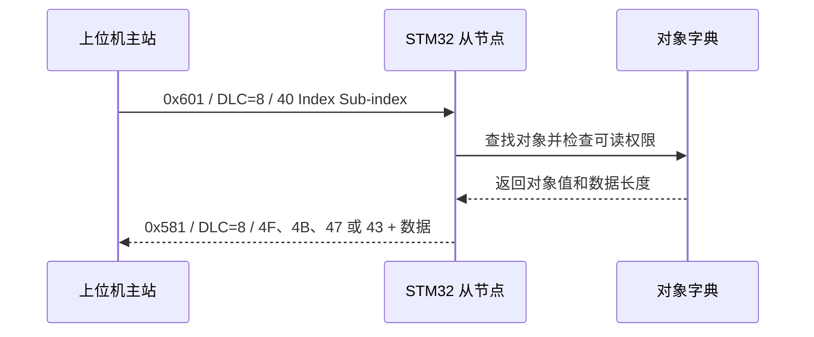
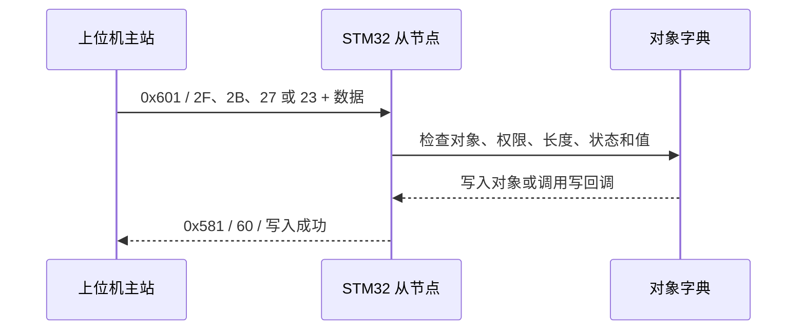

# SDO Abort 草案与帧约定

状态：阶段 0 草案，后续对照规范及测试工具复核。第一版只实现 expedited SDO Server，SDO 帧 DLC 必须为 8；多字节字段按小端传输。

## 错误码

| Abort code | 使用场景 |
|---|---|
| 0x05040001 | 无效或不支持的命令，包括本版不支持的传输方式 |
| 0x06010000 | 不支持的对象访问，一般性访问错误 |
| 0x06010001 | 尝试读取只写对象 |
| 0x06010002 | 尝试写入只读对象，包括固定 PDO 映射 |
| 0x06020000 | 索引不存在 |
| 0x06090011 | 索引存在，但子索引不存在 |
| 0x06070010 | 数据类型或长度不匹配，通用情况 |
| 0x06070012 | 提供的数据过长 |
| 0x06070013 | 提供的数据过短 |
| 0x06090030 | 参数值超出允许范围 |
| 0x08000022 | 当前设备状态不允许该次访问，例如 Operational 修改可写 PDO 定时参数 |

纠正 2.0 规划：0x06010000 不是“写只读”的专用错误码；0x06070012 特指过长，不能覆盖所有长度错误。Stopped 状态不处理 SDO，因此不发送“状态不允许”的 SDO 回复。

## 请求与响应

| 操作 | 命令字节 |
|---|---|
| Upload 请求 | 0x40 |
| Download 请求（1/2/3/4 字节） | 0x2F / 0x2B / 0x27 / 0x23 |
| Upload 响应（1/2/3/4 字节） | 0x4F / 0x4B / 0x47 / 0x43 |
| Download 成功 | 0x60 |
| Abort | 0x80 |

byte0 为命令；byte1..2 为 index（低字节先）；byte3 为 subindex；byte4..7 为数据或 abort code。未使用字节发送为 0。

Node-ID=1 时读取 0x1017:00：
- 请求：COB-ID 0x601，40 17 10 00 00 00 00 00
- 默认值响应：COB-ID 0x581，4B 17 10 00 E8 03 00 00

这些是预期测试向量，尚未运行协议测试。所有写入先校验命令、对象、权限、长度、状态和值，再调用写回调；失败不得留下部分更新。非法帧、错误节点地址和不可解析的短帧丢弃并计数，不补齐后执行。


理解正确。这个文件实际上包含三个部分：

### 1:**Abort 错误码约定**

说明 SDO 操作失败时如何返回：

```
0x80 + Abort code
```

例如：

```
0x06020000：索引不存在
0x06010002：对象只读，不能写
0x06090030：参数值非法
```


### 2:**SDO 请求帧约定**

规定主站发给 STM32 的帧格式：

```
CAN-ID = 0x601
DLC = 8
Data[0] = 命令字
Data[1..2] = Index
Data[3] = Sub-index
Data[4..7] = 数据或填充
```

例如：

```
40 17 10 00 00 00 00 00
```

表示读取 `0x1017:00`。


### 3:**SDO 响应帧约定**

规定 STM32 返回给主站的帧格式：

```
CAN-ID = 0x581
DLC = 8
Data[0] = 响应命令字
Data[1..2] = Index
Data[3] = Sub-index
Data[4..7] = 返回数据、成功信息或 Abort code
```

正常读取：

```
4B 17 10 00 E8 03 00 00
```

写入成功：

```
60 17 10 00 00 00 00 00
```

操作失败：

```
80 99 99 00 00 00 02 06
```

所以文件名可以理解为：

```
SDO Abort 草案
+ SDO 请求帧约定
+ SDO 响应帧约定
```

不过，“发送和响应出错”更准确地说是：

```
SDO 请求或访问过程发生错误
        ↓
STM32 返回 Abort 响应
```

Abort 不是单独的一种 CAN 帧，而是 **SDO 响应帧中的一种结果**。


把这份 **SDO Abort 错误码表**讲懂。它的作用是：

> 主站通过 SDO 访问对象失败时，STM32 告诉主站“为什么失败”。


## 1. 先回顾正常 SDO

正常读取：

```
主站 → STM32：读取某个对象
STM32 → 主站：返回对象数据
```

正常写入：

```
主站 → STM32：写入某个对象
STM32 → 主站：0x60，表示写入成功
```

如果失败：

```
STM32 → 主站：0x80 + Abort 错误码
```

所以：

```
0x80：这次 SDO 操作失败
后面 4 字节：具体失败原因
```

例如：

```
Data = 80 17 10 00 02 00 06 00
```

可以理解为：

**Abort 响应帧仍然是 8 字节**，因为我们规定 SDO 帧的 DLC 固定为 8。

```c
80       → Abort 命令字
17 10    → Index = 0x1017
00       → Sub-index = 0x00
00 00 02 06 → Abort code = 0x06020000 //错误码数值
```


## 2. 最常见的错误码

### `0x06020000`：索引不存在

主站访问：

```
0x9999:00
```

但对象字典里没有 `0x9999`。

```
结果：索引不存在
```

类比项目 1：

```
主站读取不存在的寄存器地址
```


### `0x06090011`：子索引不存在

主索引存在，但子索引不存在。

例如：

```
0x6401:03
```

我们只有：

```
0x6401:01
0x6401:02
```

所以：

```
0x6401 存在
0x03 不存在
```

因为，在我们项目中，`0x6401` 和 `0x6402` 容易混淆：

```
0x6401 = 模拟输入对象组
0x6402 = 当前项目暂未使用
```

我们实际定义的是：

```
0x6401:00 = 模拟输入数量，值为 2
0x6401:01 = AI1
0x6401:02 = AI2
```

所以：

```
0x6401:03
```

表示：

```
模拟输入组中访问第 3 个子索引
```

但我们只定义了 `:01` 和 `:02`，因此返回：

```
0x06090011
```

含义是：

```
索引存在，但子索引不存在
```

要注意：

```
0x6401:02 ≠ 0x6402
```

前者是：

```
Index = 0x6401
Sub-index = 0x02
```

后者是另一个独立的 Index，目前没有定义。

当前模拟输入映射：

```
0x6401:01 → AI1，UNSIGNED16，0~4095
0x6401:02 → AI2，UNSIGNED16，0~4095
```

PDO 映射到 TPDO2：

```
TPDO2，CAN-ID = 0x281，DLC = 4

byte0~1 → 0x6401:01，AI1
byte2~3 → 0x6401:02，AI2
```

你截图里的例子：

```
0x6401:03
```

错误不在 `0x6401`，而在子索引 `0x03` 不存在。


按我们当前对象字典草案：当我们访问0x6401:00时，

```
0x6401:00 = 定义模拟输入数量
```

返回值是：

```
2
```

表示这个模拟输入对象组下面有两个有效成员：

```
0x6401:01 = AI1
0x6401:02 = AI2
```

例如通过 SDO 读取：

```
请求：
CAN-ID = 0x601
DLC = 8
Data = 40 01 64 00 00 00 00 00
```

其中：

```
01 64 → Index = 0x6401
00    → Sub-index = 0x00
```

因为返回值 `2` 是 1 字节，所以响应命令使用 `0x4F`：

```
响应：
CAN-ID = 0x581
DLC = 8
Data = 4F 01 64 00 02 00 00 00
```

含义：

```
0x4F       → 读取成功，返回 1 字节
01 64      → Index = 0x6401
00         → Sub-index = 0x00
02         → 该组有 2 个模拟输入对象
```

这里的 `0x6401:00` 是“数量记录”，不是 AI 的采样值。


### `0x06010001`：不能读取，只写对象

主站尝试读取一个只允许写入的对象：

```
对象权限：wo
主站却执行读取
```

我们的第一版暂时没有典型 `wo` 对象，但错误码表先保留。


### `0x06010002`：不能写入，只读对象

主站尝试写入：

```
0x6000:01
```

但数字输入是硬件采集值：

```
0x6000:01：ro
```

所以不能写入。

固定 PDO 映射对象也属于这种情况，例如：

```
0x1A00:01
```


### `0x06070010`：数据类型或长度不匹配

主站写入的数据和对象要求不匹配。

例如：

```
0x1017:00 要求 UNSIGNED16
```

却发送了错误的格式或长度。

这是一个比较通用的长度/类型错误。


### `0x06070012`：数据过长

对象只允许 2 字节，但主站提供了超过要求的数据。

例如：

```
0x1017:00 需要 2 字节
主站却试图写入 4 字节
```


### `0x06070013`：数据过短

对象需要 2 字节，但主站只提供了 1 字节。

例如：

```
0x1017:00 需要 UNSIGNED16
主站只发送了 1 字节有效数据
```


### `0x06090030`：参数值非法

数据长度正确，但数值不符合项目约束。

例如：

```
0x6200:01 只允许低 4 位使用
主站写入 0x85
```

或者：

```
Heartbeat 周期超出项目允许范围
```

这时不是长度错误，而是：

```
数值本身不合法
```


### `0x08000022`：当前状态不允许

对象存在、权限也正确，但当前 NMT 状态不能执行该操作。

例如：

```
PDO 参数只能在 Pre-operational 修改
```

如果节点已经处于：

```
Operational
```

主站还想修改 PDO 参数，就返回：

```
0x08000022
```

这就像项目 1 中：

```
寄存器地址正确
数据格式正确
但当前设备状态不允许修改
```


### `0x05040001`：命令无效或不支持

主站发送了 STM32 第一版不认识的 SDO 命令。

例如：

```
Segmented SDO
Block SDO
```

而我们第一版只支持：

```
Expedited SDO
```

所以返回：

```
0x05040001
```


## 3. 错误码不是命令字

要区分：

```
0x80：Abort 命令字
0x06020000：Abort 的具体错误码
```

完整结构：

```c
Data[0]     = 0x80					// 命令字
Data[1..2]  = Index
Data[3]     = Sub-index
Data[4..7]  = 4 字节 Abort code		//Abort 的具体错误码
```

例如访问不存在的对象：

```
CAN-ID = 0x581
DLC    = 8
Data   = 80 99 99 00 00 00 02 06
```

解释：

```
0x80       = 操作失败
0x9999:00  = 被访问的对象
0x06020000 = 索引不存在
```

错误码在 CAN 数据区中按小端排列：

```
0x06020000
→ 00 00 02 06
```


## 4. 为什么要区分这些错误

因为主站需要知道下一步怎么处理：

```
对象不存在 → 检查 Index
只读        → 不要再写
数据过长    → 减少数据长度
值非法      → 修改参数范围
状态不允许  → 先切换 NMT 状态
命令不支持  → 换用 expedited SDO
```

如果所有错误都只返回“失败”，主站就不知道问题在哪里。


## 5. 我们项目的完整判断顺序

STM32 收到 SDO 写请求后，按顺序检查：

```
1. CAN-ID 是否是 0x601
2. DLC 是否为 8
3. 命令字是否支持
4. Index 是否存在
5. Sub-index 是否存在
6. 访问权限是否允许
7. 数据长度是否正确
8. 当前 NMT 状态是否允许
9. 参数值是否合法
10. 全部通过后才调用写回调
```

如果第 4 步失败：

```
返回 0x06020000
```

如果第 6 步失败：

```
返回 0x06010002
```

如果第 9 步失败：

```
返回 0x06090030
```


## 6. 最后用项目 1 类比

项目 1 中主站写寄存器可能遇到：

```
地址不存在
寄存器只读
数据数量错误
参数超范围
当前状态不允许
```

CANopen 的 SDO Abort 表就是把这些错误标准化成了 4 字节错误码。

可以记成：

```
SDO 正常：
0x40 读请求 → 0x4F/4B/47/43 返回数据
0x2F/2B/27/23 写请求 → 0x60 写成功

SDO 失败：
0x80 Abort → 后面跟具体错误码
```

核心理解就是：

> **Abort 码不是另一种数据，而是 SDO 操作失败时的标准化原因说明。*


# SDO 通信总览图

## 一、SDO 在项目中的位置


## 二、固定 SDO 帧格式

第一版只实现 expedited SDO（快速 SDO），SDO 请求和响应的 DLC 都固定为 8。

它表示：一次 SDO 请求或响应，就把一个较小对象的完整数据传输完，传输对象本项目不超过4字节，因此SDO完整报文不需要分段传输，采用expedited SDO

```text
Data[0]       Data[1..2]       Data[3]       Data[4..7]
┌───────────┬───────────────┬────────────┬────────────────┐
│ 命令字    │ Index         │ Sub-index  │ 数据/Abort码   │
└───────────┴───────────────┴────────────┴────────────────┘
```

Index 和多字节对象数据均按小端传输。


## 三、正常读取流程



读取命令：

```c
0x40：读取请求				//SDO请求时，STM32从节点对应的CAN地址是0x601
0x4F：成功返回 1 字节		   //SDO响应时，STM32从节点对应的CAN地址是0x581
0x4B：成功返回 2 字节
0x47：成功返回 3 字节
0x43：成功返回 4 字节
```

示例：读取 `0x1017:00`，返回 1000 ms：

```c
请求时，Data[8]为：40 17 10 00 00 00 00 00
响应时，Data[8]为：4B 17 10 00 E8 03 00 00
```


## 四、正常写入流程



写入命令：

```c
0x2F：写入 1 字节
0x2B：写入 2 字节
0x27：写入 3 字节
0x23：写入 4 字节
0x60：写入成功
```

示例：把 Heartbeat 周期改为 500 ms：

```c
请求时，Data[8]为：2B 17 10 00 F4 01 00 00
响应时，Data[8]为：60 17 10 00 00 00 00 00
```


## 五、Abort 错误流程


常用 Abort 码：

| Abort code   | 含义                 |
| ------------ | -------------------- |
| `0x05040001` | 命令无效或本版不支持 |
| `0x06010001` | 尝试读取只写对象     |
| `0x06010002` | 尝试写入只读对象     |
| `0x06020000` | Index 不存在         |
| `0x06090011` | Sub-index 不存在     |
| `0x06070010` | 类型或长度不匹配     |
| `0x06070012` | 数据过长             |
| `0x06070013` | 数据过短             |
| `0x06090030` | 参数值非法           |
| `0x08000022` | 当前状态不允许       |

错误响应示例：访问不存在的 `0x6401:03`：

```c
CAN-ID = 0x581
DLC    = 8
Data   = 80 01 64 03 11 00 09 06
```

其中：

```c
80          → Abort 命令字
01 64       → Index = 0x6401
03          → Sub-index = 0x03
11 00 09 06 → Abort code = 0x06090011，小端
```


## 六、项目 1 Modbus 类比

```c
Modbus 主站读寄存器         ↔    CANopen 主站 SDO 读取 Index:Sub-index
    


Modbus 功能码错误响应		 ↔	  CANopen SDO Abort 响应
    


Modbus 寄存器地址  		   ↔	CANopen Index + Sub-index
    
```

核心记忆：

```c
0x601：STM32 接收 SDO 请求
0x581：STM32 返回 SDO 响应
0x40：读请求
0x2F/2B/27/23：写 1/2/3/4 字节
0x4F/4B/47/43：读成功并返回 1/2/3/4 字节
0x60：写成功
0x80：Abort 失败
```

