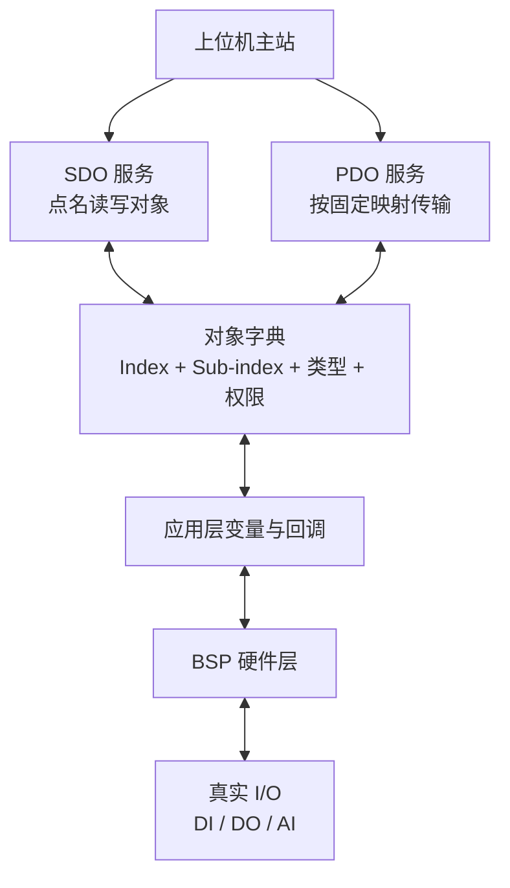
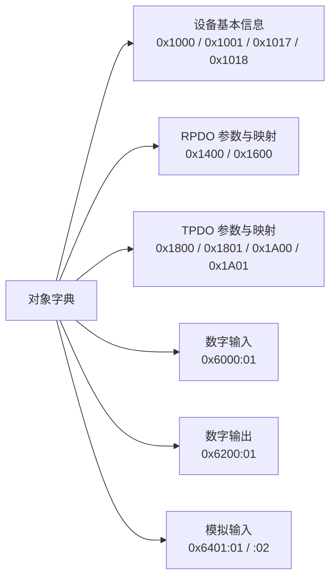
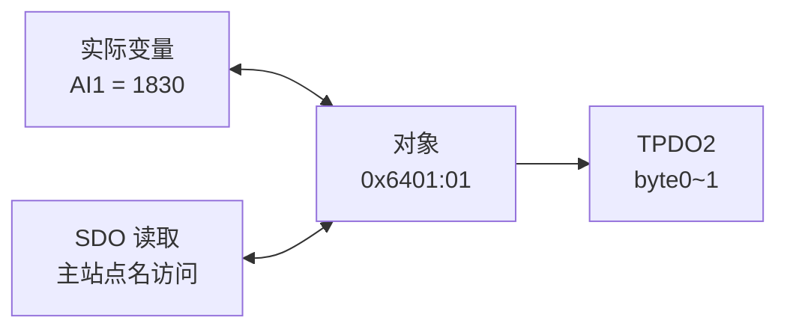

# CANopen CiA 301/401 对象字典草案

状态：阶段 0 待复核。已确认采用 4 DI / 4 DO / 2 AI；数字量按位打包，模拟量为 12 位 ADC 原始值。MCU 为 STM32F429IGT6。ro/rw 表示 SDO 访问权限，输入对象由应用更新。


### 1：设备与 I/O 对象

| 索引:子索引 | 名称 | 类型 | 访问 | 草案值或约束 |
|---|---|---|---|---|
| 0x1000:00 | Device Type | UNSIGNED32 | ro | 设备子协议 401；完整数值待 I/O 功能确认及规范复核 |
| 0x1001:00 | Error Register | UNSIGNED8 | ro | 无故障为 0，故障映射在阶段 9 完成 |
| 0x1017:00 | Producer Heartbeat Time | UNSIGNED16 | rw | 默认 1000 ms，0 关闭，范围 0..65535 |
| 0x1018:00 | Identity 最大子索引 | UNSIGNED8 | ro | 4 |
| 0x1018:01 | Vendor-ID | UNSIGNED32 | ro | 待确认；不得把 GitHub 用户名当作已分配 Vendor-ID |
| 0x1018:02 | Product code | UNSIGNED32 | ro | 待定义 |
| 0x1018:03 | Revision | UNSIGNED32 | ro | 待定义 |
| 0x1018:04 | Serial number | UNSIGNED32 | ro | 待定义 |
| 0x6000:00 | 数字输入字节数 | UNSIGNED8 | ro | 已确认 1 |
| 0x6000:01 | 数字输入 | UNSIGNED8 | ro | bit0..3 对应 DI1..4，bit4..7 为 0 |
| 0x6200:00 | 数字输出字节数 | UNSIGNED8 | ro | 已确认 1 |
| 0x6200:01 | 数字输出命令 | UNSIGNED8 | rw | 0..15，初值 0；经回调传递逻辑状态 |
| 0x6401:00 | 模拟输入数量 | UNSIGNED8 | ro | 已确认 2 |
| 0x6401:01 | 模拟输入 1 | UNSIGNED16 | ro | ADC 原始值 0..4095 |
| 0x6401:02 | 模拟输入 2 | UNSIGNED16 | ro | ADC 原始值 0..4095 |

0x6401 模拟输入已确定为 12 位 ADC 原始值 0..4095，使用 UNSIGNED16；EDS、SDO 和 PDO 必须使用同一类型，暂不转换为电压或温度工程量。

0x2000 仅预留厂商扩展索引，字段没有定义之前不实现、不放进正式 EDS。后续诊断对象另行制定。0x1017 在 Pre-operational/Operational 可写，写入后重新开始周期计时；Stopped 不提供 SDO 服务。


### 2：固定 PDO 对象

第一版固定 COB-ID、映射及传输类型，相关项只读。仅列出的 TPDO 定时参数允许在 Pre-operational 写入；不能把整个 RECORD 标成 rw。

| 索引:子索引 | 类型 | 访问 | 默认值或说明 |
|---|---|---|---|
| 0x1400:00 | UNSIGNED8 | ro | 2，RPDO1 最大子索引 |
| 0x1400:01 | UNSIGNED32 | ro | 0x200 + Node-ID |
| 0x1400:02 | UNSIGNED8 | ro | 255，异步 |
| 0x1600:00 | UNSIGNED8 | ro | 1，映射数量 |
| 0x1600:01 | UNSIGNED32 | ro | 0x62000108 |
| 0x1800:00 / 0x1801:00 | UNSIGNED8 | ro | 5，最大子索引；04 保留、不实现 |
| 0x1800:01 / 0x1801:01 | UNSIGNED32 | ro | 0x180 + Node-ID / 0x280 + Node-ID |
| 0x1800:02 / 0x1801:02 | UNSIGNED8 | ro | 255，异步事件触发 |
| 0x1800:03 / 0x1801:03 | UNSIGNED16 | rw | inhibit time；候选默认 0，单位 100 us |
| 0x1800:05 / 0x1801:05 | UNSIGNED16 | rw | event timer；默认 0 / 100，单位 ms，0 关闭周期触发 |
| 0x1A00:00 | UNSIGNED8 | ro | 1 |
| 0x1A00:01 | UNSIGNED32 | ro | 0x60000108 |
| 0x1A01:00 | UNSIGNED8 | ro | 2 |
| 0x1A01:01 | UNSIGNED32 | ro | 0x64010110 |
| 0x1A01:02 | UNSIGNED32 | ro | 0x64010210 |

TPDO1 输入变化触发；若启用 10 ms 抑制，对应 0x1800:03=100。抑制期间保留最新待发值，不能直接丢掉最终变化。TPDO2 默认每 100 ms 发送。PDO 只在 Operational 生效。


### 3：冻结前核对

- 核实 CiA 301/401 对象语义、Device Type、模拟量类型和 Identity 字段。
- 确认 I/O 数量、逻辑极性、模拟量单位和安全输出行为。
- 确保本表、PDO 表、SDO abort 表和 EDS 描述一致。
- 固定 PDO 限制必须写入 README；完成本子集不等于获得 CANopen 一致性认证。


# 对象字典总览图

## 一、对象字典在系统中的位置



对象字典不是独立存储器，而是 CANopen 对设备内部数据的标准化登记表。


## 二、Index 和 Sub-index

```text
Index      = 一组相关对象
Sub-index  = 组中的具体成员
```

#### 1. 设备基本信息组

```c
0x1000:00 = Device Type（设备类型）
0x1001:00 = Error Register（错误寄存器）
0x1017:00 = Producer Heartbeat Time（生产者心跳时间）

0x1018:00 = Identity 子索引数量（设备身份信息对象的子索引数量）
0x1018:01 = Vendor-ID（厂商 ID）
0x1018:02 = Product Code（产品代码）
0x1018:03 = Revision Number（版本号）
0x1018:04 = Serial Number（序列号）
```


#### 2. RPDO 参数与映射组

```c
0x1400:00 = RPDO1 参数最大子索引 
0x1400:01 = RPDO1 COB-ID
0x1400:02 = RPDO1 传输类型
0x1600:00 = RPDO1 映射数量
0x1600:01 = 映射 0x6200:01，长度 8 bit
    
0x1400:01、0x1400:02
    ↓
说明 RPDO1 如何通信

0x1600:00、0x1600:01
    ↓
说明 RPDO1 携带哪些对象数据
```

解析：

其中

```
0x1400 和 0x1600 也不是 CAN-ID ，它们是对象字典 Index
0x1400 = RPDO1 通信参数组
0x1600 = RPDO1 映射参数组
它们描述的是 RPDO1 的配置
```

`0x1400`：00  

```c
0x1400:00 = 2			// 表示这个参数组下面有两个有效成员： 0x1400:01 和 0x1400:02
```


0x1400: 01

```c
0x1400:01 = 0x201 		//表示：RPDO1 使用 CAN-ID 0x201
```


0x1400: 02

```c
0x1400:02 = 255			//表示 RPDO1 的传输类型。我们当前把它设计成异步接收：
    				   //这里的“异步”主要表示：RPDO 不按固定周期自动接收，而是主站什么时候发，STM32 什么时候处理。
    
//如果主站 1 秒不发送，STM32 就不会凭空产生新的 DO 命令，输出保持上一次状态。
对比一下：
- 同步传输：等待同步信号（SYNC）后，按规定时刻收发。
- 异步传输：不等待 SYNC，由事件或报文到达触发。
我们当前的 RPDO1 采用异步接收，是因为数字输出命令通常是“有变化才发送”，无需固定周期重复下发。
主站发送：CAN-ID 0x201，DATA[0] = 0x05
                 ↓
		STM32 接收 RPDO1
                 ↓
		更新 0x6200:01
                 ↓
		控制 DO1 和 DO3
就是stm32不会按规定时刻改变输出状态而改变led灯的状态，而是数字输出到stm32时，接受到了再执行改变led状态
STM32不会按固定时间自动改变 LED，而是收到新的输出命令后才执行更新。若没有新报文，LED保持当前状态
```

所以这一组是在回答： RPDO1 用哪个 CAN-ID？以什么方式接收？


0x1600 ：00

```c
0x1600:00 = 1		//表示 RPDO1 里面映射了 1 个对象。
```


0x1600:01

```c
//举例0x1600:01= 0x62000108
拆开：
0x6200 = Index
0x01   = Sub-index
0x08   = 长度 8 bit
含义是：
RPDO1 的数据来自/写入 0x6200:01
长度为 8 bit，也就是 1 字节
```


所以：

```c
0x1400：说明 RPDO1 怎么通信
0x1600：说明 RPDO1 传什么数据  //0x1600:01 ──描述“传什么”──> 0x6200:01 ──对应──> digital_outputs
```

总结：

```c
0x1600:01 本身不是数字输出数据，而是一条映射说明：
RPDO1 的数据来自对象 0x6200:01
长度为 8 bit，也就是 1 字节
真正的数据对象是：
0x6200:01 → digital_outputs
因此：
0x1600:01 = 0x62000108
可以读成：
RPDO1 收到的 1 字节数据，要写入 0x6200:01。
```


#### 3. TPDO1 参数与映射组

```c
0x1800:00 = TPDO1 参数最大子索引
0x1800:01 = TPDO1 COB-ID
0x1800:02 = TPDO1 传输类型
0x1800:03 = TPDO1 Inhibit Time
0x1800:05 = TPDO1 Event Timer
0x1A00:00 = TPDO1 映射数量
0x1A00:01 = 映射 0x6000:01，长度 8 bit
```


0x1800:00

```c
0x1800:00 = 5		// 表示这个参数组最多有这些子索引：： 0x1800:01 到 0x1800:05
```

0x1800:01

```c
0x1800:01 = 0x181 	//TPDO1 使用 CAN-ID 0x181
```

0x1800:02 

```c
0x1800:02 = 255		//表示传输类型。我们的设计是输入变化时发送，因此属于异步、事件触发思路。
255 是 CANopen 标准规定的一个传输类型编码，不是我们随便选的数字。
在 TPDO 的传输类型中：
0～240       与 SYNC 同步传输
254、255     异步传输
我们写成：
0x1800:02 = 255
其中十进制 255 就是十六进制：
255 = 0xFF
0xFF 表示：
该 TPDO 不由 SYNC 周期控制，而由设备内部事件触发发送。

本项目中，内部事件就是：
DI 状态发生变化 → 发送 TPDO1
所以 255 只是协议里的“异步传输类型编号”。
它不表示 255 毫秒，也不表示发送数据内容。
至于“什么事件触发发送”，还需要另外在程序中实现，例如：
uint8_t old_di;
uint8_t new_di;

new_di = read_di();

if (new_di != old_di)
{
    old_di = new_di;
    canopen_tpdo1_send(new_di);
}
实际流程是：
0x1800:02 = 255
    ↓
协议配置允许异步发送
    ↓
程序读取 PA0~PA3
    ↓
比较新旧 DI 状态
    ↓
发现变化
    ↓
发送 TPDO1
所以当前文档里的“输入变化时发送”属于设计意图，真正的变化检测和发送代码要到阶段 1/后续 PDO 实现阶段才会出现。 0x1800:03 的 Inhibit Time 还可以限制两次发送之间的最短间隔。
```

0x1800:03

```c
0x1800:03 = Inhibit Time	//表示发送抑制时间，防止输入变化太快时连续发送大量报文。
例如设置为 10 ms：
输入变化后发送一次
接下来 10 ms 内暂时不重复发送
```

0x1800:05

```c
0x1800:05 = Event Timer		//表示事件定时器。它用于周期触发 TPDO。
例如：
100 ms
表示每 100 ms 发送一次 TPDO1。
不过我们当前设计中：
TPDO1：主要由 DI 变化触发
TPDO2：主要每 100 ms 周期发送
```


0x1A00:00 

```c
0x1A00:00 = 1			//表示 TPDO1 映射了 1 个对象。
```

0x1A00:01

```c
//举例0x1A00:01= 0x60000108
拆开：
0x6000 = Index
0x01   = Sub-index
0x08   = 8 bit
	0x1A00:01
        ↓
    0x60000108
        ↓
┌────────┬──────────┬─────────┐
│ Index  │ Sub-index│  Length │
│ 6000   │    01    │  08 bit │
└────────┴──────────┴─────────┘
把对象字典中的 0x6000:01，按照 8 bit 的长度，映射到 TPDO1 中。
    
0x1A00:01 本身不是数字输出数据，而是一条映射说明：
RPDO1 的数据来自对象 0x60000108
长度为 8 bit，也就是 1 字节
真正的数据对象是：
0x6000:01 → digital_inputs → 放入 TPDO1 →  发送给主站
因此：
0x1600:01 = 0x62000108
可以读成：
TPDO1 收到的 1 字节数据，要写入 0x6000:01 →  发送给主站
```


#### 4. TPDO2 参数与映射组

```c
0x1801:00 = TPDO2 参数最大子索引
0x1801:01 = TPDO2 COB-ID
0x1801:02 = TPDO2 传输类型
0x1801:03 = TPDO2 Inhibit Time
0x1801:05 = TPDO2 Event Timer
0x1A01:00 = TPDO2 映射数量
0x1A01:01 = 映射 0x6401:01，长度 16 bit
0x1A01:02 = 映射 0x6401:02，长度 16 bit
```

`0x1801:00`

```
0x1801:00 = 5
```

表示 TPDO2 通信参数组最多使用这些子索引：

```
0x1801:01 到 0x1801:05
```


`0x1801:01`

```
0x1801:01 = 0x281
```

表示：

```
TPDO2 使用 CAN-ID 0x281
```

数据方向是：

```
STM32 → CAN总线 → 主站
```


`0x1801:02`

```
0x1801:02 = 255
```

表示 TPDO2 使用异步传输方式。它不等待 SYNC，而是由设备内部事件或定时条件触发发送。

本项目中，TPDO2 主要采用周期触发：

```
Event Timer = 100 ms
```

因此程序会大约每 100 ms 发送一次 TPDO2。


`0x1801:03`

```
0x1801:03 = Inhibit Time
```

表示两次 TPDO2 发送之间允许的最短间隔，用于防止短时间内重复发送过快。

例如设置为 10 ms：

```
发送一次 TPDO2
    ↓
10 ms 内暂时不再次发送
```


`0x1801:05`

```
0x1801:05 = Event Timer
```

表示事件定时器时间。

例如：

```
0x1801:05 = 100 ms
```

表示 TPDO2 每隔约 100 ms 发送一次。

TPDO2 中携带两路模拟输入：

```
AI1 → 0x6401:01
AI2 → 0x6401:02
```


`0x1A01:00`

```
0x1A01:00 = 2
```

表示 TPDO2 映射了两个对象：

```
0x1A01:01
0x1A01:02
```


`0x1A01:01`

```
0x1A01:01 = 0x64010110
```

拆开：

```
0x6401 = Index
0x01   = Sub-index
0x10   = 16 bit
```

含义是：

> TPDO2 的前 16 bit 数据来自对象 `0x6401:01`，也就是 AI1。

```
0x6401:01 → AI1 → 2字节
```


`0x1A01:02`

```
0x1A01:02 = 0x64010210
```

拆开：

```
0x6401 = Index
0x02   = Sub-index
0x10   = 16 bit
```

含义是：

> TPDO2 的后 16 bit 数据来自对象 `0x6401:02`，也就是 AI2。

```
0x6401:02 → AI2 → 2字节
```


TPDO2 完整关系

```
PC0 ADC → analog_input_1 → 0x6401:01
PC1 ADC → analog_input_2 → 0x6401:02
                              │
                              ▼
                    0x1A01:01、0x1A01:02
                              │
                              ▼
                           TPDO2
                       CAN-ID = 0x281
                           DLC = 4
```

发送示例：

```
AI1 = 1830 = 0x0726
AI2 = 2760 = 0x0AC8
```

按照 CANopen 小端顺序发送：

```
CAN-ID：0x281
DLC：4
DATA：26 07 C8 0A
```

其中：

```
DATA[0]、DATA[1] → AI1
DATA[2]、DATA[3] → AI2
```

`0x1A01:01` 和 `0x1A01:02` 只是映射说明，真正的数据对象仍然是：

```
0x6401:01 = AI1
0x6401:02 = AI2
```


总结：

`0x1A01:01` 和 `0x1A01:02` 本身不是模拟输入数据，而是两条映射说明：

```
0x1A01:01 = 0x64010110
```

可以读成：

```c
TPDO2 的前 16 bit 数据来自对象 0x6401:01
长度为 16 bit，也就是 2 字节
0x1A01:02 = 0x64010210
```

可以读成：

```c
TPDO2 的后 16 bit 数据来自对象 0x6401:02
长度为 16 bit，也就是 2 字节
```

真正的数据对象是：

```c
0x6401:01 → analog_input_1（AI1）→ 放入 TPDO2
0x6401:02 → analog_input_2（AI2）→ 放入 TPDO2
```

因此：

```c
0x1A01:01 = 0x64010110
0x1A01:02 = 0x64010210
```

可以整体理解为：

```c
TPDO2 携带两路模拟输入数据：

AI1 → DATA[0]、DATA[1]
AI2 → DATA[2]、DATA[3]
```

最终发送：

```c
CAN-ID = 0x281
DLC = 4
DATA = AI1低字节 AI1高字节 AI2低字节 AI2高字节
```

所以 `0x1A01:01`、`0x1A01:02` 只是告诉协议栈：

> TPDO2 要发送哪些对象，以及每个对象占多少位。


#### 5. 数字输入组

```c
0x6000:00 = 数字输入子索引数量，值为 1	
0x6000:01 = 4 路数字输入状态				//阶段1写c程序映射到这里 uint8_t digital_inputs;   // 0x6000:01
```

其中：

```c
bit0 → DI1 
bit1 → DI2 
bit2 → DI3 
bit3 → DI4 
bit4~bit7 → 保留，固定为 0
```


#### 6. 数字输出组

```c
0x6200:00 = 数字输出子索引数量，值为 1
0x6200:01 = 4 路数字输出命令			 //阶段1写c程序映射到这里 uint8_t digital_inputs;   //0x6200:01
```

其中：

```
bit0 → DO1 
bit1 → DO2 
bit2 → DO3 
bit3 → DO4 
bit4~bit7 → 保留，固定为 0
```


#### 7. 模拟输入组

```c
0x6401:00 = 模拟输入子索引数量，值为 2
0x6401:01 = AI1，UNSIGNED16，范围 0~4095			//阶段1写c程序映射到这里uint16_t analog_input_1;  // 0x6401:01，2字节
0x6401:02 = AI2，UNSIGNED16，范围 0~4095			//阶段1写c程序映射到这里uint16_t analog_input_2;  // 0x6401:02，2字节
0x6401:03 = 不存在，返回 Abort
    
对应关系：
0x6401:01 → AI1 → 2字节
0x6401:02 → AI2 → 2字节
所以 TPDO2 的数据长度是：
AI1（2字节） + AI2（2字节） = 4字节
DLC = 4
ADC 实际只有 0~4095，但用 UNSIGNED16 存储和传输，剩余高位补零。
```

这里最重要的是：

```
0x6401 = Index，模拟输入这一组
0x6401:00 = 组信息，说明有几个子索引
0x6401:01 = 组内第一个对象，AI1
0x6401:02 = 组内第二个对象，AI2
```

整体关系可以记成：

```
0x6401
├── 0x6401:00 → 数量 2
├── 0x6401:01 → AI1
└── 0x6401:02 → AI2
```

而 PDO 映射对象：

```
0x1A01:01 → 指向 0x6401:01
0x1A01:02 → 指向 0x6401:02
```

也就是说：

```
0x6401:01 是真正的 AI1 数据对象
0x1A01:01 是告诉 PDO“发送 AI1”的映射描述
```

这样就能把“对象分组”和“Index/Sub-index”对应起来了。


#### 8.映射关系

| PDO       | 方向         | 映射的数据组 | 对象                              |
| --------- | ------------ | ------------ | --------------------------------- |
| **RPDO1** | 主站 → STM32 | 数字输出组   | `0x6200:01`，1字节                |
| **TPDO1** | STM32 → 主站 | 数字输入组   | `0x6000:01`，1字节                |
| **TPDO2** | STM32 → 主站 | 模拟输入组   | `0x6401:01`、`0x6401:02`，共4字节 |

数据流可以记成：

```
主站 ──RPDO1──> 0x6200:01 ──> 4路数字输出
4路数字输入 ──> 0x6000:01 ──TPDO1──> 主站
AI1、AI2 ──> 0x6401:01/02 ──TPDO2──> 主站
```

其中：

- **RPDO1** 接收主站发来的 DO 命令；
- **TPDO1** 发送 DI 状态；
- **TPDO2** 发送 AI 采样值。


## 三、项目 2 的对象分组



## 四、真正承载 I/O 数据的对象

| 对象        | 含义         | 类型       | 权限 | 数据来源/去向    |
| ----------- | ------------ | ---------- | ---- | ---------------- |
| `0x6000:01` | 4 路数字输入 | UNSIGNED8  | ro   | PA0~PA3 → 应用层 |
| `0x6200:01` | 4 路数字输出 | UNSIGNED8  | rw   | 应用层 → PB0~PB3 |
| `0x6401:01` | 模拟输入 AI1 | UNSIGNED16 | ro   | PC0 ADC，0~4095  |
| `0x6401:02` | 模拟输入 AI2 | UNSIGNED16 | ro   | PC1 ADC，0~4095  |

按位打包：

```text
0x6000:01：bit0~bit3 = DI1~DI4，bit4~bit7 = 0
0x6200:01：bit0~bit3 = DO1~DO4，bit4~bit7 = 0
```


## 五、通信参数和映射对象

```text
0x1800:01 → TPDO1 的 COB-ID = 0x181
0x1A00:01 → TPDO1 映射 0x60000108

0x1400:01 → RPDO1 的 COB-ID = 0x201
0x1600:01 → RPDO1 映射 0x62000108

0x1801:01 → TPDO2 的 COB-ID = 0x281
0x1A01:01 → 映射 0x64010110
0x1A01:02 → 映射 0x64010210
```

映射值的结构：

```text
0x64010110
│    │  └── 0x10：16 bit
│    └───── 0x01：Sub-index
└────────── 0x6401：Index
```


## 六、三种访问关系



同一个 AI1 可以有两种访问方式：

```text
SDO：主站读取 0x6401:01，STM32 返回 1830
TPDO2：STM32 按固定映射，把 AI1 放入 byte0~1 周期发送
```


## 七、对象属性怎么读

```text
0x6401:01
├── Index：0x6401
├── Sub-index：0x01
├── 名称：AI1
├── DataType：UNSIGNED16
├── 长度：16 bit / 2 byte
├── AccessType：ro
├── DefaultValue：0
└── PDOMapping：允许映射到 TPDO2
```


## 八、项目 1 类比

```text
Modbus 输入寄存器/保持寄存器表
                ↓
CANopen 对象字典

寄存器地址
                ↓
Index + Sub-index

寄存器数据类型和数量
                ↓
DataType + 长度

寄存器是否可写
                ↓
AccessType

主站轮询读寄存器
                ↓
SDO 点名读取或 PDO 实时传输
```

核心记忆：

```c
对象字典：定义数据
Index：对象组
Sub-index：组内成员
DataType/长度：数据怎么解释
AccessType：能不能读写
PDO Mapping：对象放入 PDO 的哪些位
SDO/PDO：访问或传输对象数据
```


## 九：输入和输出总览

可以把对象字典想象成一张表：

```c
Index       Sub-index       含义
------------------------------------------------
0x6000      :00             有几个数字输入对象
0x6000      :01             数字输入数据

0x6200      :00             有几个数字输出对象
0x6200      :01             数字输出数据

0x6401      :00             有几个模拟输入对象
0x6401      :01             AI1
0x6401      :02             AI2
```

所以：

```
Index     = 哪一组
Sub-index = 这一组里的哪一个成员
```

例如：

```
0x6401:01
│    │  │
│    │  └── 第 1 个成员：AI1
│    └───── 模拟输入这一组
└────────── Index
```

------

 00` 经常是“这个组有几个成员”

你这里：

```
0x6401:00 = 2
0x6401:01 = AI1
0x6401:02 = AI2
```

可以理解成：

```
0x6401
│
├── :00 → “我下面有 2 个有效成员”
├── :01 → AI1
└── :02 → AI2
```

所以主站如果访问：

```
0x6401:03
```

设备就会发现：

```
:03 超出了当前对象实际存在的范围
```

于是返回 SDO Abort。
