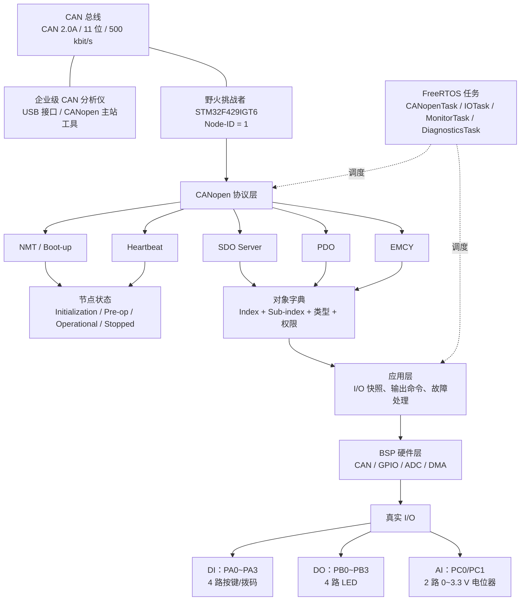
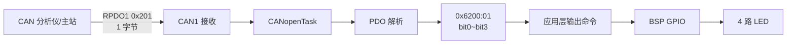
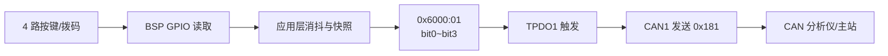

# 项目 2 系统总览图

## 分层关系

## 两条典型数据流

### CAN 主站控制数字输出

### 数字输入变化上报

## 关键边界

- 协议层只处理 CANopen 规则，不包含 HAL、FreeRTOS 和具体 GPIO。
- 对象字典定义数据；它本身不直接读按键或点亮 LED。
- BSP 只负责硬件访问，不解析 NMT、SDO、PDO。
- NMT 决定节点状态；PDO 只在 Operational 状态工作。
- SDO 适合参数读写，PDO 适合实时 I/O 数据交换。
- CAN 分析仪负责连接和观察；只有配合 CANopen 主站软件或脚本时，才执行完整主站操作。

# 名词解析：

| 模块            | 全称                | 核心作用              | 你可以先理解成                    |
| --------------- | ------------------- | --------------------- | --------------------------------- |
| ① NMT / Boot-up | Network Management  | 管理节点状态、启动    | **“你现在能不能干活”**            |
| ② Heartbeat     | 心跳                | 监视节点是否还活着    | **“你还活着吗？”**                |
| ③ SDO Server    | Service Data Object | 读写对象字典          | **“我要查看/修改你的参数”**       |
| ④ PDO           | Process Data Object | 快速传输实时 I/O 数据 | **“你的传感器/输出现在是多少？”** |
| ⑤ EMCY          | Emergency           | 紧急故障上报          | **“我出故障了！”**                |

① NMT / Boot-up：管理“节点现在是什么状态”

