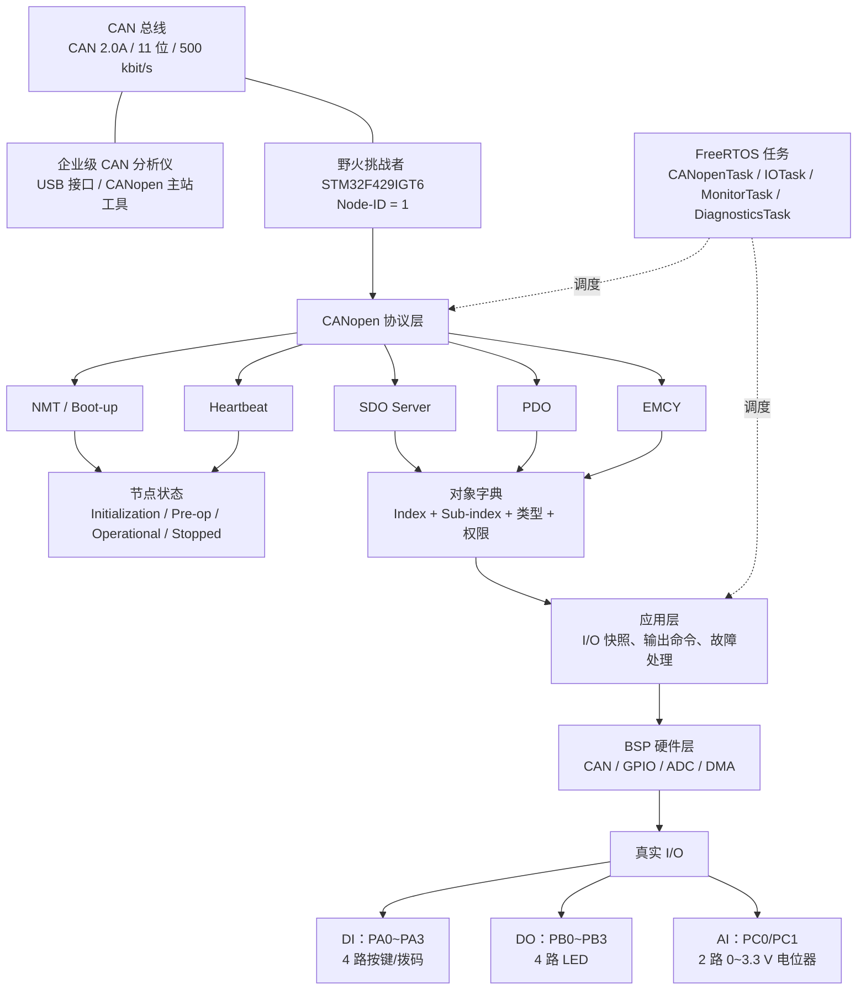

**阶段 0 已完成**。这一阶段主要是把项目边界、硬件方案、协议规则和后续开发依据先固定下来。

这些文件的作用如下：

- [项目2阶段进度.md](C:/Users/lolbo/CANopen_IO_Node/docs/项目2阶段进度.md)
  项目总进度表。记录每个阶段的目标、任务、完成情况和下一步。

- [阶段0需求与硬件清单.md](C:/Users/lolbo/CANopen_IO_Node/docs/阶段0需求与硬件清单.md)
  记录硬件基线、引脚、电气连接、I/O 方案、CAN 参数和阶段 0 验收条件。

- [对象字典草案.md](C:/Users/lolbo/CANopen_IO_Node/docs/对象字典草案.md)
  规定 CANopen 中每个对象的索引、子索引、数据类型、读写权限和默认值。例如：

  ```
  0x6000:01：数字输入
  0x6200:01：数字输出
  0x6401:01：模拟输入 1
  ```

- [COB-ID与PDO映射.md](C:/Users/lolbo/CANopen_IO_Node/docs/COB-ID与PDO映射.md)
  规定每类 CANopen 报文使用哪个 CAN ID，以及 PDO 里面装什么数据。

  ```
  TPDO1：0x181，发送数字输入
  RPDO1：0x201，接收数字输出
  TPDO2：0x281，发送两个模拟量
  ```

- [SDO-abort码表.md](C:/Users/lolbo/CANopen_IO_Node/docs/SDO-abort码表.md)
  规定 SDO 访问失败时返回什么错误码，比如对象不存在、只读、长度错误和值非法。

- [NMT与Heartbeat状态图.md](C:/Users/lolbo/CANopen_IO_Node/docs/NMT与Heartbeat状态图.md)
  规定节点的四种状态，以及 NMT 命令和 Heartbeat 的行为。

  ```
  Initialization
  Pre-operational
  Operational
  Stopped
  ```

- [EDS草案.md](C:/Users/lolbo/CANopen_IO_Node/docs/EDS草案.md)
  设备描述文件的设计草案。以后 CANopen 工具可以通过 EDS 了解节点支持哪些对象、PDO 和通信参数。

- `CMakeLists.txt`
  PC 端工程的总构建入口，告诉 CMake 使用 C 语言、C11 标准，并加载测试目录。

- `tests/CMakeLists.txt`
  PC 测试目录的构建入口。阶段 1 开始后，在这里加入协议测试程序和 CTest 测试项。

- `README.md`
  项目说明和 GitHub 使用说明，让别人知道项目做什么、目录怎么组织、如何构建和提交。

- `.gitignore`
  告诉 Git 忽略编译生成物、临时文件和 IDE 配置，避免把无关文件提交到 GitHub。

简单说，阶段 0 的这些文件共同回答了：

```
项目做什么？
硬件怎么接？
CAN 报文怎么分配？
对象怎么访问？
错误怎么返回？
节点状态怎么变化？
PC 工程怎么构建？
以后如何提交到 GitHub？
```

阶段 1 就会根据这些文档开始写第一批纯 C 协议代码。


# 

# 项目 2 系统总览图

## 一：分层关系



## 二：两条典型数据流


### 1：CAN 主站控制数字输出


### 2：数字输入变化上报


## 三：关键边界

- 协议层只处理 CANopen 规则，不包含 HAL、FreeRTOS 和具体 GPIO。
- 对象字典定义数据；它本身不直接读按键或点亮 LED。
- BSP 只负责硬件访问，不解析 NMT、SDO、PDO。
- NMT 决定节点状态；PDO 只在 Operational 状态工作。
- SDO 适合参数读写，PDO 适合实时 I/O 数据交换。
- CAN 分析仪负责连接和观察；只有配合 CANopen 主站软件或脚本时，才执行完整主站操作。


# 名词解析

| 模块            | 全称                | 核心作用              | 你可以先理解成                    |
| --------------- | ------------------- | --------------------- | --------------------------------- |
| ① NMT / Boot-up | Network Management  | 管理节点状态、启动    | **“你现在能不能干活”**            |
| ② Heartbeat     | 心跳                | 监视节点是否还活着    | **“你还活着吗？”**                |
| ③ SDO Server    | Service Data Object | 读写对象字典          | **“我要查看/修改你的参数”**       |
| ④ PDO           | Process Data Object | 快速传输实时 I/O 数据 | **“你的传感器/输出现在是多少？”** |
| ⑤ EMCY          | Emergency           | 紧急故障上报          | **“我出故障了！”**                |


### 1：NMT （Network Management）：管理“节点现在是什么状态”

它主要解决一个问题：

CANopen 的 NMT（网络管理）状态机，它是 CANopen 协议栈的“大脑”，决定了节点在不同阶段能做什么、不能做什么。这个 CANopen 节点现在处于什么状态？能不能正常进行 PDO 通信？

四大状态详解

Initialization（初始化）

Pre-operational（预操作）

 Operational（操作状态）

 Stopped（停止状态）

真正由 NMT 管理的主要是：Pre-operational（预操作）， Operational（操作状态）， Stopped（停止状态） 这三个状态


#### 1：Initialization —— 初始化状态

STM32 刚上电，现在正在把 CANopen 节点“组装起来”。

比如你的 STM32F429 上电：

```c
STM32 Reset
    ↓
SystemInit()
    ↓
GPIO初始化
    ↓
CAN初始化
    ↓
CANopen协议栈初始化
    ↓
Object Dictionary初始化
    ↓
PDO初始化
    ↓
SDO初始化
    ↓
Heartbeat初始化
    ↓
NMT初始化
```

这个阶段还不能说：我已经是一个正常工作的 CANopen 节点了，因为各种资源还没有准备好。


#### 2：Boot-up 是什么？

STM32 上电以后，CANopen 协议栈初始化完成，会发送一个 **Boot-up 报文**：

```c
CAN ID: 0x700 + Node_ID
Data:   00
```

假设你的 STM32：Node ID = 0x01

那么启动完成后：ID   = 0x701   DATA = 00

CAN 分析仪看到：701    00

意思就是：节点 1：我已经启动完成了。


#### 3：Pre-operational —— 预操作状态

这个状态非常重要：节点已经准备好了，但是还没有进入正常的过程数据工作状态

也就是：

```c
“设备已经上线”
        ↓
“可以配置”
        ↓
“但还没有正式进行实时 I/O 工作”
```


在Pre-operational阶段，SDO（Service Data Object，中文是**服务数据对象**）可以工作，PDO（Process Data Object，中文是**过程数据对象**）还不可以跑，

因为正常的 PDO 过程数据通信在 Pre-operational 状态下不会像 Operational 那样正常运行。

所以你可以简单理解：

```c
Pre-operational

SDO       ✅
NMT       ✅
Heartbeat ✅
PDO       ❌（正常过程数据通信尚未启动）
```

因此典型启动过程是：

```c
STM32上电
   ↓
Pre-operational
   ↓
主站通过SDO配置
   ↓
配置完成
   ↓
主站发送NMT Start
   ↓
Operational
```

这就是为什么叫：Pre-operational = 预操作，“预备好了，但是还没正式工作。”


#### 4：Operational —— 操作状态

这个就是：

> **正式干活。**

对于你这个项目，进入 Operational 后：

```
4 DI
4 DO
2 AI
```

这些过程数据开始正常进行 PDO 通信。

比如：

```
STM32采集ADC
       ↓
AI1 = 2350
AI2 = 1870
       ↓
PDO
       ↓
CAN总线
       ↓
CAN分析仪
```

同时数字量：

```
DI = 1010
DO = 0101
```

也可以通过 PDO 交换。

------

Operational 的核心

你可以直接记：

```
Operational = 正常生产运行状态
```

这时候：

PDO

```
✅ 正常工作
```

SDO

```
✅ 仍然可以使用
```

Heartbeat

```
✅ 正常发送
```

EMCY

```
✅ 可以发送
```

所以它不是：

> “只能 PDO。”

而是：

> 整个 CANopen 节点进入正常运行状态，PDO 开始承担主要的实时过程数据通信。


#### 5：Stopped —— 停止状态

这个状态可以理解成：

> **节点还在线，但是停止正常的应用层工作。**

比如：

```
Operational
      ↓
NMT Stop
      ↓
Stopped
```

主站说：

> **Node 1，先别干活了。**

STM32 进入：

```
Stopped
```

------

Stopped 和掉线不一样

这个非常重要。

Stopped：

```
STM32还活着
       ↓
CANopen节点还存在
       ↓
只是停止正常操作
```

而掉电：

```
STM32没了
       ↓
CAN也没了
       ↓
什么都不发
```

所以：

> **Stopped ≠ 节点离线。**
>
> 

| 状态            | STM32在干什么         | SDO  | PDO  | Heartbeat |
| --------------- | --------------------- | ---- | ---- | --------- |
| Initialization  | 正在启动 CANopen      | ❌    | ❌    | ❌         |
| Pre-operational | 已上线，等待配置/启动 | ✅    | ❌*   | ✅         |
| Operational     | 正常运行              | ✅    | ✅    | ✅         |
| Stopped         | 停止正常运行          | ❌    | ❌    | ✅         |

谁来切换状态？ 就是NMT：Network Management


### 2： Heartbeat：确认“节点还活着”

这个非常好理解。假设 STM32 Node ID：01

Heartbeat 默认使用：0x700 + Node_ID

所以：0x701

STM32 将周期性发送：

```c
701    05
701    05
701    05
701    05
...
```

这里的：05 不是随机数 ，而是节点当前的 NMT 状态。

例如：

```c
00 = Boot-up
04 = Stopped
05 = Operational
7F = Pre-operational
```

所以： 701    05

就是：Node 1说我还活着，而且现在处于 Operational。


### 3：**SDO**：Service Data Object，中文是**服务数据对象**

用于读写对象字典，适合配置参数和调试。（主站拿着“地址”去对象字典里读/写一个具体对象。）


#### 1：先把对象字典想象成 STM32 的“数据表”

你的 STM32 里面有：

```
对象字典

地址          数据
────────────────────────
0x6000:01     4路DI状态
0x6200:01     4路DO命令
0x6401:01     AI1
0x6401:02     AI2
0x1017:00     Heartbeat周期
```

例如：

```
0x6401:01 = 1830
```

就是：

> AI1 当前 ADC 值是 1830。

------


#### 2：SDO：像“查表”

假设 PC 主站想知道：

> “STM32 的 AI1 现在是多少？”

它就**点名**：

```
我要读：
0x6401:01
```

STM32 去对象字典找：

```
0x6401:01
      ↓
AI1
      ↓
1830
```

然后返回：

```
1830
```

所以：

```
主站
 │
 │ “给我 0x6401:01”
 ↓
STM32
 │
 │ 查对象字典
 ↓
0x6401:01 = 1830
 │
 ↓
返回 1830
```

这就是 **SDO Read**。

------


#### 3： SDO 也可以“改表”

例如你之前定义：

```
0x1017:00
Producer Heartbeat Time
```

默认：

```
1000 ms
```

现在 PC 想改成：

```
500 ms
```

就发：

```
写入：

0x1017:00 = 500
```

STM32：

```
SDO Server
    ↓
找到 0x1017:00
    ↓
检查权限 rw
    ↓
写入 500
```

所以：

> **SDO = 我明确告诉 STM32：“我要访问对象字典里的这个地址。”**

这就是你说的：

> **“点名访问某个对象”**

这个比喻非常准确。


#### 4：补充

这个理解是正确的，而且比喻很准确。

可以再补充两点：

1. `0x6401:01` 是对象地址，`1830` 是该对象当前保存的值。
2. SDO 不只是“查表”，还会执行完整检查：

```
对象是否存在
子索引是否存在
是否允许读/写
数据长度是否正确
数据值是否合法
当前节点状态是否允许访问
```

所以完整过程是：

```
主站点名访问 0x6401:01
        ↓
SDO Server 接收请求
        ↓
对象字典查找对象
        ↓
检查权限、类型、长度和状态
        ↓
读取或修改对象变量
        ↓
返回数据或 Abort 错误码
```

你的两个例子都成立：

```
SDO Read：
读取 0x6401:01 → 返回 AI1 当前值 1830

SDO Write：
写入 0x1017:00 = 500 → 修改 Heartbeat 周期为 500 ms
```

不过要注意，SDO 写入 `0x1017:00` 只是修改运行时配置；如果希望断电后仍然保持 500 ms，还需要额外写入 Flash、EEPROM 或 W25Q256。

可以把 SDO 最终记成：

```
SDO = 主站点名访问对象字典中的某个对象
```

这个理解已经足够支撑我们开始学习 SDO 报文格式了。


### 4：**PDO**：Process Data Object，中文是**过程数据对象**

用于实时传输过程数据，例如数字输入、数字输出和模拟量。（双方提前约好“这一帧的每几个字节是什么”，然后直接传数据。）

“过程数据”就是工业设备运行过程中不断变化的数据。

比如：

```c
DI
AI
DO
电机转速
温度
位置
压力
状态
```

这些东西会不断变化。

所以 PDO 就特别适合：

```c
实时数据
周期数据
事件数据
I/O数据
```


项目 1 中，主站通常要不断轮询：

```
主站发送 0x04
设备返回输入寄存器
```

项目 2 中，可以提前约定好：

```
TPDO1 的 ID 是 0x181
数据第 0 字节就是 4 路数字输入
```

这样 STM32 检测到输入变化后，直接发送：

这样 STM32 检测到输入变化后，直接发送：

```
CAN ID：0x181
数据：0x05
```

不需要再带：

```
Index
Sub-index
功能码
寄存器数量
```

这就是 PDO 速度更快、数据开销更小的原因。


#### 1：TPDO

`T` 是 Transmit，表示节点发送。

项目 2 中：

```
TPDO1：STM32 发送 4 路数字输入
TPDO2：STM32 发送 2 路模拟输入
```

对应项目 1：

```
设备把输入寄存器内容返回给主站
```


#### 2：RPDO

`R` 是 Receive，表示节点接收。

项目 2 中：

```
RPDO1：主站发送 4 路数字输出命令
```

收到：

```
ID：0x201
数据：0x05
```

STM32 就控制：

```
DO1、DO3 点亮
DO2、DO4 熄灭
```

对应项目 1：

```
主站通过 0x06 或 0x10 写保持寄存器
```


#### 3：引入项目1来类比


项目 1：Modbus RTU

主站是主动方：

```
主站
 │
 │  0x04：把输入寄存器 0~3 给我
 ▼
STM32
 │
 │  返回：input[0] input[1] input[2] input[3]
 ▼
主站
```

所以 STM32 即使检测到 DI0 突然发生变化：

```
DI0：0 → 1
```

它也**不会自动告诉主站**。

必须等主站下一次：

```
0x04 读取输入寄存器
```

STM32 才把最新状态返回。


项目 2：CANopen PDO

则可以提前约定：

```
TPDO1
CAN ID = 0x181

Byte 0：
bit0 = DI0
bit1 = DI1
bit2 = DI2
bit3 = DI3
```

于是 STM32 检测到：

```
DI0：0 → 1
```

如果 TPDO1 配置为**事件触发/变化触发**，STM32 可以主动发送：

```
CAN ID：0x181
Data：05
```

这里的 `0x05`：

```
0000 0101
││││ │││└─ DI0 = 1
││││ ││└── DI1 = 0
││││ │└─── DI2 = 1
││││ └──── DI3 = 0
```

主站甚至**没有先问它**。

------

所以可以把它记成一句话

**Modbus：**

> “主站问，设备答。”

**CANopen PDO：**

> “数据有变化/到了发送时机，设备主动推送。”

而这就是为什么 PDO 叫 **Process Data Object（过程数据对象）**。

因为它特别适合这种**实时过程量**：

```
DI状态
AI采样值
电机转速
温度
位置
控制状态
```

这些数据需要频繁交换，没必要每次都通过 SDO 那种“我要读哪个对象”的方式来访问。

------

你现在还差最后一个非常重要的概念：

```
PDO到底是怎么知道
“Byte 0 放 DI，
Byte 1~2 放 AI0，
Byte 3~4 放 AI1”
```

这就是 **PDO Mapping（PDO 映射）**。

而且它和你前面刚学的 **对象字典**是直接连起来的：

```
对象字典
   ↓
PDO Mapping
   ↓
规定 PDO 每个字节装什么
   ↓
CAN 报文
```

**你把 PDO Mapping 搞明白之后，CANopen 的 PDO 基本就真正通了。**


#### 4：补充

这里的 **Transmit/Receive 是以 CANopen 节点，也就是我们的 STM32 从站设备为主体** 来说的。

| 名称 | 以 STM32 节点为主体      | 实际方向     |
| ---- | ------------------------ | ------------ |
| TPDO | STM32 Transmit，节点发送 | STM32 → 主站 |
| RPDO | STM32 Receive，节点接收  | 主站 → STM32 |

所以：

```
TPDO1：
STM32 发送数字输入状态
主站接收

TPDO2：
STM32 发送两个 ADC 值
主站接收

RPDO1：
STM32 接收主站发来的输出命令
主站发送，STM32 接收
```

例如：

```
TPDO1，ID = 0x181，数据 = 0x05
```

表示：

```
STM32 发出 0x05
主站收到 0x05
```

而：

```
RPDO1，ID = 0x201，数据 = 0x05
```

表示：

```
主站发出 0x05
STM32 收到 0x05
```

项目 1 中虽然叫“主站写保持寄存器”，但本质也是：

```
主站发送 Modbus 写请求
设备接收并修改保持寄存器
```

对应关系是：

```
项目 1：主站写保持寄存器
项目 2：主站发送 RPDO，STM32 接收

项目 1：设备返回输入寄存器
项目 2：STM32 发送 TPDO，主站接收
```

最简单的记忆方式：

```
T/R 都站在 STM32 节点角度看：

TPDO = 节点发出去
RPDO = 节点收进来
```


### 5：EMCY （**Emergency Object**），中文叫**紧急报文**

它用于设备发生严重故障时，STM32 主动向 CAN 总线报告问题。可以类比项目 1 的“诊断寄存器 + 故障状态打印”，但 EMCY 更强调**故障发生时立即主动上报**。


#### 1、EMCY 解决什么问题

假设 STM32 出现：

- CAN Bus-off
- 接收 FIFO 溢出
- ADC 异常
- 输出驱动故障
- 通信超时
- 看门狗复位

如果只等主站通过 SDO 查询，主站可能很久以后才发现。

EMCY 的方式是：

```
故障发生
    ↓
STM32 立即发送 EMCY
    ↓
主站马上知道故障
```


#### 2、EMCY 的 COB-ID

项目 2 使用：

```
EMCY COB-ID = 0x080 + Node-ID
```

我们的节点：

```
Node-ID = 1
EMCY COB-ID = 0x081
```

方向是：

```
STM32 → CAN 总线 → CAN 分析仪/主站
```

EMCY 是节点主动发送的，所以它不是 RPDO，也不是 SDO 响应。


#### 3、EMCY 报文格式

EMCY 固定为 8 字节：

```
Byte 0~1：错误码 Error Code
Byte 2：Error Register
Byte 3~7：厂商自定义信息
```

例如：

```
ID：0x081
数据：00 81 01 01 00 00 00 00
```

可以解释为：

```
00 81：错误码
01：Error Register
01 00 00 00 00：厂商信息
```

错误码具体数值要由我们的故障分类表定义，不能随便写成实际标准含义。


#### 4、和项目 1 的类比

项目 1 中可能是：

```
input[8]：复位原因
input[9]：健康故障次数
input[10]：SD/日志错误次数
input[11]：当前健康状态
```

主站需要主动读取这些输入寄存器。

项目 2 中：

```
故障发生
    ↓
STM32 发送 EMCY
    ↓
主站立即收到故障通知
```

同时也可以把累计故障状态放入对象字典：

```
0x1001：Error Register
```

因此：

```
EMCY：主动发出故障事件
0x1001：保存当前故障状态，供主站查询
```


#### 5、Error Register 是什么

`Error Register` 是一个 8 位故障汇总寄存器，常见含义包括：

```
bit0：一般错误
bit1：电流
bit2：电压
bit3：温度
bit4：通信错误
bit5：设备配置错误
bit6：保留
bit7：厂商自定义
```

我们的第一版可以先定义：

```
bit0：一般故障
bit4：通信故障
bit5：设备内部故障
```

但最终位定义要在阶段 9 的故障设计中冻结。


#### 6、EMCY 与 SDO 的关系

可以把它们这样区分：

```
SDO：
主站主动问：“你的某个对象是多少？”

EMCY：
STM32 主动说：“我刚刚发生了故障！”
```

例如：

```
主站通过 SDO 读取 0x1001
```

得到当前 Error Register。

而故障刚发生时：

```
STM32 发送 EMCY，ID = 0x081
```

主站收到后，可以继续通过 SDO 查询：

```
0x1001 Error Register
其他诊断对象
```


#### 7、EMCY 与 Heartbeat 的区别

```
Heartbeat：
我还活着，当前处于什么状态

EMCY：
我发生了什么故障
```

例如：

```
Heartbeat：0x701，数据 0x05
含义：节点处于 Operational

EMCY：0x081，数据包含错误码
含义：节点报告故障
```


#### 8、项目 2 中的实际流程

```
CAN 接收 FIFO 溢出
        ↓
BSP 记录错误
        ↓
DiagnosticsTask 更新 Error Register
        ↓
协议层发送 EMCY（0x081）
        ↓
主站收到故障报文
        ↓
必要时停止输出，进入安全状态
```

需要注意：

- EMCY 发送一次还是重复发送，要由故障策略定义
- 故障恢复后是否发送“错误清除”报文，需要统一设计
- 故障时输出是否全部关闭，要在可靠性阶段明确
- EMCY 报文中的厂商信息要定义用途

当前阶段只需要先理解：

```
EMCY = 节点主动发送的紧急故障报文
```

项目 2 中它主要负责把 CAN、I/O、通信和系统故障及时告诉主站。


# SDO和PDO区别：

#### 1：

SDO 和 PDO 都是 CANopen 的通信方式，但用途不同。

| 对比     | SDO                        | PDO                              |
| -------- | -------------------------- | -------------------------------- |
| 全称     | 服务数据对象               | 过程数据对象                     |
| 主要用途 | 配置、查询对象字典         | 实时传输 I/O 数据                |
| 访问方式 | 点名访问 `Index:Sub-index` | 使用预先固定的 COB-ID 和数据格式 |
| 通信方式 | 主站请求，节点响应         | 节点或主站直接发送               |
| 数据效率 | 报文开销较大               | 报文简洁，速度快                 |
| 典型场景 | 修改心跳周期、读取参数     | 上报按键、控制 LED、发送 ADC     |

类比项目 1：

```
对象字典       ≈ Modbus 寄存器表
SDO            ≈ Modbus 读写寄存器请求
PDO            ≈ 约定好的实时数据帧
```

例如读取 AI1：

```
SDO：
主站点名读取 0x6401:01
节点查找对象并返回 ADC 值
```

例如发送数字输入：

```
TPDO1：
STM32 直接发送 ID=0x181
数据第 0 字节就是 4 路 DI 状态
```

例如控制 LED：

```
RPDO1：
主站发送 ID=0x201
数据 0x05
STM32 收到后控制 DO1、DO3 点亮
```

方向上始终以 **STM32 节点** 为主体：

```
TPDO = 节点发送给主站
RPDO = 节点接收主站数据
```

最重要的记忆：

```
SDO：我要访问哪个对象？
PDO：这帧数据按约定直接表示什么？
```

另外，SDO 和 PDO 本身不负责永久存储。数据实际保存在对象字典对应的变量中；SDO/PDO 只是访问和传输这些数据的方式。


#### 2：

**两种方式都可以访问采集数据**，但使用场景不同。

以 AI1 为例：

```
对象字典：
0x6401:01 = AI1 当前 ADC 值
```

通过 SDO 访问：

```
主站请求读取 0x6401:01
STM32 查找对象并返回 AI1 值
```

这是“点名查询”，适合调试、配置和偶尔读取。

通过 PDO 访问：

```
STM32 把 AI1 映射到 TPDO2
周期性发送或数据变化时发送
```

这是“实时上报”，适合持续监控。

区别可以这样记：

```
SDO：主站主动问，按对象地址读取
PDO：节点主动发，按固定映射传输
```

项目 2 中可以这样设计：

```
SDO 读取：
0x6401:01 → AI1
0x6401:02 → AI2

TPDO2：
ID = 0x281
byte0~1 = AI1
byte2~3 = AI2
```

同一个数据可以通过两种方式访问，但报文格式、触发方式和用途不同。


# 项目1和项目2的迁移和对比

## 项目 1

项目 1 按寄存器类型区分：

```
输入寄存器：
只能读，保存 ADC、温度、报警、诊断等采集结果

保持寄存器：
可以读，也可以写，保存采样周期、报警阈值、日志开关等配置
```

对应功能码：

```
0x04：读输入寄存器
0x03：读保持寄存器
0x06：写单个保持寄存器
0x10：写多个保持寄存器
```

所以项目 1 不是“只有一个读写操作”，而是不同寄存器使用不同功能码。


## 项目 2

项目 2 用对象字典描述每个对象：

```c#
Index		//Index 是对象的主索引，相当于项目 1 中的寄存器地址。
它通常表示一组相关数据，例如：
0x6000：数字输入组
0x6200：数字输出组
0x6401：模拟输入组
    
Sub-index	//Sub-index 是组内的具体成员编号。
Sub-index 是组内的具体成员编号。
0x6401:01：模拟输入 1
0x6401:02：模拟输入 2
可以理解为：
Index     = 表格编号
Sub-index = 表格中的第几项
    
    
数据类型				//表示这个对象按照什么格式保存和解释。

例如：
UNSIGNED8  ：无符号 8 位整数
UNSIGNED16 ：无符号 16 位整数
UNSIGNED32 ：无符号 32 位整数
INTEGER16   ：有符号 16 位整数
项目中的例子：
0x6000:01：UNSIGNED8
0x6200:01：UNSIGNED8
0x6401:01：UNSIGNED16
0x1017:00：UNSIGNED16
数据类型会影响：
- 占用多少字节
- 数值范围
- SDO 如何读写
- PDO 如何映射
- EDS 如何描述
    
长度						//表示这个对象占多少位或多少字节。
UNSIGNED8  = 8 bit  = 1 byte
UNSIGNED16 = 16 bit = 2 byte
UNSIGNED32 = 32 bit = 4 byte
例如：
0x6401:01 = UNSIGNED16
所以 AI1 占 2 个字节。
TPDO2 发送两个模拟量：
AI1：2 字节
AI2：2 字节
总共：4 字节
长度错误时，SDO 应返回错误，而不能只写入一部分数据。
    
访问权限				//访问权限表示主站能否读取或写入这个对象。
ro：read only，只读
rw：read/write，可读可写
wo：write only，只写
项目中的例子：
0x6000:01：ro
数字输入由硬件产生，主站只能读取，不能写入。
0x6200:01：rw
数字输出可以被主站写入，也可以读取当前命令值。
0x6401:01：ro
ADC 值由 STM32 采集，主站不能直接写入。
0x1017:00：rw
Heartbeat 周期可以由主站读取和修改。
    
//总览
合起来看
Index       = 0x6401
Sub-index   = 0x01
数据类型     = UNSIGNED16
长度         = 16 bit / 2 byte
访问权限     = ro
完整含义是：
在对象字典的 0x6401:01 中，保存一个只能读取的 16 位无符号数，占 2 个字节，它表示 AI1 的 ADC 值。
```

访问权限可以是：

```
ro：只读
rw：可读写
wo：只写
```

例如：

```
0x6000:01：数字输入，ro
0x6200:01：数字输出，rw
0x6401:01：模拟输入，ro
0x1017:00：Heartbeat 周期，rw
```


## SDO 和 PDO 的关系

这里不能理解成“项目 2 有两套读写操作，SDO 一套、PDO 一套”。更准确的是：

```
SDO：按对象地址访问，支持读和写
PDO：按固定映射传输实时数据
```

例如 AI1：

```
0x6401:01 = AI1
```

通过 SDO：

```
主站点名读取 0x6401:01
```

通过 PDO：

```
STM32 把 0x6401:01 映射到 TPDO2
然后周期发送给主站
```

它们访问的是同一个对象，但方式不同。

## 最终类比

```
项目 1：
输入寄存器      ≈ CANopen 的 ro 对象
保持寄存器      ≈ CANopen 的 rw 对象
Modbus 功能码   ≈ CANopen 的 SDO 访问

项目 2：
对象字典        = 定义数据
SDO             = 点名读写对象
PDO             = 实时传输已映射对象
```

所以你的理解可以修正为：

> 项目 1 用不同类型的寄存器区分采集数据和配置数据；项目 2 用对象字典中的访问权限区分只读和可读写，再用 SDO 或 PDO 访问/传输这些对象。
