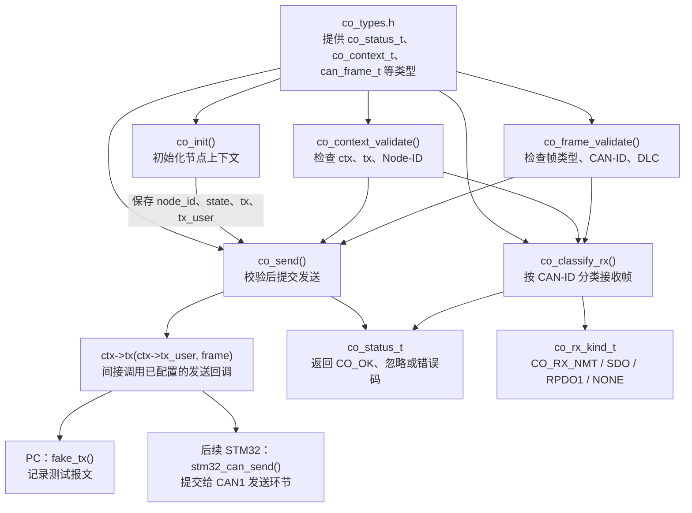

# 阶段 1：`co_core.c` 函数实现总览

## 一、总览图：四个公开/内部函数如何配合



### 二、按实际调用顺序理解

```text
1. 创建 co_context_t 类型的节点变量
2. 调用 co_init()，保存节点号、初始状态、发送函数地址和辅助数据地址
3. 创建 can_frame_t 类型的报文变量，并填写 id、dlc、data
4. 调用 co_send(&ctx, &frame)
5. co_send() 先调用 co_context_validate(ctx)
6. 上下文通过后，再调用 co_frame_validate(frame)
7. 报文通过后，执行 ctx->tx(ctx->tx_user, frame)
8. 根据初始化时保存的函数地址，实际调用 fake_tx() 或 STM32 发送适配函数
```

`co_classify_rx()` 是另一条接收路径：它同样先检查上下文和报文，然后根据 CAN-ID 判断报文属于 NMT、SDO、RPDO1，或者返回 `CO_IGNORED`。它只负责分类，不执行 NMT 命令、不访问对象字典、不修改 DO，也不发送响应。


### 三、这个 `.c` 文件中最容易混淆的三种结果

| 内容 | 由谁产生 | 表示什么 |
|---|---|---|
| `co_status_t` 函数返回值 | `co_init()`、`co_send()`、`co_classify_rx()` 等 | 本次函数操作成功、忽略或出错 |
| `status` 局部变量 | `co_send()`、`co_classify_rx()` | 暂存检查函数返回值，随后继续判断 |
| `kind` 输出参数 | `co_classify_rx()` 写入 | 接收帧的类别，例如 `CO_RX_SDO` |

本文件的学习重点是指针参数和调用链：调用方传入 `&ctx`、`&frame`，函数内部用 `ctx->成员`、`frame->成员` 访问原变量；`co_send()` 通过 `ctx->tx` 间接调用已保存的发送函数。阶段 1 只验证纯 C 基础流程，真实 CAN 发送属于后续硬件阶段。

---


# 解析

## 1：第一个函数

```c
/**
 * 用途：检查已初始化的节点上下文（仅本文件内部使用）。
 * 参数：ctx 为节点上下文，只读取，不修改。
 * 返回：CO_OK 表示有效；空指针或缺少回调返回参数错误，节点号越界返回节点错误。
 */
static co_status_t co_context_validate(const co_context_t *ctx)
{
    if (ctx == NULL || ctx->tx == NULL) { /* 短路求值：ctx 为空时不会继续读取 ctx->tx */
        return CO_ERR_ARGUMENT;
    }
    if (ctx->node_id == 0u || ctx->node_id > CO_NODE_ID_MAX) { /* 拒绝广播编号和超出范围的本机编号 */
        return CO_ERR_NODE_ID;
    }
    return CO_OK; /* 本次操作成功 */
}
```

这个函数的作用只有一个：

> **检查节点上下文 `ctx` 是否可以正常使用。**

它不初始化节点，也不发送报文，只负责检查。


### 1. `static`

```
static co_status_t co_context_validate(...)
```

这里的 `static` 表示：

> 这个函数只允许在当前 `co_core.c` 文件内部使用。

其他 `.c` 文件不能直接调用它。

因为它只是 `co_send()` 和 `co_classify_rx()` 内部使用的辅助检查函数，所以不需要对外公开。

------


### 2. 返回值类型：`co_status_t`

```c
co_status_t

typedef enum {
    CO_OK = 0, /* 操作成功；分类接口中仅表示分类成功 */
    CO_IGNORED, /* 帧与本节点无关，正常忽略 */
    CO_ERR_ARGUMENT, /* 指针或必要回调无效 */
    CO_ERR_NODE_ID, /* 节点号不在 1~127 内 */
    CO_ERR_CAN_ID, /* CAN-ID 超过 11 位范围 */
    CO_ERR_DLC, /* 数据长度不符合当前检查要求 */
    CO_ERR_FRAME_TYPE, /* 不支持扩展、远程或 CAN FD 帧 */
    CO_ERR_TX_BUSY, /* 传输层暂忙，调用者决定后续处理 */
    CO_ERR_TX_FAILED /* 传输层发送失败 */
} co_status_t;
```

表示这个函数最后返回一个操作结果。

可能的结果是：

```
CO_OK
CO_ERR_ARGUMENT
CO_ERR_NODE_ID
```

也就是：

```
检查通过
参数错误
节点号错误
```

------


### 3. 函数名

```
co_context_validate
```

拆开理解：

```
co       → CANopen
context  → 上下文
validate → 检查、验证
```

所以函数名可以读作：

> 检查 CANopen 节点上下文。

------


### 4. 参数：`const co_context_t *ctx`

```
const co_context_t *ctx
```

这个参数是：

> 指向 `co_context_t` 结构体类型变量的指针。

假设外面创建了：

```
co_context_t ctx = {0};
```

调用时传入：

```
co_context_validate(&ctx);
```

对应关系是：

```
ctx       → 结构体变量
&ctx      → 结构体变量的地址
函数里的 ctx → 接收这个地址的指针
```

因为函数参数名也叫 `ctx`，所以函数内部的 `ctx` 是一个指针。

因此访问成员时要使用：

```
ctx->tx
ctx->node_id
```

而不是：

```
ctx.tx
```

这里的 `->` 表示：

> 通过结构体指针访问结构体成员。

------


### 5. `const` 的作用

```
const co_context_t *ctx
```

表示这个函数只读取节点上下文，不修改它。

函数可以读取：

```
ctx->tx
ctx->node_id
```

但不能写：

```
ctx->node_id = 1;
ctx->tx = some_function;
```

所以这是一个“只检查、不修改”的函数。

------


### 6. 第一个 `if`

```c
if (ctx == NULL || ctx->tx == NULL) {
    return CO_ERR_ARGUMENT;
}
```

它检查两个问题：

```
ctx == NULL
```

表示调用者没有传入有效的节点上下文地址。

例如：

```
co_context_validate(NULL);
```

这时不能访问：

```
ctx->tx
```

否则就会访问无效地址。

第二个条件：

```
ctx->tx == NULL
```

表示虽然传入了节点上下文，但里面没有配置发送函数。

例如：

```
co_context_t ctx = {0};
```

由于 `{0}` 会把成员清零，所以：

```
ctx.tx == NULL
```

此时节点还没有绑定发送函数，不能用于发送。

------


### 7. `||` 的短路求值

```
ctx == NULL || ctx->tx == NULL
```

`||` 表示“或者”。

C 语言会从左向右判断，并且有短路特性：

```
如果 ctx == NULL 已经为真
    ↓
后面的 ctx->tx == NULL 不再计算
```

这是为了避免错误访问。

如果没有短路，直接读取：

```
ctx->tx
```

就可能因为 `ctx` 是空指针而出错。

所以这句代码的顺序很重要：

```
先判断 ctx 是否为空
再判断 ctx->tx 是否为空
```

------


### 8. 返回 `CO_ERR_ARGUMENT`

```
return CO_ERR_ARGUMENT;
```

如果上下文地址为空，或者发送函数为空，就返回参数错误。

这里的意思是：

> 当前不是 CAN-ID 错误，也不是 DLC 错误，而是传入的上下文参数本身不能使用。

返回之后，函数立即结束，下面的代码不会继续执行。

------


### 9. 第二个 `if`

```c
if (ctx->node_id == 0u || ctx->node_id > CO_NODE_ID_MAX) {
    return CO_ERR_NODE_ID;
}
```

这句检查节点编号。

项目规定：

```
本节点 Node-ID：1～127
```

所以以下情况非法：

```
node_id = 0
node_id = 128
node_id = 255
```

这里的 `0u`：

```
0u
```

表示无符号整数 0。

```
CO_NODE_ID_MAX
```

就是之前定义的：

```
#define CO_NODE_ID_MAX 127u
```

因此这句相当于：

```c
if (ctx->node_id == 0u || ctx->node_id > 127u)
```

------


### 10. 返回 `CO_ERR_NODE_ID`

```
return CO_ERR_NODE_ID;
```

如果节点编号不在 `1～127` 范围内，就返回节点编号错误。

注意：

```
NMT 报文中的目标节点 0 可以表示广播
本节点自己的 node_id 不能设置为 0
```

这里检查的是**本节点编号**，不是 NMT 报文里的目标节点字段。

------


### 11. 最后的 `return CO_OK`

```
return CO_OK;
```

只有前面的检查全部通过，才会执行这一句。

也就是说：

```
ctx 不为空
tx 不为空
node_id 在 1～127
    ↓
返回 CO_OK
```

`CO_OK` 在这个函数中的含义是：

> 节点上下文有效，可以继续执行后面的操作。

它还不表示：

- 报文已经发送；
- CAN 总线已经发送成功；
- 上位机已经收到报文；
- 节点已经进入 Operational。

这里只表示：

> **上下文检查通过。**

------


### 12. 整个函数可以翻译成一句话

```
如果节点上下文地址为空，或者没有发送函数，
    返回参数错误；

如果节点编号不在 1～127，
    返回节点号错误；

否则，
    返回检查成功。
```

这个函数后面会被 `co_send()` 调用：

```
co_send()
    ↓
先调用 co_context_validate()
    ↓
上下文有效，才继续检查 CAN 帧
    ↓
检查通过，才调用发送回调
```


### 13.上下文节点啥意思

**“上下文”在这里就是：一个 CANopen 节点运行时需要保存的一组信息。**

这个类型定义是：

```c
typedef struct {
    uint8_t node_id;
    co_nmt_state_t state;
    co_tx_fn tx;
    void *tx_user;
} co_context_t;
```

它规定一个节点上下文包含 4 个成员：

| 成员      | 保存什么                   |
| --------- | -------------------------- |
| `node_id` | 本节点编号，例如 `1`       |
| `state`   | 节点当前 NMT 状态          |
| `tx`      | 发送函数的地址             |
| `tx_user` | 发送函数需要的辅助数据地址 |


------

先定义类型：

```
co_context_t
```

这只是规定“节点信息应该有哪些成员”，还没有真正创建节点。

再创建变量：

```
co_context_t ctx = {0};
```

此时才真正创建了一个变量 `ctx`，它里面有：

```c
ctx.node_id
ctx.state
ctx.tx
ctx.tx_user
```

可以把它想成一个“节点信息盒子”：

```
ctx
├── node_id  ：我是几号节点
├── state    ：我当前是什么 NMT 状态
├── tx       ：我要调用哪个发送函数
└── tx_user  ：发送函数要使用什么辅助资源
```

例如初始化：

```
co_init(&ctx, 1, fake_tx, &bus);
```

执行后大致变成：

```
ctx.node_id  = 1
ctx.state    = CO_NMT_INITIALIZATION
ctx.tx       = fake_tx
ctx.tx_user  = &bus
```

以后 `co_send()` 接收：

```
co_send(&ctx, &frame);
```

它通过 `ctx` 找到：

```
ctx->tx
ctx->tx_user
```

然后调用实际的发送函数fake_tx（）：

```
fake_tx(&bus, frame);
```

所以：

```
co_context_t → 节点上下文的类型
ctx          → 具体创建出来的节点上下文变量
can_frame_t  → CAN 报文的类型
frame        → 具体创建出来的一帧报文变量
```

最重要的区别是：

```
ctx   保存“这个节点怎么工作”
frame 保存“这次要发送什么报文”
```

因此，`co_context_validate()` 检查的就是这个节点信息盒子是否完整、可用


当前 PC 测试：

```c
fake_bus_t bus = {0};
co_init(&ctx, 1, fake_tx, &bus);
```

此时：

```
ctx.tx_user = &bus;
```

`fake_tx()` 把它当作 `fake_bus_t *` 使用，用来记录测试结果。

以后接入 STM32 时，可以这样：

```
co_init(&ctx, 1, stm32_can_send, &hcan1);
```

此时：

```
ctx.tx_user = &hcan1;
```

`stm32_can_send()` 内部再把它转换为：

```
CAN_HandleTypeDef *hcan = user;
```

然后使用这个句柄提交报文。

不过更推荐以后传入一个 CAN 适配器上下文，而不是直接传裸句柄：

```
typedef struct {
    CAN_HandleTypeDef *hcan;
    /* 以后还可以放发送队列、统计计数等 */
} can_adapter_t;

can_adapter_t adapter = {
    .hcan = &hcan1
};

co_init(&ctx, 1, stm32_can_send, &adapter);
```

这样 `tx_user` 保存的是：

```
PC 阶段：&bus
STM32 阶段：&adapter，里面再保存 &hcan1
```

所以结论是：

> `ctx.tx_user` 保存的是发送函数需要的辅助对象地址；STM32 简单实现可以填 `&hcan1`，完整实现更适合填 CAN 适配器上下文地址。


## 2：第二个函数

```c
co_status_t co_init(co_context_t *ctx, uint8_t node_id,
                    co_tx_fn tx, void *tx_user)
{
    if (ctx == NULL || tx == NULL) { /* 先检查指针，避免写入无效内存或保存空回调 */
        return CO_ERR_ARGUMENT;
    }
    if (node_id == 0u || node_id > CO_NODE_ID_MAX) { /* 所有检查通过后才写上下文，保证失败不改配置 */
        return CO_ERR_NODE_ID;
    }
    ctx->node_id = node_id; /* 记录本节点编号 */
    ctx->state = CO_NMT_INITIALIZATION; /* 初始状态，不在这里进入运行状态 */
    ctx->tx = tx; /* 绑定外部提供的发送函数 */
    ctx->tx_user = tx_user; /* 绑定传输私有数据，可为空 */
    return CO_OK; /* 本次操作成功 */
}
```

这个函数的整体作用是：

> **把一个节点上下文变量初始化好。**

也就是给它填写：

```c
节点编号
初始 NMT 状态
发送函数地址
发送函数辅助数据地址
```


### 1. 函数返回值类型

```
co_status_t
```

表示函数最后会返回一个 `co_status_t` 类型的结果。

可能返回：

```
CO_OK
CO_ERR_ARGUMENT
CO_ERR_NODE_ID
```

所以它不是“返回一个节点”，而是返回：

> 初始化成功还是失败。

------


### 2. 第一个参数：`co_context_t *ctx`

```
co_context_t *ctx
```

它是一个指针，指向需要被初始化的节点变量。

外部可能这样创建变量：

```
co_context_t ctx = {0};
```

调用初始化：

```
co_init(&ctx, 1, fake_tx, &bus);
```

这里：

```
ctx  ：节点结构体变量
&ctx ：这个变量的地址
函数形参 ctx：接收这个地址
```

因为传入的是地址，所以函数内部可以修改外面的结构体，此处形参没有加const，co_context_validate(const co_context_t *ctx)这个加了：

```
ctx->node_id = node_id;
```

这里的 `->` 表示：

> 通过结构体指针访问结构体成员。

------


### 3. 第二个参数：`uint8_t node_id`

```
uint8_t node_id
```

这是一个普通的 8 位无符号整数，用来传入本节点编号，我们的从机stm32采用的就是node_id =1 。

调用时：

```
co_init(&ctx, 1, fake_tx, &bus);
```

数字：

```
1
```

就传给了形参：

```
node_id
```

之后函数把它保存到ctx结构体中的node_id变量中：

```
ctx->node_id = node_id;
```

也就是：

```
ctx.node_id = 1;
```

------


### 4. 第三个参数：`co_tx_fn tx`

```
co_tx_fn tx
```

这里的 `tx` 不是结构体，而是之前定义的**函数指针类型**。

调用时：

```
co_init(&ctx, 1, fake_tx, &bus);
```

传入：

```
fake_tx
```

它表示 `fake_tx`() 这个发送函数的地址。

函数内部：

```
ctx->tx = tx;
```

意思是：

> 把传进来的发送函数地址保存到节点上下文的 `tx` 成员中。

所以执行后：

```
ctx.tx = fake_tx
```

这一步只是保存发现函数的地址，还没有执行 `fake_tx()`。

------


### 5. 第四个参数：`void *tx_user`

```
void *tx_user
```

这是发送函数要使用的辅助数据地址。

当前 PC 测试中：

```
fake_bus_t bus = {0};
```

调用时传入：

```
&bus
```

所以：

```
co_init(&ctx, 1, fake_tx, &bus);
```

此时tx_user存的地址就是&bus

函数内部执行：

```
ctx->tx_user = tx_user=&bus;
```

执行后：

```
ctx.tx_user = &bus
```

这个地址以后会作为 `fake_tx()` 的第一个参数。

如果是 STM32 硬件，可能是：

```
co_init(&ctx, 1, stm32_can_send, &hcan1);
```

此时：

```
ctx.tx       = stm32_can_send
ctx.tx_user  = &hcan1
```

------


### 6. 第一个 `if`：检查指针

```c
if (ctx == NULL || tx == NULL) {
    return CO_ERR_ARGUMENT;
}
```

检查两个东西：

```
ctx == NULL
```

表示没有传入有效的co_context_t  ctx 节点变量地址，函数不能写入节点信息。

```
tx == NULL
```

表示没有提供发送函数，后面无法发送报文。

`||` 表示“或者”。

只要任意一个条件成立，就返回：

```
CO_ERR_ARGUMENT
```

此时不会执行下面的赋值语句。

------


### 7. 第二个 `if`：检查节点编号

```c
if (node_id == 0u || node_id > CO_NODE_ID_MAX) {
    return CO_ERR_NODE_ID;
}
```

项目规定本节点编号范围为：

```
1～127
```

因此：

```
0       非法
1～127   合法
128     非法
255     非法
```

其中：

```
CO_NODE_ID_MAX
```

就是：

```
#define CO_NODE_ID_MAX 127u
```

如果节点编号非法，返回：

```
CO_ERR_NODE_ID
```

------


### 8. 为什么要先检查，再赋值

注意代码顺序：

```
先检查参数
    ↓
检查节点号
    ↓
全部通过后才给 ctx 赋值
```

这样可以保证：

> 如果初始化失败，原来的 `ctx` 内容不会被部分改写。

例如：

```
co_init(&ctx, 0, fake_tx, &bus);
```

因为节点号 0 非法，函数直接返回：

```
CO_ERR_NODE_ID
```

下面这些赋值都不会执行：

```
ctx->node_id = node_id;
ctx->state = CO_NMT_INITIALIZATION;
ctx->tx = tx;
ctx->tx_user = tx_user;
```

------


### 9. 四个赋值语句

```
ctx->node_id = node_id;
```

把节点编号保存到上下文。

```
ctx->state = CO_NMT_INITIALIZATION;
```

把节点初始状态设置为 Initialization。

注意：

```
这里只是保存状态值
不会发送 Boot-up
不会进入 Operational
ctx->tx = tx;
```

保存发送函数地址。

```
ctx->tx_user = tx_user;
```

保存发送函数所需的辅助数据地址。

执行完后，假设调用：

```
co_init(&ctx, 1, fake_tx, &bus);
```

那么大致结果是：

```
ctx.node_id  = 1
ctx.state    = CO_NMT_INITIALIZATION
ctx.tx       = fake_tx
ctx.tx_user  = &bus
```

------


### 10. 最后的 `return CO_OK`

```
return CO_OK;
```

表示所有检查通过，节点上下文已经初始化完成。

它不表示：

```
报文已发送
上位机已收到
CAN 总线已确认
```

这里只表示：

> **初始化工作成功完成。**

整个函数可以翻译成一句话：

```
检查节点地址和发送函数是否有效；
检查 Node-ID 是否在 1～127；
如果都正确，就把这些信息保存到 ctx；
最后返回 CO_OK。
```

这就是 `co_init()` 的完整职责。


### 11.为什么它叫做发送函数所需的辅助数据地址  

这是因为 **`tx_user` 的设计故意不绑定 CAN**。

第四个参数在接口里写成：

```
void *tx_user
```

它的名字不是：

```
CAN_HandleTypeDef *can_handle
```

因为协议核心不应该知道 STM32 HAL，也不应该规定发送函数一定使用 CAN 句柄。

它只表达一个通用意思：

> **把发送函数工作时需要的外部对象地址保存下来。**

在不同环境中，这个对象可以不同：

```
PC 测试：
tx_user = &bus
```

这里发送函数需要 `bus` 来记录测试结果。

```
简单 STM32 实现：
tx_user = &hcan1
```

这里发送函数需要 `hcan1` 这个 CAN 外设句柄。

```
完整 STM32 实现：
tx_user = &adapter
```

这里 `adapter` 可能包含：

```
typedef struct {
    CAN_HandleTypeDef *hcan;
    /* 发送队列 */
    /* 发送统计 */
} can_adapter_t;
```

所以：

```
co_init(&ctx, 1, stm32_can_send, &hcan1);
```

第四个参数虽然实际是 CAN1 句柄地址，但从 `co_init()` 的角度看，它只是：

```
发送函数以后需要使用的一个外部对象地址
```

进入发送函数后，才由具体函数决定如何解释这个地址：

```
co_status_t stm32_can_send(void *user,
                           const can_frame_t *frame)
{
    CAN_HandleTypeDef *hcan = user;

    /* 使用 hcan 提交 frame */
}
```

这里的关系是：

```
co_init() 只负责保存地址
    ↓
ctx.tx_user = &hcan1
    ↓
co_send() 把这个地址传给发送函数
    ↓
stm32_can_send() 把 user 当作 CAN_HandleTypeDef * 使用
```

因此“辅助数据地址”是**接口层的通用叫法**；“CAN 外设句柄”是**STM32 具体实现中的一种实际内容**。

可以这样记：

```
tx_user 的类型：void *
tx_user 的用途：由具体发送函数决定
当前 PC：指向 fake_bus_t
以后 STM32：可以指向 hcan1，也可以指向 CAN 适配器结构体
```

它叫辅助数据，是为了让 `co_core.c` 保持纯 C、与 HAL 解耦。


### 12.那应该如何理解第四个参数

可以这样理解，但要稍微准确一点：

> 第三个参数是“调用哪个发送函数”；第四个参数是“这个发送函数依靠什么发送资源”。

例如：

```c
co_init(&ctx, 1, stm32_can_send, &hcan1);
```

对应：

```
stm32_can_send → 具体执行发送工作的函数
&hcan1         → 让这个函数能够操作 CAN1 的句柄
```

不过 `hcan1` 本身不是 CAN 外设硬件，而是 STM32 HAL 中描述 CAN1 外设的软件句柄。它里面保存了操作 CAN1 所需的信息。

发送函数内部：

```
co_status_t stm32_can_send(void *user,
                           const can_frame_t *frame)
{
    CAN_HandleTypeDef *hcan = user;

    /* 使用 hcan 操作 CAN 外设，提交 frame */
}
```

所以第四个参数可以记成：

```c
发送函数需要使用的发送资源对应的地址，可以是can，can具备发送的能力，所以叫发送资源，我们传入的是can1的句柄，也就是其地址
//发送函数通过这个地址找到 CAN1 句柄，再操作 CAN1 外设发送报文。
```

这个资源在当前项目中可能是：

```
PC 测试：        &bus
STM32 简单实现： &hcan1
STM32 完整实现： &adapter
```

因此你说“一个具备发送能力的外设”方向是对的，但更准确的说法是：

> 第四个参数不是直接传入外设硬件，而是传入一个能让发送函数访问发送外设或发送队列的对象地址。


### 13.句柄的介绍

可以。先记住一句话：

> **句柄不是 CAN 外设本身，而是软件中描述和管理 CAN 外设的一个结构体对象。**


#### 1. 句柄是什么

STM32 HAL 中通常会有类似定义：

```
CAN_HandleTypeDef hcan1;
```

`hcan1` 是一个句柄对象。它里面会保存一些信息，例如：

```
使用哪个 CAN 外设实例
初始化参数
发送状态
接收状态
错误状态
HAL 内部管理信息
```

其中最关键的是，它会知道自己对应哪个硬件实例，例如 CAN1。

可以粗略想成：

```
typedef struct {
    CAN_TypeDef *Instance;  /* 指向 CAN1 硬件寄存器 */
    CAN_InitTypeDef Init;   /* 波特率等初始化参数 */
    /* 其他状态和管理信息 */
} CAN_HandleTypeDef;
```

实际 HAL 结构体更复杂，这里只是帮助理解。


#### 2. 为什么传地址

定义：

```
CAN_HandleTypeDef hcan1;
```

这是一个结构体变量，里面保存了 CAN1 的管理信息。

取地址：

```
&hcan1
```

得到这个结构体在内存中的地址。

发送函数接收：

```
CAN_HandleTypeDef *hcan
```

于是：

```
hcan = &hcan1;
```

函数就可以通过指针访问句柄内容：

```
hcan->Instance
hcan->Init
```

这里：

```
hcan->成员
```

等价于：

```
(*hcan).成员
```

也就是：

> 先根据地址找到 `hcan1`，再访问其中的成员。


#### 3. 句柄如何连接到真正的 CAN 硬件

关键不是“地址本身能发送”，而是句柄内部保存了硬件实例信息。

例如句柄中可能有：

```
hcan1.Instance = CAN1;
```

`CAN1` 是 STM32 芯片定义的一个硬件寄存器地址。

所以 HAL 函数可以这样工作：

```
HAL_CAN_AddTxMessage(hcan, &header, data, &mailbox);
```

HAL 内部大致会：

```
通过 hcan 找到 hcan->Instance
    ↓
发现 Instance 对应 CAN1
    ↓
把报文头和数据写入 CAN1 的发送寄存器
    ↓
请求 CAN1 硬件发送
```

因此完整关系是：

```
&hcan1
    ↓
CAN_HandleTypeDef *hcan
    ↓
hcan->Instance
    ↓
CAN1 硬件寄存器
    ↓
CAN 控制器发送报文
```


#### 4. 为什么不用直接传 CAN1

因为 `CAN1` 通常是硬件寄存器结构体的地址或宏，不包含完整的软件管理状态。HAL 还需要知道：

```
这个外设的配置是什么
当前是否正在发送
发生了什么错误
使用哪个回调
```

这些信息都放在句柄里，所以 HAL API 接收的是：

```
CAN_HandleTypeDef *hcan
```

而不是只接收硬件寄存器地址。


#### 5. 放回我们的项目

初始化：

```
co_init(&ctx, 1, stm32_can_send, &hcan1);
```

保存：

```
ctx.tx = stm32_can_send;
ctx.tx_user = &hcan1;
```

发送：

```
co_send(&ctx, &frame);
```

内部：

```
ctx->tx(ctx->tx_user, frame);
```

等价于：

```
stm32_can_send(&hcan1, frame);
```

发送函数内部再调用 HAL：

```
co_status_t stm32_can_send(void *user,
                           const can_frame_t *frame)
{
    CAN_HandleTypeDef *hcan = user;

    /* 根据 frame 填写 HAL 的报文头和数据 */
    /* 使用 hcan 调用 HAL_CAN_AddTxMessage() */

    return CO_OK;
}
```

所以，**传入句柄地址的本质**是：

> 把“如何找到并管理 CAN1 外设”的信息交给发送函数，让它能够通过句柄访问 CAN1 并提交报文。


## 3：第三个函数

```c
co_status_t co_frame_validate(const can_frame_t *frame)
{
    if (frame == NULL) { /* 先检查指针，再访问帧成员 */
        return CO_ERR_ARGUMENT;
    }
    if (frame->is_extended || frame->is_remote || frame->is_fd) { /* 只接受标准经典 CAN 数据帧 */
        return CO_ERR_FRAME_TYPE;
    }
    if (frame->id > CO_CAN_ID_MAX) { /* 禁止截断非法 ID 后当作合法帧处理 */
        return CO_ERR_CAN_ID;
    }
    if (frame->dlc > CO_CAN_DATA_MAX) { /* 避免超过 8 字节缓冲区；DLC=0 仍合法 */
        return CO_ERR_DLC;
    }
    return CO_OK; /* 本次操作成功 */
}
```

它的作用是：

> **检查一帧 CAN 报文的通用格式是否符合本项目要求。**

它只检查“这是不是一帧可以继续处理的标准经典 CAN 数据帧”，不负责判断它是 SDO、PDO 还是 Heartbeat。


### 1. 返回值类型

```
co_status_t
```

表示函数会返回一个结果码，例如：

```c
CO_OK
CO_ERR_ARGUMENT
CO_ERR_FRAME_TYPE
CO_ERR_CAN_ID
CO_ERR_DLC
```

调用示例：

```
co_status_t result = co_frame_validate(&frame);
```


### 2. 参数：`const can_frame_t *frame`

```c
typedef struct {
    uint32_t id; /* 实际 CAN-ID，不是带配置标志位的对象字典 COB-ID 参数 */
    uint8_t dlc; /* 有效数据长度，允许 0~8 */
    uint8_t data[CO_CAN_DATA_MAX]; /* 数据缓冲区；只有前 dlc 字节属于有效载荷 */
    uint8_t is_extended; /* 非零表示扩展帧，本项目拒绝 */
    uint8_t is_remote; /* 非零表示远程帧，本项目拒绝 */
    uint8_t is_fd; /* 非零表示 CAN FD 帧，本项目拒绝 */
} can_frame_t;

const can_frame_t *frame
```

表示：

> 传入一个 `can_frame_t` 报文变量的地址，函数只读取，不修改它。

外部创建报文：

```
can_frame_t frame = {0};
```

调用：

```
co_frame_validate(&frame);
```

对应：

```
frame  ：报文结构体变量
&frame ：报文变量的地址
函数内 frame：接收这个地址的指针
```

所以函数内部使用->访问结构体变量，而非用frame.id 来访问：

```c
frame->id
frame->dlc
frame->is_fd
```

而不是：

```
frame.id
```

因为这里的 `frame` 是指针。

------


### 3. 第一个检查：报文地址是否为空

```c
if (frame == NULL) {
    return CO_ERR_ARGUMENT;
}
```

如果调用：

```
co_frame_validate(NULL);
```

就表示没有传入任何有效报文。

此时如果直接访问：

```
frame->id
```

就会通过空指针访问无效内存。

因此必须先检查：

```
frame 是不是 NULL
    ↓
不是 NULL，才允许访问 frame 的成员
```

如果为空，返回：

```
CO_ERR_ARGUMENT
```

表示传入参数错误。

------


### 4. 第二个检查：帧类型

```c
if (frame->is_extended ||
    frame->is_remote ||
    frame->is_fd) {
    return CO_ERR_FRAME_TYPE;
}
```

这里检查结构体中的三个标志：

```
frame->is_extended
frame->is_remote
frame->is_fd
```

只要有一个不为 0，条件就成立。

本项目只接受：

```
标准帧
数据帧
经典 CAN
```

所以要求：

```
is_extended = 0
is_remote   = 0
is_fd       = 0
```

分别对应：

| 成员          | 非零表示  | 本项目 |
| ------------- | --------- | ------ |
| `is_extended` | 扩展帧    | 拒绝   |
| `is_remote`   | 远程帧    | 拒绝   |
| `is_fd`       | CAN FD 帧 | 拒绝   |

例如：

```
frame.is_extended = 1;
```

表示它是扩展帧，函数返回：

```
CO_ERR_FRAME_TYPE
```

注意：这里的 `||` 仍然具有短路求值特性。只要前面的条件已经为真，后面的条件就不再继续判断，但在这个例子中三个成员本身都可以安全读取。


### 5. 第三个检查：CAN-ID

```c
if (frame->id > CO_CAN_ID_MAX) {
    return CO_ERR_CAN_ID;
}
```

之前定义：

```
#define CO_CAN_ID_MAX UINT32_C(0x7FF)
```

所以这句实际是在检查：

```
frame->id > 0x7FF
```

标准 CAN-ID 的合法范围是：

```
0x000 ～ 0x7FF
```

例如：

```
0x201：合法
0x701：合法
0x7FF：合法上限
0x800：非法
```

如果 `frame->id` 是 `0x800`，返回：

```
CO_ERR_CAN_ID
```

为什么不检查小于 0？

因为：

```
uint32_t id
```

是无符号整数，不可能保存负数。

------


### 6. 第四个检查：DLC

```
if (frame->dlc > CO_CAN_DATA_MAX) {
    return CO_ERR_DLC;
}
```

之前定义：

```
#define CO_CAN_DATA_MAX 8u
```

所以检查的是：

```
frame->dlc > 8
```

经典 CAN 的 DLC 范围是：

```
0～8
```

因此：

```
DLC=0：合法空数据帧
DLC=1：合法
DLC=4：合法
DLC=8：合法最大值
DLC=9：非法
```

注意：

```
uint8_t dlc
```

虽然变量本身可以保存 0～255，但协议允许范围仍然由代码限制为 0～8。

这里检查的是**通用 CAN 长度**，不是具体服务的长度。

例如：

```
NMT 通常要求 DLC=2
RPDO1 要求 DLC=1
SDO 要求 DLC=8
```

这些属于具体协议服务的检查，要由后面的 NMT、PDO、SDO 模块完成。

------


### 7. 最后返回成功

```
return CO_OK;
```

只有下面所有条件都满足，才会执行：

```
frame 不是 NULL
不是扩展帧
不是远程帧
不是 CAN FD 帧
CAN-ID 不超过 0x7FF
DLC 不超过 8
```

这时返回：

```
CO_OK
```

它的含义是：

> 这帧报文通过了基础格式检查，可以交给后续模块继续处理。

它不表示：

```
报文一定是合法 SDO
报文一定是合法 PDO
报文已经发送
上位机已经收到
```

------

### 8. 函数检查顺序

代码顺序是有原因的：

```
先检查 frame 是否为空
    ↓
再访问 frame 的成员
    ↓
检查帧类型
    ↓
检查 CAN-ID
    ↓
检查 DLC
    ↓
返回成功
```

不能一开始就写：

```
if (frame->id > CO_CAN_ID_MAX)
```

因为如果 `frame == NULL`，访问 `frame->id` 会出错。

------


### 9. 一个完整示例

```c
can_frame_t frame = {0};

frame.id = 0x701;
frame.dlc = 1;
frame.data[0] = 0x05;

co_status_t result = co_frame_validate(&frame);
```

检查结果：

```
frame 非空       通过
帧类型标志全为 0 通过
ID=0x701         通过
DLC=1            通过
```

所以：

```
result == CO_OK
```

如果改成：

```
frame.dlc = 9;
```

结果就是：

```
result == CO_ERR_DLC
```

这就是 `co_frame_validate()` 的职责：

> **只验证 CAN 帧的通用外形，不验证具体 CANopen 服务内容。**


## 4：第四个函数

```c
co_status_t co_send(const co_context_t *ctx, const can_frame_t *frame)
{
    co_status_t status = co_context_validate(ctx); /* 先检查节点上下文和发送回调 */
    if (status != CO_OK) { /* 失败立即返回，不执行后续操作 */
        return status; /* 保留具体错误原因 */
    }
    status = co_frame_validate(frame); /* 确认帧的基本格式有效 */
    if (status != CO_OK) { /* 失败立即返回，不执行后续操作 */
        return status; /* 保留具体错误原因 */
    }
    return ctx->tx(ctx->tx_user, frame); /* 调用传输回调一次，并原样返回传输结果 */
}
```

它的整体作用是：

> 先检查节点和报文，检查通过后，调用节点已经配置好的发送函数。
>
> 

### 1. 函数返回值和参数

```c
co_status_t co_send(
    const co_context_t *ctx,
    const can_frame_t *frame
)
```

返回值：

```
co_status_t
```

表示发送流程的结果，例如：

```c
CO_OK
CO_ERR_ARGUMENT
CO_ERR_CAN_ID
CO_ERR_DLC
CO_ERR_TX_BUSY
```

第一个参数：

```c
const co_context_t *ctx
```

是节点上下文变量ctx 的地址。

例如：

```c
co_context_t ctx = {0};
co_send(&ctx, &frame);
```

第二个参数：

```c
const can_frame_t *frame
```

是待发送 CAN 报文变量的地址。

例如：

```c
can_frame_t frame = {0};
co_send(&ctx, &frame);
```

两个参数都带 `const`，表示 `co_send()` 只读取节点信息和报文，不修改它们。


### 2. 第一步：检查节点上下文

```c
co_status_t status = co_context_validate(ctx);
```

这句做了两件事：

#### 创建变量

```
co_status_t status;
```

创建一个保存检查结果的变量 `status`。


#### 调用检查函数

```
co_context_validate(ctx)
```

把当前收到的节点上下文地址交给内部检查函数。

注意，调用 `co_send()` 时外部传入：

```
&ctx
```

进入 `co_send()` 后，形参 `ctx` 已经保存这个地址，所以这里直接写：

```
co_context_validate(ctx)
```

不再写 `&ctx`。

检查函数会确认：

```
ctx 不是 NULL
ctx->tx 不是 NULL
ctx->node_id 在 1～127
```

返回结果保存到：

```
status
```

------


### 3. 判断上下文检查结果

```
if (status != CO_OK) {
    return status;
}
```

意思是：

> 如果节点上下文检查没有成功，就立即返回具体错误。

例如：

```
ctx 为空       → CO_ERR_ARGUMENT
tx 没有配置    → CO_ERR_ARGUMENT
node_id 非法   → CO_ERR_NODE_ID
```

这里返回的是变量 `status`，所以不会丢失具体错误原因。

例如：

```
return CO_ERR_NODE_ID;
```

和：

```
return status;
```

在当前情况下效果相同，但 `return status` 更通用，因为它保留了检查函数实际返回的结果。

如果检查失败，后面的代码不会执行：

```
co_frame_validate(frame);
ctx->tx(...);
```

这叫做**提前返回**。

------


### 4. 第二步：检查 CAN 报文

```
status = co_frame_validate(frame);
```

这里没有重新声明 `status`，而是把新的检查结果覆盖保存到原变量中。

它调用：

```
co_frame_validate(frame)
```

检查报文：

```
frame 不是 NULL
不是扩展帧
不是远程帧
不是 CAN FD 帧
CAN-ID 不超过 0x7FF
DLC 不超过 8
```

注意这里传的是：

```
frame
```

不是：

```
&frame
```

因为 `co_send()` 内部的 `frame` 已经是：

```
const can_frame_t *
```

也就是指针。

------


### 5. 判断报文检查结果

```
if (status != CO_OK) {
    return status;
}
```

如果报文不合格，就立即返回错误，不调用发送函数。

例如：

```
frame == NULL      → CO_ERR_ARGUMENT
CAN-ID = 0x800     → CO_ERR_CAN_ID
DLC = 9            → CO_ERR_DLC
is_extended = 1   → CO_ERR_FRAME_TYPE
```

这样非法报文不会进入发送回调。

此时也不会发生：

```
发送函数调用
CAN 外设操作
测试记录更新
```

------


### 6. 最关键的一行：调用发送回调

```
return ctx->tx(ctx->tx_user, frame);
```

这句是整个 `co_send()` 的最终动作。

先拆开：

```
ctx->tx
```

通过节点上下文指针，找到其中保存的发送函数地址。

```
ctx->tx_user
```

找到发送函数所需的辅助数据地址。

```
frame
```

把待发送报文地址传给发送函数。

所以整句可以读成：

> 调用 `ctx` 中保存的发送函数，把 `ctx` 中保存的辅助数据和当前报文传给它，并返回发送函数的结果。

------


### 7. 代入 PC 测试中的具体值

假设之前初始化：

```
fake_bus_t bus = {0};
co_context_t ctx = {0};

co_init(&ctx, 1, fake_tx, &bus);
```

初始化完成后：

```
ctx.tx      = fake_tx
ctx.tx_user = &bus
```

然后创建报文：

```
can_frame_t frame = {0};

frame.id = 0x701;
frame.dlc = 1;
frame.data[0] = 0x05;
```

调用：

```
co_send(&ctx, &frame);
```

进入 `co_send()` 后，最后一行：

```
return ctx->tx(ctx->tx_user, frame);
```

根据 `ctx` 中保存的内容，实际等价于：

```
return fake_tx(&bus, &frame);
```

注意这里：

- `&bus`：因为 `bus` 是结构体变量，要传它的地址。
- `frame`：因为 `frame` 在 `co_send()` 内已经是指针，直接传即可。


### 8. 为什么最后直接 `return`

```
return ctx->tx(ctx->tx_user, frame);
```

可以拆成两行来理解：

```
co_status_t tx_result;

tx_result = ctx->tx(ctx->tx_user, frame);
return tx_result;
```

直接写成一行只是更简洁。

假设 `fake_tx()` 返回：

```
CO_OK
```

那么：

```
fake_tx 返回 CO_OK
    ↓
co_send 返回 CO_OK
    ↓
调用者的 result 得到 CO_OK
```

如果 `fake_tx()` 返回：

```
CO_ERR_TX_BUSY
```

那么 `co_send()` 也返回：

```
CO_ERR_TX_BUSY
```

`co_send()` 不修改这个结果，也不自动重试。

------


### 9. 函数的完整流程

```
调用 co_send(&ctx, &frame)
    ↓
ctx 指向节点上下文
frame 指向待发送报文
    ↓
检查 ctx
    ↓
失败：立即返回错误
    ↓
检查 frame
    ↓
失败：立即返回错误
    ↓
从 ctx->tx 找到发送函数
    ↓
从 ctx->tx_user 找到辅助数据
    ↓
调用发送函数
    ↓
返回发送函数的结果
```

在 PC 测试中：

```
co_send(&ctx, &frame)
    ↓
fake_tx(&bus, &frame)
```

以后 STM32 中：

```
co_send(&ctx, &frame)
    ↓
stm32_can_send(&adapter, &frame)
```

所以 `co_send()` 的核心不是自己实现具体 CAN 发送，而是：

> **统一完成检查，并根据节点上下文调用正确的发送函数。**


## 5:最后一个函数

```c
co_status_t co_classify_rx(const co_context_t *ctx, const can_frame_t *frame,
                           co_rx_kind_t *kind)
{
    co_status_t status;
    if (kind == NULL) { /* 分类结果必须有可写的输出地址 */
        return CO_ERR_ARGUMENT;
    }
    *kind = CO_RX_NONE; /* 先清除结果，防止失败时残留上一次分类 */
    status = co_context_validate(ctx); /* 确认上下文有效 */
    if (status != CO_OK) { /* 失败立即返回，不执行后续操作 */
        return status; /* 保留具体错误原因 */
    }
    status = co_frame_validate(frame); /* 确认帧的基本格式有效 */
    if (status != CO_OK) { /* 失败立即返回，不执行后续操作 */
        return status; /* 保留具体错误原因 */
    }
    if (frame->id == CO_COB_NMT) { /* NMT 的节点号不在 CAN-ID 中，而在 data[1] */
        if (frame->dlc != 2u) { /* 必须先满足 2 字节长度，才读取 NMT 目标 */
            return CO_ERR_DLC;
        }
        if (frame->data[1] != 0u && frame->data[1] != ctx->node_id) { /* 既不是广播，也不是发给本节点 */
            return CO_IGNORED; /* 不处理无关帧 */
        }
        *kind = CO_RX_NMT; /* 记录 NMT 类别，但不执行 data[0] 中的命令 */
    } else if (frame->id == CO_COB_SDO_RX_BASE + ctx->node_id) { /* 匹配本节点 SDO 请求 CAN-ID */
        *kind = CO_RX_SDO; /* 只分类，后续 SDO 模块负责解析和响应 */
    } else if (frame->id == CO_COB_RPDO1_BASE + ctx->node_id) { /* 匹配本节点输出命令 CAN-ID */
        *kind = CO_RX_RPDO1; /* 只分类，后续 PDO 模块负责状态和数据检查 */
    } else {
        return CO_IGNORED; /* 不处理无关帧 */
    }
    return CO_OK; /* 本次操作成功 */
}
```

它回答两个问题：

> **这帧是不是需要本节点处理？如果是，属于 NMT、SDO 还是 RPDO1？**

它不会从硬件中接收报文。调用它之前，报文已经放进了 `can_frame_t` 变量中。


好，这次只学习 **`co_classify_rx()`：接收帧分类函数**。

它回答两个问题：

> **这帧是不是需要本节点处理？如果是，属于 NMT、SDO 还是 RPDO1？**

它不会从硬件中接收报文。调用它之前，报文已经放进了 `can_frame_t` 变量中。


### **1：先看三个参数**

```c
co_status_t co_classify_rx(
    const co_context_t *ctx,
    const can_frame_t *frame,
    co_rx_kind_t *kind
)
```

| 参数            | 传入什么           | 用途                    |
| --------------- | ------------------ | ----------------------- |
| `ctx`（输入）   | 已初始化节点的地址 | 读取本节点编号          |
| `frame`（输入） | 已收到报文的地址   | 读取 CAN-ID、长度和数据 |
| `kind`（输出）  | 分类结果变量的地址 | 把分类结果写回给调用者  |

前两个参数带 `const`，只读取。第三个没有 `const`，因为函数需要修改调用者的分类结果。

假设 `node` 已经初始化为节点 1：

```c
can_frame_t rx_frame = {
    .id = 0x601,
    .dlc = 8,
    .data = {0x40, 0x17, 0x10, 0x00}
};

co_rx_kind_t rx_kind = CO_RX_NONE;

co_status_t result =
    co_classify_rx(&node, &rx_frame, &rx_kind);
```

这里特意使用不同的变量名，方便对应：

```
&node     → 形参 ctx
&rx_frame → 形参 frame
&rx_kind  → 形参 kind
```

调用之后，有两个结果：

```
result  → 分类操作成功、忽略，还是出错？
rx_kind → 匹配到了什么类别？
```


### 2：声明临时结果变量**

```c
co_status_t status;
```

用于保存后面两个检查函数的返回结果。

这里尚未赋值，但没有问题：后面会先赋值，再读取。


### 3：检查分类结果的地址**

```
if (kind == NULL) {
    return CO_ERR_ARGUMENT;
}
```

我们需要把分类结果写到调用者提供的变量中，因此必须先检查有没有提供地址。

例如这样调用：

```
co_classify_rx(&node, &rx_frame, NULL);
```

函数就不知道该把类别写到哪里，因此返回参数错误。

注意，检查的是 **`kind` 指针是否为空**，不是检查分类值是不是 `CO_RX_NONE`。


### 4：清除旧的分类结果**

```
*kind = CO_RX_NONE;
```

这是本函数中需要重点理解的一行。

在参数声明里：

```
co_rx_kind_t *kind
```

`*` 表示声明一个指针。

在赋值语句里：

```
*kind = CO_RX_NONE;
```

`*kind` 表示：**找到这个指针所指向的变量，并给那个变量赋值。**

前面传入了：

```
&rx_kind
```

所以此时这行的效果就是：

```
rx_kind = CO_RX_NONE;
```

为什么先清除？假设上次分类结果是 SDO，这次收到无关报文。如果不清除，就可能留下上次的 `CO_RX_SDO`，造成误判。

因此，有效的输出地址会先被写入“未匹配”，后面匹配成功再更新。


### 5：检查节点上下文**

```
status = co_context_validate(ctx);

if (status != CO_OK) {
    return status;
}
```

这部分就是我们已经学过的检查：

```
ctx 是否为空？
发送回调是否为空？
本节点编号是否在 1～127？
```

失败就立即返回，分类结果保持 `CO_RX_NONE`。

虽然这个分类函数不会发送报文，但当前复用了同一个上下文检查函数，所以仍要求上下文中已配置发送回调。


### 6：检查报文基本格式**

```
status = co_frame_validate(frame);

if (status != CO_OK) {
    return status;
}
```

检查：

```
报文指针
帧类型
CAN-ID 范围
DLC 范围
```

失败就返回具体错误。通过后，才继续判断它属于哪个服务。


### 7：第一种情况：NMT 报文**

```
if (frame->id == CO_COB_NMT) {
```

因为：

```
#define CO_COB_NMT UINT32_C(0x000)
```

所以实际判断：

```
frame->id == 0x000
```

发现 CAN-ID 为 `0x000`，就进入 NMT 分类分支。


第一步：先检查长度：

```c
if (frame->dlc != 2u) {
    return CO_ERR_DLC;
}
```

我们项目中：NMT 报文规定固定是 **2 个数据字节**

NMT 报文格式是：

```c
CAN-ID = 0x000
DLC    = 2
DATA[0] = NMT 命令
DATA[1] = 目标节点 Node-ID
  
```

因此要先确认 DLC=2，才能把 `data[1]` 当作有效的目标编号使用。

再检查目标：

```c
if (frame->data[1] != 0u &&
    frame->data[1] != ctx->node_id) {
    return CO_IGNORED;
}

CAN-ID：000
DLC：   2
DATA：  01 01
        │  │
        │  └── 目标节点 1
        └───── Start 命令
```

`&&` 表示“并且”，这句读作：

> 如果目标既不是广播编号 0，也不是本节点编号，就忽略。

本节点为 1 时：

| `data[1]` | 含义         | 结果     |
| --------- | ------------ | -------- |
| 0         | 广播         | 接受分类 |
| 1         | 发给本节点   | 接受分类 |
| 2         | 发给其他节点 | 忽略     |

通过后：

```
*kind = CO_RX_NMT;
```

将调用者的分类变量改成：

```
rx_kind = CO_RX_NMT;
```

这里只识别 NMT，不检查或执行 `data[0]` 中的命令，不改变节点状态。


### 8：第二种情况：本节点的 SDO 请求**

```c
} else if (frame->id == CO_COB_SDO_RX_BASE + ctx->node_id) {
    *kind = CO_RX_SDO;
}
```

对于节点 1：

```
CO_COB_SDO_RX_BASE + ctx->node_id
= 0x600 + 1
= 0x601
```

所以收到 `0x601`，就把类别设为：

```
CO_RX_SDO
```

此时只完成地址匹配，没有解析对象字典，也没有返回 SDO 响应。


### 9：第三种情况：本节点的 RPDO1**

```
} else if (frame->id == CO_COB_RPDO1_BASE + ctx->node_id) {
    *kind = CO_RX_RPDO1;
}
```

对于节点 1：

```
0x200 + 1 = 0x201
```

收到 `0x201`，就把类别设为：

```
CO_RX_RPDO1
```

这里只分类，不修改 DO，也不检查节点是否处于 Operational。

SDO 的 DLC=8、RPDO1 的 DLC=1 和数据内容限制，留给后续对应模块检查。


### 10：其他报文：忽略**

```
} else {
    return CO_IGNORED;
}
```

如果前面三种情况都没有匹配，就忽略。

例如节点 1 收到：

```
0x602 → 节点 2 的 SDO 请求
0x202 → 节点 2 的 RPDO1
```

结果为：

```
result  = CO_IGNORED
rx_kind = CO_RX_NONE
```


### 11：分类成功，返回 `CO_OK`**

```
return CO_OK;
```

走到这里，说明已经成功写入了某一种类别。

对于最开始的 `0x601` 示例：

```
result  = CO_OK
rx_kind = CO_RX_SDO
```

这两个值表达不同的信息：

```
CO_OK     → 分类操作成功
CO_RX_SDO → 具体类别是 SDO 请求
```

整个函数的顺序就是：

```c
确认分类输出地址存在
    ↓
清除旧分类
    ↓
检查节点上下文
    ↓
检查报文基本格式
    ↓
匹配 NMT / 本节点 SDO / 本节点 RPDO1
    ↓
写入类别并返回 CO_OK，或返回忽略/错误
```

它完成的是**“辨认报文应该交给哪个服务”**，具体执行命令是后续模块的工作。


