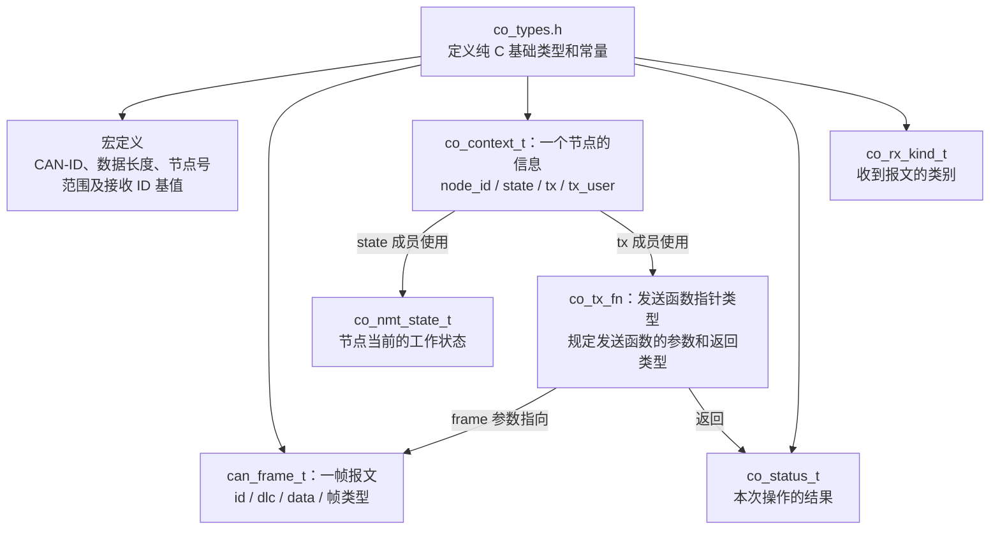
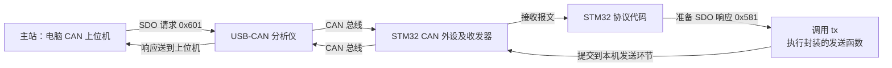

# 阶段 1：纯 C 基础类型与 CAN 帧抽象

## 一、总览：这份笔记在学什么

这份笔记当前对应 `co_types.h`：先约定“一帧报文怎么保存、一个节点需要哪些信息、发送函数采用什么接口、处理结果怎么表示”，再由 `co_core.c` 使用这些类型完成初始化、校验、发送和接收分类。

**头文件里的类型定义本身不会发送报文，也不会执行 NMT 状态切换。当前先在 PC 上验证纯 C 基础层，后续再接入 STM32 CAN 硬件。**



| 内容 | 回答什么问题 | 本项目例子 |
|---|---|---|
| 宏定义 | 范围和固定参数是多少？ | CAN-ID 最大 0x7FF；数据最多 8 字节；Node-ID 为 1～127 |
| `co_status_t` | 这次函数操作结果怎么样？ | CO_OK、CO_ERR_DLC、CO_ERR_TX_BUSY |
| `co_nmt_state_t` | 节点当前处于什么状态？ | Initialization、Pre-operational、Operational、Stopped |
| `can_frame_t` | 要发送或刚收到的报文是什么？ | id=0x701，dlc=1，data[0]=0x05 |
| `co_tx_fn` | 可以接入什么样的发送函数？ | 两个参数 user、frame；返回 co_status_t |
| `co_context_t` | 一个节点需要保存哪些信息？ | 节点号、NMT 状态、发送函数地址、发送辅助数据地址 |
| `co_rx_kind_t` | 收到的帧属于哪种服务？ | NMT、SDO、RPDO1 或未匹配 |

### 1. 先分清类型、变量、成员和取值

```c
co_status_t result = CO_OK;
/* 类型名       变量名   枚举常量 */

co_context_t ctx = {0};             /* 创建节点变量；正式使用前还需初始化 */
ctx.node_id = 1;                    /* 访问 ctx 中的 node_id 成员 */
ctx.state = CO_NMT_INITIALIZATION;  /* 访问 ctx 中的 state 成员 */
```

`typedef enum` 定义枚举类型，给一组整数起名字；`typedef struct` 定义结构体类型，把多个成员组合起来。`can_frame_t` 是结构体类型，不是枚举。结构体变量访问成员用 `.`，结构体指针访问成员用 `->`。


### 2. 函数指针：先规定接口，再选择发送函数，最后调用

```c
/* ① 定义类型：不是创建变量，也不是执行发送 */
typedef co_status_t (*co_tx_fn)(void *user, const can_frame_t *frame);

/* ② 假设后续硬件适配层提供了这个函数，此处只是声明 */
co_status_t stm32_can_send(void *user, const can_frame_t *frame);

/* ③ 创建函数指针变量，并保存封装函数的地址 */
co_tx_fn tx = stm32_can_send;

/* ④ 调用 tx，即执行 stm32_can_send，取得本次提交结果 */
co_status_t result = tx(&hcan1, &frame);
```

上面是后续 STM32 接入的调用示意，依赖已定义的 CAN1 句柄、报文变量和发送函数实现，不能直接当作当前 PC 工程代码运行。

| 名字或参数 | 作用 |
|---|---|
| `co_tx_fn` | 函数指针类型 |
| `tx` | 保存函数地址的变量；赋值不执行函数，加括号调用才执行 |
| `stm32_can_send` | 以后封装的实际发送函数，此名称为示例，当前尚未实现 |
| `void *user` | 本机发送所需的辅助数据地址，例如 CAN1 句柄地址；不是主机地址 |
| `const can_frame_t *frame` | 待发送帧的地址；通过它读取 CAN-ID、长度和数据，不能通过它修改原帧 |
| `co_status_t` 返回值 | 本次提交结果；不是节点的 NMT 状态 |

在节点上下文中，`tx` 保存“调用哪个函数”，`tx_user` 保存“调用时传给 user 的辅助地址”。PC 测试绑定 `fake_tx`，以后 STM32 绑定硬件发送函数，协议核心因此不必直接依赖 HAL。


### 3. 谁发送给谁：这里的发送函数属于 STM32 节点这一侧

本项目中，电脑 CAN 上位机作为主站工具，STM32 为 Node-ID=1 的从节点。CAN 总线本身支持多主仲裁，主从称呼是这里的应用角色。



STM32 主动发送 Heartbeat、TPDO，也使用这一侧的发送接口。上位机发送请求使用上位机软件自己的发送功能。

**目前 PC 测试中的 `fake_tx()` 只记录调用次数、复制报文并返回预设结果，不会向真实 CAN 总线或上位机发报文。上图是后续协议服务和硬件接入后的通信流程。**


### 4. 三种“状态”和三个发送完成层次，分别记忆

| 容易混淆的内容 | 例子 | 实际含义 |
|---|---|---|
| 函数操作结果 `co_status_t` | CO_OK | 本次操作成功；具体含义看调用的是哪个接口 |
| 节点工作状态 `co_nmt_state_t` | CO_NMT_OPERATIONAL = 5 | 节点处于运行状态，可作为心跳内容 |
| 接收类别 `co_rx_kind_t` | CO_RX_SDO | 识别到本节点的 SDO 请求，尚不表示已执行 |

| 发送过程中的观察结果 | 能证明什么 |
|---|---|
| 发送回调返回 CO_OK | 本机接受提交；可能仅进入软件队列或 CAN 硬件邮箱 |
| CAN 外设报告正常发送完成 | 总线发送成功；正常总线模式下 ACK 表示至少一个其他节点正确接收 |
| 上位机显示收到的帧 | 报文到达上位机软件；是否完成业务处理还需应用反馈 |

软件发送队列是 RAM 中的待发送列表；CAN 发送邮箱是 CAN 外设中的待发送硬件位置。ACK 不标明接收节点身份，也不证明上位机业务处理完成。TPDO 和 Heartbeat 没有逐帧的应用层确认回复。


### 5. 复习时先核对这些边界

- 标准帧说的是 **11 位 CAN-ID**；经典 CAN 数据载荷为 **0～8 字节**，不是整个 CAN 帧只有 8 字节。
- `data[8]` 预留容量，`dlc` 决定本帧有效字节数；DLC=0 时没有有效载荷。
- Node-ID=1 是节点编号；0x201、0x601 等是该节点使用的不同 CAN-ID。
- 阶段 1 先定义接收用的 NMT、RPDO1、SDO 请求 ID；TPDO1=0x181、TPDO2=0x281 的设计仍然有效，对应宏尚未加入。
- 数值说明：`uint16_t` 能完整保存 0x800，不会因此截断；11 位无符号位域才装不下 0x800。 `uint32_t id` 提供更宽的输入保存范围，是否越界仍需显式比较。
- `UINT32_C()` 用于构造适合 `uint_least32_t` 的无符号整数常量，在本项目平台上可按 32 位无符号常量理解；它本身不做范围检查。
- 本文件中的结构体没有声明 `struct can_frame` 标签，因此当前使用 `can_frame_t` 声明变量；若想写 `struct can_frame`，必须先定义这个标签。
- 当前完成的是基础帧校验、发送接口和接收分类；NMT 状态机、SDO 响应、PDO 数据处理以及真实硬件发送属于后续阶段。

阅读顺序：`co_types.h`（数据和类型）→ `co_core.h`（接口约定）→ `co_core.c`（具体实现）→ `test_co_core.c`（验证行为）。

---

### 6.现阶段学习

现在先理解**每个类型用来保存什么、解决什么问题**就够了，不必一次记住所有语法。

后面看实际调用时，我们拿一帧报文走完整个过程：

```
创建节点 → 准备 CAN 帧 → 校验 → 调用发送函数 → 检查返回结果
```

你就能看到 `can_frame_t`、`co_context_t`、`co_tx_fn` 和 `co_status_t` 怎么配合。

接下来学习 `co_core.h`，先认识有哪些接口；再到 `co_core.c` 和测试里看它们实际怎么用


# 代码解析


## 1：宏定义

```c
#define CO_CAN_ID_MAX UINT32_C(0x7FF) 		/* 11 位标准 CAN-ID 的最大值；32 位类型用于检测越界输入 */
#define CO_CAN_DATA_MAX 8u 				   /* 经典 CAN 每帧最多 8 个数据字节 */
#define CO_NODE_ID_MAX 127u 			   /* 节点号上限；0 仅用于 NMT 广播目标 */
#define CO_COB_NMT UINT32_C(0x000)          /* NMT 固定 CAN-ID，目标节点在数据第 2 字节中 */
#define CO_COB_RPDO1_BASE UINT32_C(0x200)   /* RPDO1 基值，加节点号后得到接收输出命令的 CAN-ID */
#define CO_COB_SDO_RX_BASE UINT32_C(0x600)  /* SDO 请求基值；节点 1 接收 0x601 */
```


#### 1：CAN-ID 的最大值

```c
#define CO_CAN_ID_MAX UINT32_C(0x7FF)
先拆成三部分：
#define         // 定义宏
CO_CAN_ID_MAX    // 宏名称：CAN-ID 的最大值
UINT32_C(0x7FF)  // 无符号整数常量
以后代码中写：
if (frame->id > CO_CAN_ID_MAX)
就是在判断：
这个报文的 CAN-ID 是否超过标准帧允许的范围？

为什么最大值是 0x7FF？因为标准 CAN-ID 有 11 位：
二进制：111 1111 1111
十六进制：0x7FF
十进制：2047
所以合法范围是：
0x000 ～ 0x7FF
```

UINT32_C() 的作用：告诉编译器“请把 0x7FF 这个数当成 32 位无符号整数来看待”，这样在后面做比较时，类型匹配，不会出错。


为什么要用 32 位变量来装 11 位的数据？

```c
uint32_t id; 		                  // 用一个 32 位的“大碗”来装 ID
id = 收到的CAN_ID;                     // 比如对方发来了一个非法的 0x800

if (id > CO_CAN_ID_MAX) { 			  // 拿 0x800 和 0x7FF 比
    								// 0x800 比 0x7FF 大，判定为非法，拒绝！
}
```

如果反过来，你用 11 位（或更小）的变量来装：

```c
uint16_t id; 							 // 或者只用 11 位位域
id = 0x800;  							 // 0x800 是 1000 0000 0000，11 位装不下
									     // 结果：数据被截断，id 变成了 0x000
if (id > 0x7FF) { 
   										 // 0x000 不大于 0x7FF，代码以为它是合法的！非法数据就被放过去了。
}
```

1：UINT32_C() 本身不校验数据，它只是个“类型声明工具”，保证 0x7FF 是个 32 位数。

2：**真正干活的是 `uint32_t id` 这个 32 位变量**。因为它够宽，所以即使有人传了非法的 `0x800`、`0x900`，它也能原封不动地存下来，不会丢失信息

3：**最后通过和 `CO_CAN_ID_MAX`（0x7FF）比较**，就能轻松地发现“哦，这个数超范围了”，从而把非法 ID 拒之门外。

一句话概括：用大号容器（32位）装小号数据（11位ID），是为了保留完整的原始值，方便跟上限值（0x7FF）做对比，防止非法值因为“装不下”而被截断、伪装成合法值混进来。


#### 2：CAN 数据长度上限

```c
#define CO_CAN_DATA_MAX 8u
```

表示：

> 经典 CAN 一帧最多携带 8 个数据字节。

`8u` 中的 `u` 表示 **unsigned，无符号整数常量**，数值仍然是 8。

它**不是“8 位”的意思**。

后面的：

```
uint8_t data[CO_CAN_DATA_MAX];
```

相当于：

```
uint8_t data[8];
```

这是一个包含 8 个元素的数组，每个元素 1 字节。

注意，**最多能放 8 字节，不代表每帧都必须发送 8 字节**：

```c
RPDO1：DLC = 1
TPDO1：DLC = 1
TPDO2：DLC = 4
SDO：  DLC = 8
```


#### 3：节点编号上限

```
#define CO_NODE_ID_MAX 127u
```

表示本节点编号的合法范围上限是 127：

```
本节点可配置：1 ～ 127
当前项目使用：1
```

这里没有把当前节点“固定成 127”，只是定义上限。

`0` 在 NMT 命令的目标节点字段中表示广播：

```
目标节点 = 1：发给节点 1
目标节点 = 0：发给所有节点
```

所以初始化时不能把我们自己的 Node-ID 设置为 0。

还要区分：

| 名称    | 本项目示例 | 含义                   |
| ------- | ---------- | ---------------------- |
| Node-ID | `1`        | 节点编号               |
| CAN-ID  | `0x201`    | 一种具体通信报文的标识 |

**一个节点会使用多个 CAN-ID。**


#### 4：NMT 的固定 CAN-ID

```c
#define CO_COB_NMT UINT32_C(0x000)
```

表示：

> NMT 命令报文固定使用 CAN-ID `0x000`。

它不需要加上节点编号。目标节点在数据中：

```
CAN-ID = 0x000
DLC    = 2
DATA   = 01 01
         │  │
         │  └─ 目标节点：1
         └──── 命令：Start，进入 Operational
```

如果希望所有节点进入 Operational：

```
CAN-ID = 0x000
DATA   = 01 00
```

所以接收 NMT 时，需要先识别 `CAN-ID=0x000`，再检查 `data[1]` 是否为本节点或广播。


#### 5：RPDO1 的基础 CAN-ID

```
#define CO_COB_RPDO1_BASE UINT32_C(0x200)
```

`BASE` 表示**基值**，不是最终 CAN-ID。

在我们采用的预定义连接集中：

```
RPDO1 CAN-ID = 0x200 + Node-ID
```

当前节点编号为 1：

```
0x200 + 1 = 0x201
```

例如主站发送：

```
CAN-ID = 0x201
DLC    = 1
DATA   = 05
```

后续 PDO 模块会按映射将它解释为 DO 输出值。

`R` 是从**节点的视角**说的：这是节点接收的 PDO。因此方向是：

```
主站 → STM32 节点
```

当前阶段只识别这类帧，还不会操作 LED。


#### 6： SDO 请求的基础 CAN-ID

```
#define CO_COB_SDO_RX_BASE UINT32_C(0x600)
```

这里：

```
SDO：服务数据对象
RX：节点接收
BASE：基础值
```

因此：

```
节点接收 SDO 请求的 CAN-ID = 0x600 + Node-ID
```

对于节点 1：

```
主站 → 节点：0x601，SDO 请求
节点 → 主站：0x581，SDO 响应
```

当前这个宏只定义了**请求方向的基值**，所以是 `0x600`，不是 `0x580`。

例如后面看到：

```
frame->id == CO_COB_SDO_RX_BASE + ctx->node_id
```

当 `ctx->node_id` 为 1 时，就是判断：

```
frame->id == 0x601
```

也就是：**“这是不是发给我的 SDO 请求？”**

这 6 行只是定义后续代码要使用的常量，尚未接收、发送或处理任何报文。下一段 `co_status_t` 则用来表达：**调用一个函数以后，它成功了、忽略了报文，还是遇到了错误？**


#### 7：阶段1只定义接收方向的宏

因为当前这几行宏主要服务于**阶段 1 的接收入口和节点过滤**，所以只定义了：

- NMT：节点接收
- RPDO1：节点接收
- SDO RX：节点接收

TPDO 是 **节点发送给主站** 的报文，当前阶段还没有实现 PDO 发送逻辑，所以暂时没有定义对应宏。

按当前 Node-ID=1，TPDO 的 CAN-ID 是：

```c
#define CO_COB_TPDO1_BASE UINT32_C(0x180)
#define CO_COB_TPDO2_BASE UINT32_C(0x280)
```

计算：

```
TPDO1 = 0x180 + 1 = 0x181
TPDO2 = 0x280 + 1 = 0x281
```

完整方向是：

```
RPDO1：0x200 + 1 = 0x201，主站 → 节点
TPDO1：0x180 + 1 = 0x181，节点 → 主站
TPDO2：0x280 + 1 = 0x281，节点 → 主站
```

所以不是 TPDO 没有 CAN-ID，而是我们当前的 `co_types.h` 只先定义了**阶段 1 需要的接收 ID**。到了阶段 6 实现 PDO 时再增加 TPDO 宏也可以。

不过为了让阶段 0 的全部固定 PDO 关系更完整，现在就把这两个基础宏补进去也合理：

```
#define CO_COB_TPDO1_BASE UINT32_C(0x180)
#define CO_COB_TPDO2_BASE UINT32_C(0x280)
```

它们只定义常量，不会改变当前功能。


## 2：第一个枚举

```c
typedef enum {
    CO_OK = 0, /* 操作成功；分类接口中仅表示分类成功 */
    CO_IGNORED, /* 帧与本节点无关，正常忽略 */
    CO_ERR_ARGUMENT, /* 指针或必要回调无效 */
    CO_ERR_NODE_ID, /* 节点号不在 1~127 内 */
    CO_ERR_CAN_ID, /* CAN-ID 超过 11 位范围 */
    CO_ERR_DLC, /* 数据长度不符合当前检查要求 */
    CO_ERR_FRAME_TYPE, /* 不支持扩展、远程或 CAN FD 帧 */
    CO_ERR_TX_BUSY, /* 传输层暂忙，调用者决定后续处理 */
    CO_ERR_TX_FAILED /* 传输层发送失败 */
} co_status_t;
```

- `enum`：枚举，把整数起成有意义的名字。
- `typedef`：为这个类型起名。
- `co_status_t`：我们起的类型名，以后可以用它声明变量。

例如：

```
co_status_t result;
```

意思是：创建一个名叫 `result` 的变量，用来保存执行结果。

这里要区分：

```
co_status_t   是类型名
result        是变量名
CO_ERR_DLC    是可赋给变量的枚举常量，数值为 5
```

这些结果码是我们为程序内部定义的，不是 CANopen 规定要发送到总线上的状态字节。 目前先理解“类型、变量、枚举常量”这三者的关系就可以。


## 3：第二个枚举

```c
typedef enum {
    CO_NMT_INITIALIZATION = 0, 			/* 初始化状态，数值 0 也用于 Boot-up 通知 */
    CO_NMT_STOPPED = 4, 			    /* 停止状态，对应状态字节 0x04 */
    CO_NMT_OPERATIONAL = 5,			    /* 运行状态，对应状态字节 0x05 */
    CO_NMT_PRE_OPERATIONAL = 127 		/* 预运行状态，对应状态字节 0x7F */
} co_nmt_state_t;
```

这段定义的是 **NMT 状态类型**。NMT 是 CANopen 的网络管理，节点会处于不同工作状态。


## 4：第三个枚举

```c
typedef struct {
    uint32_t id; 			       /* 实际 CAN-ID，不是带配置标志位的对象字典 COB-ID 参数 */
    uint8_t dlc; 				  /* 有效数据长度，允许 0~8 */
    uint8_t data[CO_CAN_DATA_MAX]; /* 数据缓冲区；只有前 dlc 字节属于有效载荷 */
    uint8_t is_extended; 		   /* 非零表示扩展帧，本项目拒绝 */
    uint8_t is_remote; 			  /* 非零表示远程帧，本项目拒绝 */
    uint8_t is_fd; 				 /* 非零表示 CAN FD 帧，本项目拒绝 */
} can_frame_t;

```

这段定义了项目中最核心的数据结构之一：**CAN 报文结构体**。

它把一帧 CAN 报文的关键信息集中放在一起。

### 1. `typedef struct`

```
typedef struct {
    ...
} can_frame_t;
```

`struct` 用来把多个不同类型的变量组合成一个整体。

如果没有 `typedef`，使用时要写：

```
struct can_frame frame;
```

现在通过 `typedef` 给它起了类型名：

```
can_frame_t frame;
```

例如：

```
can_frame_t tx_frame;
can_frame_t rx_frame;
```

分别表示发送帧和接收帧。


### 2. `uint32_t id`

```
uint32_t id;
```

表示 CAN-ID。

例如：

```
0x000：NMT
0x181：TPDO1
0x201：RPDO1
0x601：SDO 请求
0x701：Heartbeat
```

为什么 CAN-ID 只有 11 位，却使用 `uint32_t`？

因为这样可以完整保存非法输入，方便检查：

```
if (frame->id > CO_CAN_ID_MAX) {
    return CO_ERR_CAN_ID;
}
```

例如收到：

```
id = 0x800
```

如果使用更小的类型，可能发生截断；使用 `uint32_t` 可以准确判断它超过了 `0x7FF`。

注释中特别说：

```
实际 CAN-ID，不是带配置标志位的对象字典 COB-ID 参数
```

这里的 `id` 必须是总线上真正使用的 CAN-ID，例如：

```
frame.id = 0x201;
```

不能把对象字典中可能带有有效标志位的配置值直接塞进来。

------


### 3. `uint8_t dlc`

```
uint8_t dlc;
```

DLC 是 **Data Length Code**，表示当前报文有几个有效数据字节。

经典 CAN 的范围是：

```
DLC = 0 ～ 8
```

在本项目中：

```
RPDO1：DLC = 1
TPDO1：DLC = 1
TPDO2：DLC = 4
SDO：  DLC = 8
```

例如：

```
frame.id = 0x201;
frame.dlc = 1;
frame.data[0] = 0x05;
```

表示：

```
CAN-ID = 0x201
有效数据长度 = 1
有效数据 = 05
```

虽然 `dlc` 用 `uint8_t`，可以保存 0～255，但协议校验会限制它不能大于 8。

------


### 4. `uint8_t data[CO_CAN_DATA_MAX]`

```
uint8_t data[CO_CAN_DATA_MAX];
```

由于：

```
#define CO_CAN_DATA_MAX 8u
```

所以等价于：

```
uint8_t data[8];
```

它提供 8 个字节的 CAN 数据缓冲区：

```
data[0]
data[1]
data[2]
data[3]
data[4]
data[5]
data[6]
data[7]
```

但是，真正有效的数据只看前 `dlc` 个字节。

例如：

```
frame.dlc = 1;
frame.data[0] = 0x05;
```

此时：

```
data[0] 有效
data[1]～data[7] 不属于本帧有效载荷
```

再比如 TPDO2：

```
frame.dlc = 4;
frame.data[0] = AI1 低字节;
frame.data[1] = AI1 高字节;
frame.data[2] = AI2 低字节;
frame.data[3] = AI2 高字节;
```

------


### 5. `uint8_t is_extended`

```
uint8_t is_extended;
```

表示是否为扩展帧：

```
0：标准帧
非 0：扩展帧
```

本项目只使用 CANopen 标准帧，也就是 11 位 CAN-ID：

```
if (frame->is_extended) {
    return CO_ERR_FRAME_TYPE;
}
```

CAN 扩展帧使用 29 位 ID，本项目不支持。

------


### 6. `uint8_t is_remote`

```
uint8_t is_remote;
```

表示是否为远程帧：

```
0：数据帧
非 0：远程帧
```

CAN 远程帧主要用于请求某个 CAN-ID 的数据，但 CANopen 这一版协议不使用它。

因此项目只接受普通数据帧：

```
if (frame->is_remote) {
    return CO_ERR_FRAME_TYPE;
}
```

------


### 7. `uint8_t is_fd`

```
uint8_t is_fd;
```

表示是否为 CAN FD 帧：

```
0：经典 CAN
非 0：CAN FD
```

本项目明确使用：

```
CAN 2.0A
11 位标准帧
最多 8 字节数据
```

所以 CAN FD 帧必须拒绝：

```
if (frame->is_fd) {
    return CO_ERR_FRAME_TYPE;
}
```

CAN FD 可以携带超过 8 字节的数据，但第一版项目不实现。

------


### 8. 一个完整的示例

假设主站向 Node-ID=1 下发 DO 状态：

```
can_frame_t frame = {
    .id = 0x201,
    .dlc = 1,
    .data = {0x05},
    .is_extended = 0,
    .is_remote = 0,
    .is_fd = 0
};
```

它代表：

```
CAN-ID：0x201
DLC：1
DATA[0]：0x05
标准帧
数据帧
经典 CAN
```

`0x05` 的二进制是：

```
0000 0101
```

表示：

```
DO1 = 1
DO2 = 0
DO3 = 1
DO4 = 0
```

------

这整个结构体的核心思想是：

> 用一个 C 结构体，同时保存 CAN-ID、有效长度、数据内容和帧类型信息，让协议层可以在不依赖 STM32 HAL 的情况下处理 CAN 报文。


### 9.经典can标准数据帧

经典 CAN **标准数据帧不一定是 8 字节**。

它的有效数据长度可以是：

```
0、1、2、3、4、5、6、7、8 字节
```

所以：

```
标准帧 ≠ 一定 8 字节
```

这里要区分两个概念：

- **标准帧**：指 CAN-ID 是 11 位。
- **数据长度**：由 DLC 表示，可以是 0～8 字节。

我们的项目使用的是：

```
11 位标准帧
经典 CAN
最大数据长度 8 字节
```

`co_types.h` 中：

```
#define CO_CAN_DATA_MAX 8u
```

表示：

> 给 `data` 数组预留 8 字节空间，因为经典 CAN 的最大有效载荷就是 8 字节。

而真正这一帧用了几个字节，由：

```
frame.dlc
```

决定。

例如：

```
TPDO1：DLC = 1，使用 1 字节
RPDO1：DLC = 1，使用 1 字节
TPDO2：DLC = 4，使用 4 字节
SDO：DLC = 8，使用 8 字节
NMT：DLC = 2，使用 2 字节
```

因此这段结构：

```
uint8_t data[CO_CAN_DATA_MAX];
```

虽然始终分配 8 个字节，但不代表每个报文都发送 8 字节。有效范围是：

```
data[0] 到 data[dlc - 1]
```

例如：

```
frame.dlc = 1;
frame.data[0] = 0x05;
```

只有 `data[0]` 有效，后面的数组空间只是预留的。

在我们的项目里，不是规定所有 CAN 报文必须 8 字节，而是每种 CANopen 报文按照协议规定自己的 DLC。


## 5：函数指针

```c
/* 发送函数指针：user 为私有数据，frame 为只读帧；返回传输状态。
 * 回调必须非阻塞；排队时先复制帧。成功只表示接受提交，不代表总线 ACK。 */
typedef co_status_t (*co_tx_fn)(void *user, const can_frame_t *frame);
```

它定义的不是一个普通函数，而是一个**函数指针类型**。


#### **① 拆解函数指针类型，理解它表示什么**

```
typedef co_status_t (*co_tx_fn)(void *user, const can_frame_t *frame);
```

分开看：

| 部分                       | 含义                                                         |
| -------------------------- | ------------------------------------------------------------ |
| `typedef`                  | 给类型起名字                                                 |
| `co_status_t`              | 返回值：指向的函数返回操作结果，例如 `CO_OK`                 |
| `(*co_tx_fn)`              | 函数类型：将这个函数指针类型命名为 `co_tx_fn` （是一个函数指针） |
| `void *user`               | 函数的第一个参数：辅助数据的地址                             |
| `const can_frame_t *frame` | 第二个参数：待发送 CAN 帧的地址                              |

整句话表示：

> 定义一个函数指针类型 `co_tx_fn`，它可以指向“接收这两个参数，并返回 `co_status_t`”的函数。

这行只是定义类型，还没有创建指针变量，也没有发送报文。


#### **② 声明 `tx`，把封装的发送函数赋给它**

假设以后我们封装的 STM32 发送函数叫 `stm32_can_send`，它的声明是：

```
co_status_t stm32_can_send(void *user, const can_frame_t *frame);
```

它的参数和返回值类型，符合 `co_tx_fn` 的要求。

于是可以写：

```
co_tx_fn tx;           /* 声明一个函数指针变量 tx */
tx = stm32_can_send;  /* 把发送函数的地址赋给 tx */
```

也可以合成一行：

```
co_tx_fn tx = stm32_can_send;
```

注意：

```
tx = stm32_can_send;
```

是**保存函数地址**，这时还没有调用函数。

以后写：

```
tx(...);
```

才会调用它所指向的 `stm32_can_send()`。

这里的 `stm32_can_send` 是帮助理解的示例名称，当前工程还没有实现这个硬件发送函数。


#### **③ 封装函数的两个形参是什么意思**

```
co_status_t stm32_can_send(
    void *user,
    const can_frame_t *frame
);
```

第一个形参：

```
void *user
```

表示**发送函数需要的辅助数据地址**。

例如，STM32 发送函数需要知道使用哪个 CAN 外设，可以把 CAN 句柄的地址传进来：

```
&hcan1
```

在使用 STM32 HAL 的实现中，函数内部可以将它还原成对应的指针类型：

```
CAN_HandleTypeDef *hcan = user;
```

这样发送函数就知道要操作哪个 CAN 外设。

这里 `user` 不是指上位机用户，也不是报文目的地址，而是**给本机发送函数使用的辅助信息**。

第二个形参：

```
const can_frame_t *frame
```

表示**待发送 CAN 报文的地址**。

函数通过它读取：

```
frame->id       /* CAN-ID */
frame->dlc      /* 有效数据长度 */
frame->data     /* 数据内容 */
```

`const` 表示不能通过这个指针修改原始报文。

两个参数可以这样记：

```
user  → 发送时需要使用什么资源，例如 CAN1 句柄
frame → 具体要发送哪一帧报文
```


#### **④ STM32 调用这个函数，向主机 CAN 上位机发送报文**

下面以 STM32 发送一帧 Operational 心跳为例，演示以后的调用方式：

```
/* 准备报文：节点 1 的运行状态心跳 */
can_frame_t frame = {
    .id = 0x701,
    .dlc = 1,
    .data = {0x05},
    .is_extended = 0,
    .is_remote = 0,
    .is_fd = 0
};

/* 选择封装好的 STM32 发送函数 */
co_tx_fn tx = stm32_can_send;

/* 调用它，传入 CAN1 句柄地址和报文地址 */
co_status_t result = tx(&hcan1, &frame);
```

最后一行等价于直接调用：

```
co_status_t result = stm32_can_send(&hcan1, &frame);
```

这时两个实参分别交给两个形参：

```
&hcan1  → user
&frame  → frame
```

实际发送方向是：

```
STM32 程序调用 tx
    ↓
执行 stm32_can_send
    ↓
将报文提交给 STM32 CAN 外设
    ↓
经过 CAN 收发器和总线
    ↓
USB-CAN 分析仪
    ↓
电脑上的 CAN 上位机接收
```

调用返回的 `result` 表示**本次提交结果**：

```
CO_OK             /* 已接受提交 */
CO_ERR_TX_BUSY     /* 暂时忙，未接受提交 */
CO_ERR_TX_FAILED   /* 提交失败 */
```

`CO_OK` 表示本机接受了发送请求，不表示主机上位机已经收到或处理了报文。


#### ⑤：提交成功区分

我们需要区分 **“提交成功”“总线发送成功”“上位机处理成功”**，这三个结果来自不同环节。

##### 1：提交成功：看发送函数的返回值**

```
result = tx(&hcan1, &frame);
```

返回 `CO_OK`，只说明报文已经交给发送队列或 CAN 邮箱。

此时 CAN 控制器可能还在等待总线空闲、等待仲裁，所以不能说已经发出去了。


##### 2：CAN 总线发送成功：看 CAN 外设的发送完成结果**

之后由 CAN 控制器真正执行发送。STM32 可以通过**发送完成中断或查询硬件状态**，知道结果。

以后接入 STM32 HAL 时，可以通过对应邮箱的发送完成回调处理成功事件，例如：

```
void HAL_CAN_TxMailbox0CompleteCallback(CAN_HandleTypeDef *hcan)
{
    /* 邮箱 0 的报文已成功完成 CAN 总线发送 */
}
```

邮箱 1、邮箱 2 也有对应回调；需要先配置并启用相关中断通知。失败或异常则结合错误回调、错误码和邮箱状态处理。

流程是：

```
调用发送函数
    ↓
返回 CO_OK：提交成功
    ↓
CAN 控制器实际发送
    ↓
发送完成通知：总线发送成功
```

如果没有其他正常工作的节点提供 ACK，就不能完成正常的成功发送。是否自动重试，取决于控制器配置。

但 **CAN ACK 只说明至少一个其他节点正确接收了这帧，不包含接收者身份，也不证明电脑软件处理了它。**


##### 3：上位机确实收到或处理：看上位机记录或应用层反馈**

在我们的项目中：

- **调试验证**：在 CAN 上位机中看到 STM32 发来的 `0x701`、`0x581`、`0x181` 等报文，确认上位机能收到。
- **需要 STM32 自己知道主机已经处理**：必须有应用层的确认报文，并定义等待超时和失败处理。

CANopen 的 **TPDO 和 Heartbeat 本身没有逐帧应用层确认**，不能等一个协议中不存在的“主机确认回复”。SDO 有请求—响应交互，但 STM32 发出 SDO 响应后，也没有额外的“主机已处理响应”确认。

所以，我们后续接入硬件时，会分别记录：

| 观察结果             | 能证明什么           |
| -------------------- | -------------------- |
| 发送函数返回 `CO_OK` | 本机接受提交         |
| CAN 外设报告发送完成 | CAN 总线发送成功     |
| 上位机显示收到的报文 | 报文已到达上位机软件 |

**当前阶段只模拟并验证第一步；阶段 7 接入 bxCAN 后，再验证真实发送完成和上位机接收。**


## 6：co_context_t 结构体

```c
typedef struct {
    uint8_t node_id;		 /* 本节点编号，当前项目使用 1 */
    co_nmt_state_t state;    /* 节点当前 NMT 状态，阶段 1 只设置初值 */
    co_tx_fn tx; 			/* 保存发送函数地址，使协议层不依赖具体硬件 */
    void *tx_user; 			/* 保存传输层私有数据地址，发送时原样传给回调 */
} co_context_t;
```

**把一个节点需要保存的信息，集中放在一起。**


#### **① `uint8_t node_id;`**

```
uint8_t node_id;
```

保存本节点的编号。我们的项目使用：

```
Node-ID = 1
```

`uint8_t` 能保存 0～255，但程序会检查，要求节点号在 1～127 内。


#### **② `co_nmt_state_t state;`**

```
co_nmt_state_t state;
```

这里用到了前面定义的 NMT 状态枚举：

- `co_nmt_state_t`：类型名。
- `state`：结构体成员名。

它保存节点当前处于哪个状态，例如：

```
CO_NMT_INITIALIZATION
CO_NMT_PRE_OPERATIONAL
CO_NMT_OPERATIONAL
CO_NMT_STOPPED
```

注意区分我们刚学过的两种类型：

```
co_status_t      → 一次函数操作的结果，例如成功、长度错误
co_nmt_state_t   → 节点的工作状态，例如预运行、运行
```


#### **③ `co_tx_fn tx;`**

```
co_tx_fn tx;
```

这就是上一段函数指针类型的实际使用：

- `co_tx_fn`：函数指针类型。
- `tx`：保存发送函数地址的成员。

和刚才的：

```
co_tx_fn send_ptr;
```

意思一样，只是这里把变量名换成了 `tx`，并放进结构体中。

以后将封装好的发送函数地址保存到 `tx`，就能通过它调用那个函数。


#### **④ `void \*tx_user;`**

```
void *tx_user;
```

保存发送函数需要使用的辅助数据地址。

还记得发送函数的第一个参数吗？

```
void *user
```

这个成员就是为那个参数准备的：

```
tx       保存：调用哪个发送函数
tx_user  保存：调用时交给它什么辅助数据
```

例如发送函数需要操作某个发送队列，`tx_user` 就可以保存那个队列对象的地址。如果不需要辅助数据，可以使用 `NULL`。

这里保存的是**地址**，不会自动复制地址指向的数据。


#### **⑤ `} co_context_t;`**

```
} co_context_t;
```

结束结构体定义，并把这个类型命名为 `co_context_t`。

到这里，我们定义好了类型，但还没有创建节点变量。

写下面这一行，才真正创建变量：

```
co_context_t ctx = {0};
```

- `co_context_t`：类型。
- `ctx`：我们起的变量名。
- `{0}`：对成员进行零初始化；正式使用前仍需调用后面的初始化函数。

现在，之前提到的 `ctx.state` 就有出处了：

```
ctx.node_id = 1;                        /* 设置节点编号 */
ctx.state = CO_NMT_INITIALIZATION;      /* 设置初始状态 */
```

这里的点号 `.` 表示：**访问这个结构体变量中的某个成员。**

因此：

```
ctx.state
```

读作：“变量 `ctx` 里面的 `state` 成员。”

这段先掌握四个成员分别存什么：

| 成员      | 保存的内容                 |
| --------- | -------------------------- |
| `node_id` | 我是几号节点               |
| `state`   | 我当前处于什么 NMT 状态    |
| `tx`      | 我通过哪个函数提交报文     |
| `tx_user` | 发送函数需要的辅助数据地址 |


## 7：最后一个枚举

接收帧的分类类型

```c
typedef enum {
    CO_RX_NONE = 0,
    CO_RX_NMT,
    CO_RX_SDO,
    CO_RX_RPDO1
} co_rx_kind_t;
```

它用来记录：

> **收到的 CAN 帧属于哪一种需要处理的服务？**

这里 `RX` 表示接收，`kind` 表示类别。


#### **① `CO_RX_NONE = 0`**

```
CO_RX_NONE = 0,
```

表示没有匹配到需要处理的服务。

例如我们是节点 1，收到发给节点 2 的 SDO 请求：

```
CAN-ID = 0x602
```

它不属于我们的接收范围，分类结果保持 `CO_RX_NONE`。

分类开始前也会先设置为这个值，避免保留上一次的结果。


#### **② `CO_RX_NMT`**

```
CO_RX_NMT,
```

自动取值为 `1`，表示识别到**发给本节点或广播的 NMT 报文**。

对于我们的节点 1：

```
CAN-ID = 0x000，DATA = 01 01 → 发给节点 1
CAN-ID = 0x000，DATA = 01 00 → 广播
```

这两种都可以分类为 `CO_RX_NMT`。

当前阶段只识别类别，还不会执行进入 Operational 的命令。


#### **③ `CO_RX_SDO`**

```
CO_RX_SDO,
```

自动取值为 `2`，表示本节点的 SDO 请求。

节点 1 对应：

```
CAN-ID = 0x600 + 1 = 0x601
```

当前只根据地址识别它，SDO 命令、长度和对象地址的解析留到后续阶段。


#### **④ `CO_RX_RPDO1`**

```
CO_RX_RPDO1
```

自动取值为 `3`，表示本节点的 RPDO1。

节点 1 对应：

```
CAN-ID = 0x200 + 1 = 0x201
```

以后它用于接收 DO 输出命令。当前分类成功，不代表已经修改输出。


#### **⑤ `} co_rx_kind_t;`**

```
} co_rx_kind_t;
```

给这个枚举类型起名。以后可以这样创建变量：

```
co_rx_kind_t kind = CO_RX_NONE;
```

意思是：

> 创建一个保存接收类别的变量 `kind`，初始值为“未匹配”。


## 8：对比

现在我们已经遇到了三个枚举，可以放在一起区分：

| 类型             | 回答的问题             | 示例                       |
| ---------------- | ---------------------- | -------------------------- |
| `co_status_t`    | 这次操作结果怎么样？   | `CO_OK`：成功              |
| `co_nmt_state_t` | 节点当前处于什么状态？ | `CO_NMT_OPERATIONAL`：运行 |
| `co_rx_kind_t`   | 收到的帧属于什么类别？ | `CO_RX_SDO`：SDO 请求      |